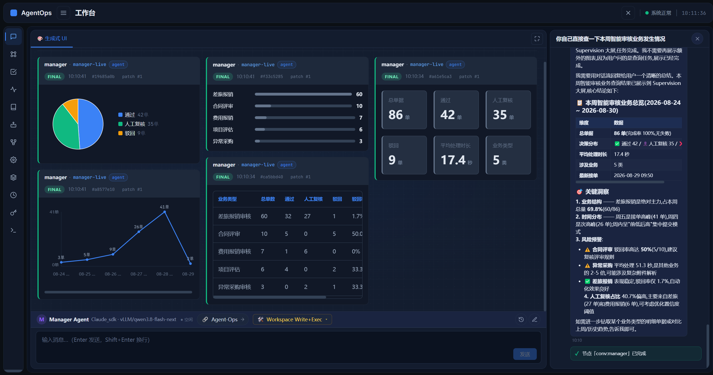
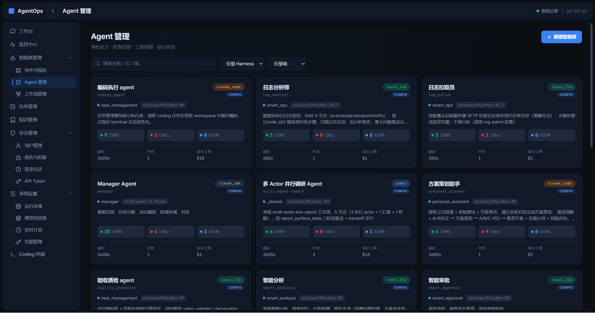
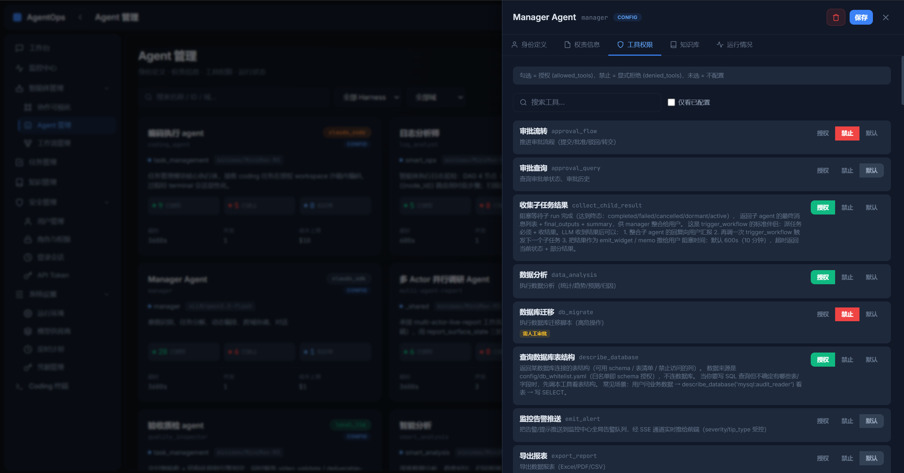
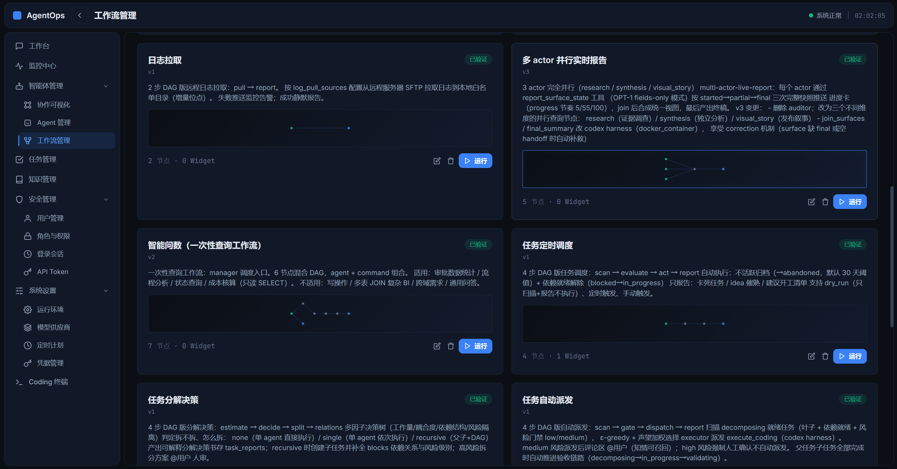
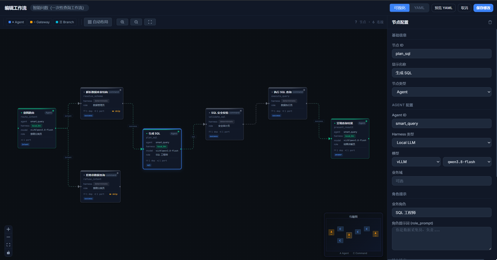
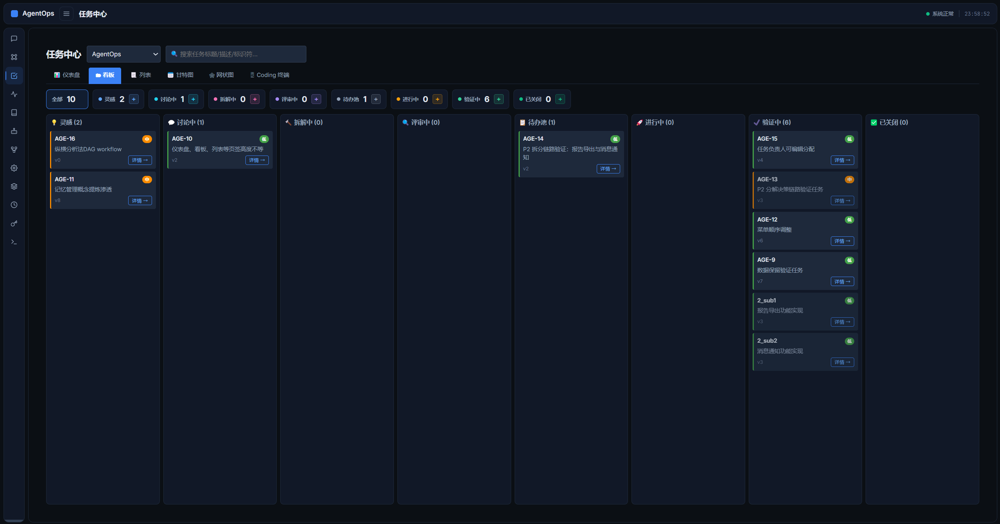
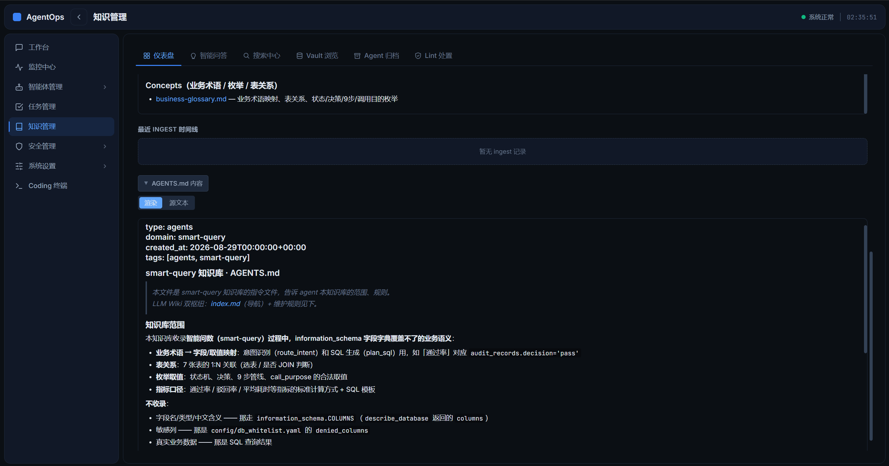

# AgentOps — 多 Agent DAG 编排平台

> **多 Harness · 多工作流 · 可视化作战室 · 一句话即办**
>
> 用户对 Manager Agent 说一句话，即可完成 OA 智能审批、日志巡检、视频生成、周报撰写、智能问数、知识检索、任务分解等办公全场景；底层打通 Claude Code / OpenCode / Kimi / 本地 LLM 等多 Harness 基座；可视化作战室让执行过程、思考逻辑、产物、置信度全程可见、可审、可干预。

[](LICENSE)
[](https://www.python.org)
[](https://nodejs.org)
[](docker-compose.yml)
[](https://github.com/LetheChen/AgentOps)
[](https://github.com/LetheChen/AgentOps)
[](https://github.com/LetheChen/AgentOps)
[](https://github.com/LetheChen/AgentOps)
[](https://github.com/LetheChen/AgentOps)
[](https://github.com/LetheChen/AgentOps)
[-lightgrey.svg)](https://github.com/LetheChen/AgentOps)
[](https://github.com/LetheChen/AgentOps/stargazers)
[](https://github.com/LetheChen/AgentOps/network/members)

***

## 功能截图

> 完整图廊 + 文字说明见 [docs/gallery/README.md](docs/gallery/README.md)

### 业务智能分析 + A2UI 生成式 UI ⭐

A2UI 受限协议直接在对话流中渲染 **36 类 widget**（18 个 A2UI v1.0 标准组件 + 18 个 AgentOps Catalog 扩展）：图表 / DAG / SQL 结果 / 媒体 / 表单 / 弹窗 / 进度条 / 时间轴 一气呵成，坏数据在协议层拒绝。



### Agent 管理 — 可视化作战室

Agent 列表 / 注册管理 / 启停控制。Agent 定义层（role / tools / skills / kb / constraints）一次定义，多 DAG 复用、跨业务域共用。



### Agent 维护 — role / tools / skills / runtime 四维编辑

业务 Agent 与 Harness 原生子 Agent 分层架构，模型供应商（Claude Code / OpenCode / Kimi / 本地 LLM）可热切换。



### 工作流管理 — DAG 工作流列表

16 套预置工作流（智能审批 / 视频生产 / 周报 / 智能问数 / 任务调度 / 日志巡检 等）。



### 工作流维护 — 可视化 DAG 编辑器

节点拖拽 / 边连接 / 属性面板，编辑器实时同步 YAML。质量门禁 / 三态决策（reject / manual / pass）与企业 OA 审批规范天然对齐。



### 任务管理 — 任务状态机 + 派发记录

任务分解 → 派发 → 执行 → 提交 → 审核 → 关闭 全链路。



### 知识管理 — 知识域仪表盘 / Vault 浏览 / 智能问答

三层知识库（Vault / 管理 / 高级分析），支持个人 vault（Obsidian 兼容）。



***

## 目录

* [项目简介](#项目简介)

* [快速开始](#快速开始)

  * [方式 A：Docker 一键部署（推荐）](#方式-aDocker-一键部署推荐)

  * [方式 B：本地源码运行](#方式-b本地源码运行开发调试)

* [架构概览](#架构概览)

* [详细安装部署教程（AI 可读）](#详细安装部署教程ai-可读)

  * [环境要求](#环境要求)

  * [Docker 部署完整流程](#Docker-部署完整流程)

  * [本地源码部署完整流程](#本地源码部署完整流程)

  * [配置管理](#配置管理)

  * [常见问题排查](#常见问题排查)

* [开发指南](#开发指南)

* [文档导航](#文档导航)

* [许可证](#许可证)

***

## 项目简介

AgentOps 是一个 **"Manager Agent 超级助理 + 可视化作战室 + 生成式 UI (A2UI 受限协议)"** 的多 Agent 协作管理平台。底层打通 Claude Code / OpenCode / Kimi / 本地 LLM (vLLM) 等多 Harness 基座，把大模型能力编排成可审计、可干预、可复用的企业级工作流。

**核心能力**：

| 模块                              | 说明                                                                                                                                                                                                                                                                                                                               |
| ------------------------------- | -------------------------------------------------------------------------------------------------------------------------------------------------------------------------------------------------------------------------------------------------------------------------------------------------------------------------------- |
| 🧠 **Manager Agent**            | 统一入口，理解用户意图、调度子 Agent 与 DAG 工作流                                                                                                                                                                                                                                                                                                  |
| 🔀 **DAG 工作流**                  | 声明式工作流编排（YAML），可视化编辑器 + 实时事件流                                                                                                                                                                                                                                                                                                    |
| 🤖 **多 Harness 适配**             | Claude Code / OpenCode / Kimi / MiniMax / 本地 LLM (vLLM) / HTTP / Deterministic，模型可热切换                                                                                                                                                                                                                                            |
| 🎨 **生成式 UI（A2UI 受限协议）**        | Agent 回复中直接渲染图表、DAG、SQL 结果、媒体等内容；坏数据在协议层拒绝；36 类 widget（18 A2UI v1.0 标准 + 18 AgentOps Catalog 扩展：AoGrid / AoMetric / AoTable / AoBarChart / AoLineChart / AoPieChart / AoDag / AoTimeline / AoArtifact / AoStep / AoSection / AoProgress / AoStatusBadge / AoList / AoDisclosure / AoLink / AoIf / AoGridItem）让对话流具备"看一眼即懂"的视觉表达力 |
| 🔐 **凭据与权限**                    | 目录 ACL + 凭据本地加密 + 操作全审计                                                                                                                                                                                                                                                                                                          |
| 📊 **可视化作战室**                   | 任务状态机 + 思考链路 + 中间产物 + 置信度全链路可见、可审、可干预                                                                                                                                                                                                                                                                                            |
| 📚 **三层知识库**                    | 个人 Vault（Obsidian 兼容）/ 管理知识域 / 高级分析；智能问答 + 知识域仪表盘                                                                                                                                                                                                                                                                                |
| 🎬 **18 个领域 Agent + 16 套预置工作流** | 智能审批、视频生产、周报、智能问数、任务调度、日志巡检 等开箱即用                                                                                                                                                                                                                                                                                                |

> 用户对 Manager Agent 说一句话，AgentOps 即可完成 OA 智能审批、日志巡检、视频生成、周报撰写、智能问数、知识检索、任务分解等办公全场景，并直接在对话流内给出图表 / DAG / 审批结果等富交互产物。

**技术栈**：Python 3.12 + FastAPI + uvicorn · React 18 + TypeScript + Vite + ReactFlow · SQLite + aiosqlite · Docker

***

## 快速开始

### 方式 A：Docker 一键部署（推荐）

**前置条件**：已安装 [Docker Desktop](https://www.docker.com/products/docker-desktop/)（含 docker compose plugin）

**Linux / macOS**：

```bash
git clone https://github.com/LetheChen/AgentOps.git AgentOps
cd AgentOps
chmod +x install.sh
./install.sh
```

**Windows PowerShell**：

```powershell
git clone https://github.com/LetheChen/AgentOps.git AgentOps
cd AgentOps
.\install.ps1
```

脚本会自动：

1. 检测 Docker 与 docker compose
2. 从 `.env.example` 复制出 `.env`
3. 构建单镜像 `agentops:latest`（前后端合并到一个镜像）
4. 容器首次启动自动建表（33 张表）+ 创建 admin 账号
5. 启动单容器（端口 80，对外暴露 Web + /api + /docs）
6. 等待健康检查通过

**访问**：

* 前端 UI：<http://localhost>

* API：<http://localhost/api/...>

* Swagger：<http://localhost/docs>

* 默认账号：`admin` / 密码见 `.env` 或 `data/bootstrap-password.txt`

### 方式 B：本地源码运行（开发调试）

**前置条件**：Python 3.11+ / Node 20+

**Linux / macOS**：

```bash
git clone https://github.com/LetheChen/AgentOps.git AgentOps
cd AgentOps
chmod +x install-local.sh
./install-local.sh
```

**Windows**：

```powershell
git clone https://github.com/LetheChen/AgentOps.git AgentOps
cd AgentOps
.\install-local.ps1
```

脚本会自动：

1. 创建 Python 虚拟环境 `.venv` + `pip install -e .`
2. `npm install` 前端依赖
3. 从 `.env.example` 复制出 `.env`
4. 初始化 SQLite 数据库
5. 后端启动（端口 1987）+ 前端启动（端口 5173）

**访问**：

* 前端 UI：<http://localhost:5173>

* API：<http://localhost:1987>

***

## 架构概览

```
┌─────────────────────────────────────────────────────────────┐
│                  AgentOps 平台架构                            │
├─────────────────────────────────────────────────────────────┤
│                                                             │
│  ┌──────────────┐    ┌────────────────────────────────┐    │
│  │  Web (React) │ ←→ │  API (FastAPI / uvicorn :1987) │    │
│  │  Vite + RFL  │    │                                │    │
│  └──────────────┘    │  ┌──────────────────────────┐  │    │
│           ↑           │  │   Manager Agent          │  │    │
│           │           │  │   - 意图理解              │  │    │
│           │           │  │   - Subagent 调度         │  │    │
│           │           │  │   - DAG 编排              │  │    │
│           │           │  └──────────────────────────┘  │    │
│           │           │              ↓                 │    │
│           │           │  ┌──────────────────────────┐  │    │
│           │           │  │   Harness 适配层         │  │    │
│           │           │  │   Claude / Codex / Kimi  │  │    │
│           │           │  │   / OpenCode / LocalLLM  │  │    │
│           │           │  └──────────────────────────┘  │    │
│           │           │              ↓                 │    │
│           │           │  ┌──────────────────────────┐  │    │
│           │           │  │  SQLite EventStore       │  │    │
│           │           │  │  (audit.db · 33 表)      │  │    │
│           │           │  └──────────────────────────┘  │    │
│           │           └────────────────────────────────┘    │
│           │                          ↓                     │
│           │           ┌────────────────────────────────┐    │
│           │           │  agentops-worker (容器化子Agent) │    │
│           │           │  Node 22 + Codex AppServer     │    │
│           │           │  WS Bridge :7891               │    │
│           │           └────────────────────────────────┘    │
└─────────────────────────────────────────────────────────────┘
```

**三层模型**（详细见 [`docs/00-platform/architecture/DESIGN-architecture-refactor-v3.md`](docs/00-platform/architecture/DESIGN-architecture-refactor-v3.md)）：

| 层                  | 职责                                         | 关键实体                         |
| ------------------ | ------------------------------------------ | ---------------------------- |
| **Agent 定义层**      | role / tools / skills / kb / constraints   | `config/agents/*.yaml`       |
| **DAG 拓扑层**        | nodes / edges / conditions / quality\_gate | `workflows/*.yaml`           |
| **RuntimeProfile** | provider / model / fallback\_chain         | `config/provider_catalog.py` |

***

## 详细安装部署教程（AI 可读）

本节按"AI 智能体可一步步跟随执行"的标准撰写，每一步给出**前置条件 → 命令 → 期望输出 → 失败处置**。

### 环境要求

#### 硬件最低配置

| 配置项 | 最低                          | 推荐                           |
| --- | --------------------------- | ---------------------------- |
| CPU | 2 核                         | 4 核+                         |
| 内存  | 4 GB                        | 8 GB+                        |
| 磁盘  | 10 GB                       | 30 GB+（含 docker 镜像 + run 产物） |
| 网络  | 能拉取 Docker Hub / npm / pypi | 国内构建建议配镜像加速                  |

#### 软件依赖

**Docker 部署**：

| 软件             | 最低版本   | 检测命令                     |
| -------------- | ------ | ------------------------ |
| Docker         | 24.0+  | `docker --version`       |
| docker compose | v2.20+ | `docker compose version` |

**本地源码部署**：

| 软件      | 最低版本  | 检测命令                |
| ------- | ----- | ------------------- |
| Python  | 3.11+ | `python3 --version` |
| Node.js | 20+   | `node --version`    |
| npm     | 10+   | `npm --version`     |
| Git     | 2.30+ | `git --version`     |

#### 操作系统

* Linux：Ubuntu 22.04+ / Debian 12+ / CentOS 9+ / 其他主流发行版

* macOS：13+（Apple Silicon / Intel 均支持）

* Windows：10 / 11 + WSL 2 后端（Docker Desktop 自动配置）

#### 端口占用

默认需要以下端口（可在 `.env` 修改）：

| 端口   | 服务                                  | 必选      |
| ---- | ----------------------------------- | ------- |
| 80   | Web UI + API + Swagger（nginx 单端口全栈） | ✅       |
| 1987 | uvicorn 容器内部端口（不对外暴露）               | —（容器内）  |
| 5173 | 前端 dev server（仅本地源码模式）              | ✅（本地模式） |
| 7891 | agentops-worker WS bridge（可选）       | ⚪       |

**检测端口冲突**：

```bash
# Linux / macOS
ss -tlnp | grep -E ':(80|1987|5173|7891)\b'
# Windows PowerShell
Get-NetTCPConnection -LocalPort 80,1987,5173,7891 -State Listen -ErrorAction SilentlyContinue
```

### Docker 部署完整流程

#### 步骤 1：克隆代码

```bash
git clone https://github.com/LetheChen/AgentOps.git AgentOps
cd AgentOps
```

**期望输出**：当前目录包含 `docker-compose.yml`、`Dockerfile`、`install.sh`、`install.ps1` 等文件。

**失败处置**：

* 若 `git` 未安装：先安装 Git（Linux `sudo apt install git`，macOS `brew install git`，Windows 下载 <https://git-scm.com>）。

* 若网络受限：配置 git 代理或使用 SSH 协议。

#### 步骤 2：配置 `.env`

`.env` 文件保存所有**敏感配置**（API Key、密码、webhook URL 等），**不会**进入 git。

首次安装时 `.env` 不存在，脚本会自动从 `.env.example` 复制。

**手动复制**（可选）：

```bash
cp .env.example .env
```

**必填项**（生产部署前必填，否则 admin 账号走随机密码路径）：

```env
# admin 首次登录密码（生产建议留空，自动生成随机密码到 data/bootstrap-password.txt）
AGENTOPS_BOOTSTRAP_USERNAME=admin
AGENTOPS_BOOTSTRAP_PASSWORD=           # 留空 = 自动随机生成

# 企业微信 webhook（log_analyst 告警推送用，可选）
WECOM_WEBHOOK_URL=

# 大模型 API Key（按需填写）
MINIMAX_API_KEY=
DEEPSEEK_API_KEY=
OPENAI_API_KEY=
```

**常用可选项**：

```env
# 端口（默认 80；单容器仅对外暴露 Web 80 端口）
AGENTOPS_WEB_PORT=80

# 镜像版本（升级时改这里）
AGENTOPS_VERSION=latest

# 日志巡检根目录
LOG_PATROL_DIR=./logs/

# 禁用 Obsidian 个人 vault（生产强烈建议置空）
OBSIDIAN_VAULT_ROOT=

# 时区
TZ=Asia/Shanghai
```

**完整 .env 模板**：见 `.env.example`。

#### 步骤 3：执行一键安装脚本

```bash
# Linux / macOS
chmod +x install.sh
./install.sh

# Windows PowerShell
.\install.ps1
```

**脚本执行流程**（约 5-10 分钟）：

1. **检测 Docker 与 docker compose**（< 1 秒）

   * 失败：按提示安装 Docker Desktop / docker compose

2. **创建** **`.env`**（若不存在）

   * 已存在则跳过

3. **构建单镜像**（首次 5-10 分钟；后续约 30 秒）

   * `agentops:latest`：单镜像同时包含 Python 后端（基于 `python:3.12-slim`）+ 前端 nginx（基于 `nginx:1.27-alpine`）

   * 进度：`[AgentOps] 构建单镜像 agentops:latest（首次约 5-10 分钟）`

   * **国内网络优化**：Dockerfile 内已使用 npmmirror.com（npm）和 aliyun（apt）镜像源；若仍超时，可设置 `SKIP_BUILD=1` 用现成镜像。

4. **首次启动**（< 30 秒，**容器内自动**）

   * 自动创建 SQLite 数据库（33 张表）

   * 创建 admin 账号（密码：若 `.env` 留空则随机生成 16 位密码，写入 `data/bootstrap-password.txt`）

5. **启动主服务**（< 10 秒）

   * 单容器 `agentops`（端口 80，对外暴露 Web + /api + /docs；uvicorn :1987 仅容器内）

6. **健康检查**（最多 60 秒）

   * 等待 `http://localhost/` 返回 200

**期望最终输出**：

```
==================================================
       AgentOps 启动成功
==================================================

访问入口：
  - 前端 UI   : http://localhost
  - API       : http://localhost:1987
  - Swagger   : http://localhost:1987/docs
```

#### 步骤 4：登录使用

1. 浏览器打开 <http://localhost>
2. 登录页输入：

   * 用户名：`admin`

   * 密码：

     * 若 `.env` 设置了 `AGENTOPS_BOOTSTRAP_PASSWORD`：用该密码

     * 若 `.env` 留空：从 `data/bootstrap-password.txt` 读取
3. 首次登录强制改密（系统提示）
4. 进入工作台，开始与 Manager Agent 对话

#### 步骤 5：可选 — 启动 agentops-worker

`agentops-worker` 是容器化的子 Agent 运行环境（含 Codex AppServer），仅当 Manager Agent 需要在容器中执行 coding 任务时才需要。

```bash
docker compose --profile worker up -d
```

#### 常用运维命令

```bash
# 查看日志（实时）
docker compose logs -f agentops

# 查看容器状态
docker compose ps

# 停止服务（保留数据）
docker compose down

# 完全重置（⚠️ 删除所有数据）
docker compose down -v

# 升级到最新镜像
docker compose pull
docker compose up -d

# 进入容器调试
docker compose exec agentops bash

# 查看资源占用
docker stats agentops
```

### 本地源码部署完整流程

#### 步骤 1：克隆代码

同 Docker 部署。

#### 步骤 2：执行一键安装脚本

```bash
# Linux / macOS
chmod +x install-local.sh
./install-local.sh

# Windows PowerShell
.\install-local.ps1
```

**脚本执行流程**（约 3-5 分钟）：

1. **检测 Python / Node / npm**
2. **创建虚拟环境** **`.venv`** **+ pip install -e .**
3. **复制** **`.env.example`** **→** **`.env`**
4. **`npm install`（前端依赖）**
5. **初始化 SQLite 数据库**
6. **后台启动后端（1987）+ 前端 dev server（5173）**

#### 步骤 3：访问

* 前端 UI：<http://localhost:5173>

* API：<http://localhost:1987>

* Swagger：<http://localhost:1987/docs>

#### 步骤 4：停止

**Linux / macOS**：

```bash
kill $(cat .backend.pid .frontend.pid)
```

**Windows PowerShell**：

```powershell
Stop-Process -Id (Get-Content .backend.pid),(Get-Content .frontend.pid)
```

### 配置管理

#### 关键配置文件

| 文件                         | 作用                              | 修改后                                    |
| -------------------------- | ------------------------------- | -------------------------------------- |
| `.env`                     | 敏感配置（API Key / 密码）              | 重启 api 容器：`docker compose restart api` |
| `config/agents/*.yaml`     | Agent 定义（role / tools / skills） | 重启 api 容器                              |
| `config/tools/*.yaml`      | 工具定义（input/output/handler）      | 重启 api 容器                              |
| `workflows/*.yaml`         | 预置工作流（DAG 节点 + 边）               | 自动 reload（无需重启）                        |
| `config/knowledge/*/`      | 知识域内容                           | 自动 reload                              |
| `config/db_whitelist.yaml` | 数据库连接白名单                        | 重启 api 容器                              |

#### 添加新的 LLM Provider

编辑 `.env`：

```env
# OpenAI 兼容 provider 通用配置
OPENAI_API_KEY=sk-...
OPENAI_BASE_URL=https://api.openai.com/v1
OPENAI_MODEL=gpt-4o
```

或在 `config/provider_catalog.py` 中注册自定义 provider。

#### 持久化数据位置

**Docker 部署**：

| 数据         | 路径（容器内）              | 持久化方式                    |
| ---------- | -------------------- | ------------------------ |
| SQLite 数据库 | `/app/data/audit.db` | 命名卷 `agentops_data`      |
| 日志         | `/app/logs/`         | 命名卷 `agentops_logs`      |
| run 产物     | `/app/workspace/`    | 命名卷 `agentops_workspace` |

查看卷：

```bash
docker volume inspect agentops_data
```

**本地源码部署**：直接落在仓库根的 `audit.db` / `logs/` / `workspace/`（已在 `.gitignore`）。

### 常见问题排查

#### Q1：构建后端镜像卡在 `pip install`

**现象**：长时间停在 `pip install` 步骤。

**原因**：PyPI 网络受限（中国大陆常见）。

**处置**：

```bash
# 方法 1：临时使用国内镜像
docker build --build-arg PIP_INDEX_URL=https://pypi.tuna.tsinghua.edu.cn/simple \
    -t agentops:latest -f docker/agentops/Dockerfile .

# 方法 2：修改 Dockerfile（永久生效），将 pip install 改为：
# pip install -i https://pypi.tuna.tsinghua.edu.cn/simple ...
```

#### Q2：前端构建报 `tsc` 错误

**现象**：`vite build` 阶段 TypeScript 编译失败。

**原因**：通常是 Node 版本 < 20。

**处置**：

```bash
node --version  # 应 >= 20
```

若版本低，升级 Node：

```bash
# nvm
nvm install 20 && nvm use 20

# macOS
brew install node@20

# Windows：下载安装 nvm-windows
```

#### Q3：容器启动后 `curl http://localhost` 连不上

**排查步骤**：

```bash
# 1. 看容器是否启动
docker compose ps

# 2. 看 agentops 容器日志
docker compose logs agentops --tail=100

# 3. 进容器内部 curl
docker compose exec agentops curl -fsS http://127.0.0.1/

# 4. 检查端口映射
docker port agentops
```

**常见根因**：

* 端口被宿主机其他进程占用（修改 `.env` 中 `AGENTOPS_WEB_PORT`）

* 防火墙拦截（Linux `sudo ufw allow 80`，Windows 防火墙放行）

* `.env` 中关键变量缺失导致启动失败（看日志最后几行）

#### Q4：忘记 admin 密码

**处置**：

```bash
# 重置 admin 密码（删除数据库后重启）
docker compose down
docker volume rm agentops_data
docker compose up -d agentops
# 容器首次启动会自动建表 + 创建 admin（密码随机写入 data/bootstrap-password.txt）

# 或保留数据库：手动修改 users 表（仅 dev）
docker compose exec agentops sqlite3 /app/data/audit.db \
  "UPDATE security_users SET password_hash='<新的argon2哈希>' WHERE username='admin';"
```

#### Q5：升级后旧数据库结构不兼容

**现象**：升级镜像后容器启动报"no such column"等 SQL 错误。

**处置**：暂未提供自动 migration。可在 issue 区反馈版本号 + 报错。

#### Q6：性能调优

* **uvicorn workers**：默认 1 worker（sqlite 限制）。多 worker 需切换到 PostgreSQL。

* **资源限制**：在 `docker-compose.yml` 中加 `mem_limit: 2g` / `cpus: '2'`。

* **大文件上传**：nginx `client_max_body_size` 默认 50m，可在 `docker/agentops/nginx.conf` 调整。

### 生产部署建议

1. **数据库**：SQLite 仅适合中小规模 + 单实例。高并发 / 多实例部署建议迁移到 PostgreSQL（修改 `audit/store.py` 即可）。
2. **HTTPS**：在 web 服务前加一层 nginx 或 traefik 终结 TLS。
3. **备份**：定期备份 `agentops_data` 命名卷（`docker run --rm -v agentops_data:/data -v $(pwd):/backup alpine tar czf /backup/audit-$(date +%F).tgz /data`）。
4. **日志**：挂载 ELK / Loki 收集 `agentops_logs` 卷。
5. **监控**：暴露 Prometheus metrics（在 `api/server.py` 中加 `/metrics` 路由）。
6. **.env 保护**：生产 `.env` 文件用 Docker secrets / Vault 注入，不要写进镜像。

***

## 开发指南

### 项目结构

```
AgentOps/
├── api/                # FastAPI 后端（路由 / 安全 / 鉴权）
├── orchestrator/       # Manager Agent / 调度引擎 / Harness 路由
├── harness/            # 多模型 Harness 适配（Claude / Codex / Kimi 等）
├── workflow/           # DAG 工作流引擎（节点 / 边 / 执行 / 校验）
├── audit/              # SQLite 事件存储（事件溯源 + 审计）
├── task/               # 任务管理（状态机 / 编排）
├── tools/              # 工具实现（DB / HTTP / 文件 / SQL 等）
├── config/             # 配置（agents / tools / knowledge / domains）
├── workflows/          # 预置工作流 YAML
├── skills/             # 技能定义（dag-ops / subagent-dispatch 等）
├── web/                # React 前端（Vite + ReactFlow + A2UI）
├── docker/             # Docker 镜像构建文件
│   ├── agentops/       # 全栈单镜像（nginx 前端 + uvicorn 后端 + start.sh 一键拉起）
│   └── agentops-worker/# 容器化子 Agent（可选）
├── tests/              # pytest 测试
├── docs/               # 公开设计文档（架构核心）
├── install.sh          # Docker 一键安装（Linux / macOS）
├── install.ps1         # Docker 一键安装（Windows）
├── install-local.sh    # 本地源码安装（Linux / macOS）
├── install-local.ps1   # 本地源码安装（Windows）
├── docker-compose.yml  # 三件套编排
└── pyproject.toml      # Python 依赖
```

### 常用命令

```bash
# 后端测试
pytest tests/ -v

# 前端开发
cd web && npm run dev

# 前端类型检查
cd web && npm run typecheck

# 前端构建
cd web && npm run build

# Lint
ruff check .

# 启动 manager + worker 调试
./start.ps1         # Windows
./stop.ps1          # Windows
```

### 添加新的 Agent

1. 在 `config/agents/` 创建 `<name>.yaml`：

```yaml
name: my_agent
role: |
  你的 Agent 角色描述
tools:
  - sql_query
  - emit_alert
skills:
  - dag-ops
runtime:
  provider: minimax
  model: MiniMax-M3
```

1. 在 `config/provider_catalog.py` 注册 provider。
2. 重启 API 容器。

### 添加新的工作流

1. 在 `workflows/` 创建 `<name>.yaml`：

```yaml
name: my_workflow
nodes:
  - id: start
    type: start
  - id: process
    type: agent
    agent: my_agent
    inputs:
      prompt: "{{start.input}}"
  - id: end
    type: end
edges:
  - from: start
    to: process
  - from: process
    to: end
```

1. API 自动 reload，可在前端工作流编辑器查看。

***

## 文档导航

* [docs/gallery/README.md](docs/gallery/README.md) — 功能截图图廊（Agent / 工作流 / 任务 / 知识 / A2UI 等 7 张）

* [docs/INDEX.md](docs/INDEX.md) — 公开文档总索引

* [PRD v1.6](docs/00-platform/architecture/REQUIREMENTS-agentops-prd-v1.6.md) — 产品需求基线

* [HLD v1.3](docs/00-platform/architecture/DESIGN-agentops-hld-v1.3.md) — 平台整体架构

* [v3 架构改造](docs/00-platform/architecture/DESIGN-architecture-refactor-v3.md) — sessions/runs/subagents 三层

* [Agent/Harness 分层](docs/00-platform/architecture/DESIGN-agent-harness-layering.md)

* [Manager/Subagent/DAG 业务关系](docs/00-platform/architecture/DESIGN-manager-subagent-dag-three-layers.md)

* [P016 节点容器化](docs/00-platform/architecture/DESIGN-node-containerization-and-event-relay-p016.md)

* [Harness 三语境分析](docs/00-platform/harness-analysis/ANALYSIS-harness-three-contexts.md)

> 详细业务设计文档（OA 集成 / 智能审核 / 致远审批 / 企业微信 / 内网 vLLM 等）位于 `docs/_private/`（私有，不开源）。

***

## 许可证

本项目采用 [MIT License](LICENSE)。

***

## 致谢

* 感谢所有 Claude Code / OpenCode / Codex / Kimi / MiniMax 等 Harness 基座

* 感谢 A2UI 受限协议与 ReactFlow / Vite / FastAPI / SQLite 等开源生态

