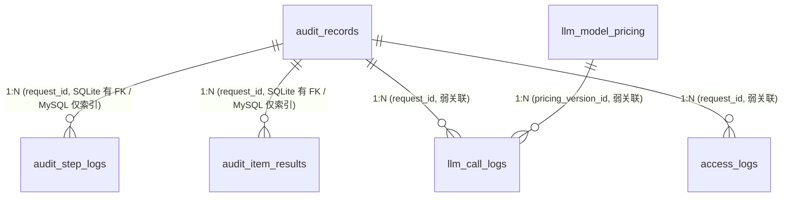

# audit_platform 数据库字典

> 最后更新：2026-08-28
> 适用版本：oa_audit v2 业务库
> 数据来源：[sub_projects/oa_audit/src/database.py](file:///e:/GitHub/AI_Agent_Platform/sub_projects/oa_audit/src/database.py) 的 `_MYSQL_DDL` + `_MYSQL_MIGRATIONS`

## 一、库概况

| 项 | 值 |
|---|---|
| 库名 | `audit_platform`（由 `.env` 的 `AUDIT_DB_NAME` 控制） |
| 字符集 / 排序 | `utf8mb4` / `utf8mb4_unicode_ci` |
| 引擎 | `InnoDB` |
| 建表方式 | SQLAlchemy `init_schema()` 启动时按 `_MYSQL_DDL` 幂等建表 + `_MYSQL_MIGRATIONS` 补列 |
| 部署 | docker-compose（[docker/mysql/docker-compose.yml](file:///e:/GitHub/AI_Agent_Platform/docker/mysql/docker-compose.yml)） + 本地直连（[scripts/setup_mysql.py](file:///e:/GitHub/AI_Agent_Platform/scripts/setup_mysql.py)） |
| 表数量 | 7 |

### 1.1 表清单与角色

| # | 表 | 行量级 | 角色 |
|---|---|---|---|
| 1 | `audit_records` | 万级 | 审核任务汇总（主表），`doc_number` 在此 |
| 2 | `audit_step_logs` | 十万级 | 9 步管线步骤日志，1:N 子表 |
| 3 | `audit_item_results` | 十万级 | 审核项结果，1:N 子表 |
| 4 | `llm_call_logs` | 百万级 | LLM 调用流水（成本/性能分析用） |
| 5 | `llm_model_pricing` | 数十级 | LLM 价目版本表（成本计算基础） |
| 6 | `users` | 数十级 | 后台账号 |
| 7 | `access_logs` | 百万级 | API 访问日志 |

### 1.2 表关系图



> **重要**：MySQL 部署下**没有任何数据库层外键**。`audit_records` 被删除时，MySQL 不会自动级联清理子表，必须由应用代码或 SQL 显式按"子表 → 主表"顺序删除。

---

## 二、audit_records — 审核任务汇总（主表）

> 表 DDL：[database.py:195-221](file:///e:/GitHub/AI_Agent_Platform/sub_projects/oa_audit/src/database.py#L195-L221)
> 写入入口：[audit_api.py:_run_audit_pipeline](file:///e:/GitHub/AI_Agent_Platform/sub_projects/oa_audit/src/api/audit_api.py)（9 步管线）
> 业务主键：`request_id`（OA 回调回写时的对账键）

| 列名 | 类型 | 约束 | 业务含义 | 取值示例 |
|---|---|---|---|---|
| `id` | INT | PK AUTO_INCREMENT | 自增主键，仅做行定位，业务不用 | `12345` |
| **`request_id`** | VARCHAR(64) | NOT NULL **UNIQUE** | 审核请求全局唯一 ID，OA 回调回查的 key | `req-20260828-001` |
| `agent_id` | VARCHAR(64) | NOT NULL | 子 Agent ID（YAML 目录名） | `purchase_contract_agent`、`expense_agent` |
| `agent_name` | VARCHAR(128) | NULL | 子 Agent 中文显示名 | `采购合同审核` |
| `form_app_id` | VARCHAR(64) | NOT NULL | OA 表单应用 ID（`workflow.yaml` 声明） | `3140761` |
| `summary_id` | VARCHAR(64) | NULL | OA 流程实例 ID（用于回查 OA 单据） | `BPM-20260828-9981` |
| **`doc_number`** | VARCHAR(64) | NULL | **OA 单据编号**（业务方查询键，**待清理空值**） | `CGHT-2026-08-001`、`EXP-001` |
| `node_token` | VARCHAR(255) | NULL | OA 当前审批节点 token（回调 OA 用） | `e7f0...` |
| `status` | VARCHAR(16) | NOT NULL DEFAULT `'pending'` | 任务状态机：`pending` → `running` → `completed` / `failed` | `pending` / `running` / `completed` / `failed` |
| `decision` | VARCHAR(16) | NULL | 9 步管线最终决策（Step8 `aggregate_decision` 写入） | `pass` / `manual` / `reject` |
| `llm_prompt` | MEDIUMTEXT | NULL | Step6 批量审核的完整 LLM 提示词（保留审计追溯） | 长 JSON / Markdown |
| `llm_result` | MEDIUMTEXT | NULL | Step6 LLM 原始返回（保留审计追溯） | JSON list |
| `report_path` | VARCHAR(512) | NULL | Step9 生成的 PDF 报告路径 | `/data/reports/202608/AuditBPM-20260828-9981.pdf` |
| `receive_time` | DATETIME | NULL | OA 推单接收时间（`/api/v1/audit/dispatch` 入站时刻） | `2026-08-28 10:00:01` |
| `complete_time` | DATETIME | NULL | 9 步管线全部结束的时间（含回调结果） | `2026-08-28 10:00:35` |
| `error_message` | TEXT | NULL | 失败原因（管线异常时填） | `Step3 attachment 下载失败：404` |
| `applicant_id` | VARCHAR(64) | NULL | 申请人 OA 账号（从 main_table.申请人 提取，2026-08-15 迁移新增） | `zhangsan` |
| `created_at` | DATETIME | DEFAULT CURRENT_TIMESTAMP | 行创建时间（一般 ≈ receive_time） | |
| `updated_at` | DATETIME | ON UPDATE CURRENT_TIMESTAMP | 最近一次状态变更时间 | |

**索引**：`agent_id` / `status` / `receive_time` / **`doc_number`** / `applicant_id`

**生命周期**：
1. `pending`：dispatch 路由创建
2. `running`：`_run_audit_pipeline` 入口改写
3. `completed` / `failed`：Step9 末尾或异常分支改写

**业务方主要查询场景**：
- `WHERE doc_number = ?` — 通过单据号查审批意见
- `WHERE agent_id = ? AND status = ?` — 审核中心列表
- `WHERE summary_id = ?` — 通过 OA 单据查内部记录

---

## 三、audit_step_logs — 9 步管线步骤日志

> 表 DDL：[database.py:223-238](file:///e:/GitHub/AI_Agent_Platform/sub_projects/oa_audit/src/database.py#L223-L238)
> 写入入口：`_run_audit_pipeline` 内 9 个 `insert_step_log` / `update_step_log`（audit_api.py:609、701、750、851、1075、1172、1359、1440、1501）
> 统计入口：[engine/stats_aggregator.py](file:///e:/GitHub/AI_Agent_Platform/sub_projects/oa_audit/src/engine/stats_aggregator.py)（按 `step_id` 聚合耗时/延迟）

| 列名 | 类型 | 约束 | 业务含义 | 取值示例 |
|---|---|---|---|---|
| `id` | INT | PK AUTO_INCREMENT | | |
| **`request_id`** | VARCHAR(64) | NOT NULL | 关联 `audit_records.request_id`（SQLite 有 FK，MySQL 仅索引） | |
| **`step_id`** | VARCHAR(64) | NOT NULL | 9 步管线固定枚举（见下表） | `step6_batch_audit` |
| `step_name` | VARCHAR(128) | NULL | 步骤中文显示名（前端 + 报表用） | `统一模型审核` |
| `action` | VARCHAR(64) | NULL | 动作英文 ID（与 `step_id` 末段一致，便于代码侧搜索） | `batch_audit` |
| `status` | VARCHAR(16) | NOT NULL | 步骤状态：`pending` / `running` / `completed` / `failed` / `skipped` | |
| `input_data` | MEDIUMTEXT | NULL | 步骤入参摘要 JSON（精简版，避免重复大字段） | 见下方各步骤说明 |
| `output_data` | MEDIUMTEXT | NULL | 步骤出参摘要 JSON | 见下方各步骤说明 |
| `start_time` | DATETIME | NULL | 步骤开始时间 | |
| `end_time` | DATETIME | NULL | 步骤结束时间 | |
| `duration_ms` | INT | NULL | 步骤耗时（毫秒） | `1283` |
| `error_message` | TEXT | NULL | 步骤失败原因 | `LLM 调用超时` |

**9 步枚举表**（来源：[stats_aggregator.py:659-667](file:///e:/GitHub/AI_Agent_Platform/sub_projects/oa_audit/src/engine/stats_aggregator.py#L659-L667)）：

| step_id | step_name | action | 关键 output_data 字段 |
|---|---|---|---|
| `step1_fetch_oa_data` | 数据预处理 | `fetch_oa_data` | `main_table`、`doc_number`、`applicant_id`、`corporate_travel_summary` |
| `step2_activate_items` | 激活审核项 | `activate_items` | `active_count`、`active_item_ids`、`inactive_item_ids` |
| `step3_dispatch_tools` | 调度工具 | `dispatch_tools` | `dispatch_result`（工具执行摘要） |
| `step4_parse_attachments` | 附件识别 | `parse_attachments` | 各 item 的 `vision_recognition` 摘要 |
| `step5_prepare_and_assemble` | 数据组装准备 | `prepare_and_assemble` | `prompt_preview`（**LLM 全量提示词**）、`prompt_meta` |
| `step6_batch_audit` | 统一模型审核 | `batch_audit` | `llm_result_format`、`llm_result_summary`（按 item 拆分） |
| `step7_split_results` | 结果拆分 | `split_results` | `item_decisions`（每个 item 的 decision / opinion / reason） |
| `step8_aggregate_decision` | 汇总决策 | `aggregate_decision` | `pass_count` / `reject_count` / `manual_count` / `reason` |
| `step9_report_and_callback` | 生成PDF报告并回调OA | `report_and_callback` | `pdf_size` / `approval_result` / `callback_success` / `callback_error` |

**索引**：`request_id`

---

## 四、audit_item_results — 审核项结果

> 表 DDL：[database.py:240-263](file:///e:/GitHub/AI_Agent_Platform/sub_projects/oa_audit/src/database.py#L240-L263)
> 写入入口：`Recorder.save_item_result`（Step7 后） + `_run_audit_pipeline` Step9 末尾补 `opinion`/`reason`/`detail`
> 渲染入口：审计详情页 + PDF 报告生成器

| 列名 | 类型 | 约束 | 业务含义 | 取值示例 |
|---|---|---|---|---|
| `id` | INT | PK AUTO_INCREMENT | | |
| **`request_id`** | VARCHAR(64) | NOT NULL | 关联 `audit_records.request_id` | |
| **`item_id`** | VARCHAR(64) | NOT NULL | 审核项 ID（YAML 目录名） | `amount_comparison`、`trip_closure` |
| `item_name` | VARCHAR(128) | NULL | 审核项中文显示名（YAML 声明） | `合同金额比对` |
| `agent_id` | VARCHAR(64) | NULL | 所属子 Agent（跨 Agent 复用项时与 audit_records.agent_id 不一致） | |
| `status` | VARCHAR(16) | NOT NULL | 单项执行状态：`pending` / `running` / `completed` / `failed` / `skipped` | |
| `decision` | VARCHAR(16) | NULL | 单项决策：`pass` / `manual` / `reject` / `skip` | `pass` |
| `extracted_data` | MEDIUMTEXT | NULL | 从 OA / 附件抽取的原始数据 JSON（按 `data_sources.yaml` 字段白名单） | 见下方示例 |
| `check_results` | MEDIUMTEXT | NULL | 程序化检查器执行结果 JSON 列表（每项 `{checker, hit, detail}`） | `[{checker: "amount_check", hit: true, detail: "..."}]` |
| **`opinion`** | TEXT | NULL | LLM 审批意见原文（来自 `审批意见` 字段） | `✅通过` / `❌不通过` / `⚠️人工复核` |
| **`reason`** | TEXT | NULL | LLM 具体原因（来自 `具体原因` 字段；PDF 报告与 OA 回调展示） | `合同金额与订单金额不一致，差 1200 元` |
| `llm_prompt` | MEDIUMTEXT | NULL | 该单项的 LLM 提示词（与 Step6 共用批审提示，单项视角可重读 Step5） | |
| `llm_result` | MEDIUMTEXT | NULL | 该单项的 LLM 返回片段（从 Step6 返回拆分） | `{"审批意见":"✅通过","具体原因":"..."}` |
| **`detail`** | MEDIUMTEXT | NULL | 综合明细 JSON（含 `summary` / `checker_summary` / `decision_path`），前端详情页折叠展示 | |
| `start_time` / `end_time` / `duration_ms` | DATETIME / DATETIME / INT | NULL | 单项执行时段 | |
| `error_message` | TEXT | NULL | 单项执行异常信息 | |

**索引**：`request_id` / `item_id` / `agent_id`

**`extracted_data` JSON 示例结构**（来自 `data_sources.yaml` 声明的字段）：

```json
{
  "合同编号": "CGHT-2026-08-001",
  "合同金额": 100000.00,
  "订单金额": 98800.00,
  "vision_recognition": { "发票号": "...", "金额": "..." }
}
```

**`detail` JSON 示例结构**：

```json
{
  "summary": "合同金额与订单金额比对通过",
  "checker_summary": "程序化检查：金额差 1200 元 > 阈值 500 元 → 需人工复核",
  "decision_path": ["llm:✅通过", "checker:hit=true", "final:manual"]
}
```

---

## 五、llm_call_logs — LLM 调用流水

> 表 DDL：[database.py:265-295](file:///e:/GitHub/AI_Agent_Platform/sub_projects/oa_audit/src/database.py#L265-L295)
> 写入入口：[tools/llm_logger.py](file:///e:/GitHub/AI_Agent_Platform/sub_projects/oa_audit/src/tools/llm_logger.py)（`log_llm_call`，LLMClient 每次调用结束异步写库）
> 业务用途：成本核算 + 延迟分析（[engine/stats_aggregator.py](file:///e:/GitHub/AI_Agent_Platform/sub_projects/oa_audit/src/engine/stats_aggregator.py) P4 性能面板）

| 列名 | 类型 | 约束 | 业务含义 | 取值示例 |
|---|---|---|---|---|
| `id` | INT | PK AUTO_INCREMENT | | |
| **`call_id`** | VARCHAR(64) | NOT NULL **UNIQUE** | LLM 单次调用 ID（UUID） | `llm-7f3a-...` |
| `request_id` | VARCHAR(64) | NULL | 关联审核任务（弱，可空：单元测试可无 request_id） | |
| `agent_id` | VARCHAR(64) | NULL | 所属 Agent | |
| **`model_category`** | VARCHAR(16) | NOT NULL | 模型类别，CHECK 约束：`text` / `vision` | `text` |
| `model_name` | VARCHAR(128) | NOT NULL | 模型名（与 `llm_model_pricing.model_name` 对应） | `gpt-4o-mini` / `qwen-vl-plus` |
| **`provider`** | VARCHAR(64) | NULL | LLM Provider 名（来自 settings.yaml `providers[].name`） | `aliyun_bailian` / `openai` |
| `endpoint` | VARCHAR(256) | NULL | API endpoint | `https://dashscope.aliyuncs.com/compatible-mode/v1` |
| **`call_purpose`** | VARCHAR(64) | NULL | 调用目的（区分业务场景，固定枚举） | 见下方枚举 |
| `status` | VARCHAR(16) | NOT NULL | `success` / `failed` / `timeout` | `success` |
| `http_status` | INT | NULL | LLM API 返回 HTTP 码 | `200` / `429` |
| `prompt_tokens` | INT | NULL | 输入 token | `1280` |
| `completion_tokens` | INT | NULL | 输出 token | `256` |
| `total_tokens` | INT | NULL | 总 token | `1536` |
| `prompt_chars` | INT | NULL | 输入字符数（用于非 token 计费模型对照） | |
| `response_chars` | INT | NULL | 输出字符数 | |
| `latency_ms` | INT | NULL | 调用耗时（毫秒） | |
| `retry_count` | INT | DEFAULT 0 | 重试次数（含最终成功的一次） | `0` / `2` |
| `error_type` | VARCHAR(64) | NULL | 错误分类（网络/超时/限流/解析失败/业务错误…） | `rate_limit` |
| `error_message` | TEXT | NULL | 错误详情 | |
| **`pricing_version_id`** | INT | NULL | 命中价目版本 ID（NULL=无对应价目，成本记 0） | |
| **`cost_rmb`** | DECIMAL(10,6) | NULL | 人民币成本（按 `pricing_version_id` 当时价目计算） | `0.002315` |
| `created_at` | DATETIME | DEFAULT CURRENT_TIMESTAMP | 调用发生时间 | |

**`call_purpose` 枚举**（来源：[audit_api.py:587, 1269](file:///e:/GitHub/AI_Agent_Platform/sub_projects/oa_audit/src/api/audit_api.py#L587) + Step4 attachment 内部）：

| 值 | 含义 |
|---|---|
| `audit_pipeline` | 管线级 context 初始化标记 |
| `batch_audit` | Step6 批量审核（text） |
| `attachment_vision` | Step4 附件识别（vision） |
| `attachment_text` | Step4 附件识别后的文本结构化（text） |
| `item_audit` | （预留）单项审核 |

**索引**：`created_at` / `model_name` / `request_id` / `status` / `agent_id`

---

## 六、llm_model_pricing — LLM 价目版本表

> 表 DDL：[database.py:297-309](file:///e:/GitHub/AI_Agent_Platform/sub_projects/oa_audit/src/database.py#L297-L309)
> 写入入口：[seed_llm_pricing.py](file:///e:/GitHub/AI_Agent_Platform/sub_projects/oa_audit/src/seed_llm_pricing.py)（种子） + [api/pricing_api.py](file:///e:/GitHub/AI_Agent_Platform/sub_projects/oa_audit/src/api/pricing_api.py)（运维增改）
> 业务用途：`llm_call_logs.cost_rmb` 按调用时刻命中的"当时价目"计算

| 列名 | 类型 | 约束 | 业务含义 | 取值示例 |
|---|---|---|---|---|
| `id` | INT | PK AUTO_INCREMENT | | |
| **`model_name`** | VARCHAR(128) | NOT NULL | 模型名 | `gpt-4o-mini` |
| **`model_category`** | VARCHAR(16) | NOT NULL | 模型类别 CHECK：`text` / `vision` | `text` |
| `input_price_per_1k` | DECIMAL(10,6) | NOT NULL | 输入价（元/千 token） | `0.001500` |
| `output_price_per_1k` | DECIMAL(10,6) | NOT NULL | 输出价（元/千 token） | `0.004500` |
| **`effective_from`** | DATETIME | NOT NULL | 生效开始 | `2026-08-01 00:00:00` |
| **`effective_to`** | DATETIME | NULL | 生效结束（NULL = 当前生效版本） | `NULL` / `2026-08-31 23:59:59` |
| `note` | TEXT | NULL | 备注（如"厂商调价"） | |
| `created_at` | DATETIME | DEFAULT CURRENT_TIMESTAMP | | |

**索引**：组合 `(model_name, model_category, effective_from)`

**生效版本判定**：调用 `llm_call_logs` 写库时，按 `(model_name, model_category)` 取 `effective_from <= now < effective_to OR effective_to IS NULL` 的那一行。

---

## 七、users — 后台账号

> 表 DDL：[database.py:311-323](file:///e:/GitHub/AI_Agent_Platform/sub_projects/oa_audit/src/database.py#L311-L323)
> 写入入口：[api/auth_api.py](file:///e:/GitHub/AI_Agent_Platform/sub_projects/oa_audit/src/api/auth_api.py)
> 鉴权用途：JWT 签发 + RBAC（admin/user）+ 双 JWT 密钥域隔离（human/service）

| 列名 | 类型 | 约束 | 业务含义 | 取值示例 |
|---|---|---|---|---|
| `id` | INT | PK AUTO_INCREMENT | | |
| `username` | VARCHAR(64) | NOT NULL **UNIQUE** | 登录名 | `admin` / `service_maxkb` |
| `password_hash` | VARCHAR(256) | NOT NULL | bcrypt 哈希 | `$2b$12$...` |
| **`role`** | VARCHAR(16) | NOT NULL DEFAULT `'user'` | 角色 CHECK：`admin` / `user` | `admin` |
| **`user_type`** | VARCHAR(16) | NOT NULL DEFAULT `'human'` | 用户类别 CHECK：`human` / `service`（2026-08-06 迁移） | `human` |
| `is_active` | TINYINT | NOT NULL DEFAULT 1 | 是否启用（`0` = 禁用，登录拒绝） | `1` |
| `created_at` | DATETIME | DEFAULT CURRENT_TIMESTAMP | | |
| `updated_at` | DATETIME | ON UPDATE CURRENT_TIMESTAMP | | |

**索引**：`username` / `user_type`

**`user_type` 与双密钥域的对应**：

| user_type | 签发密钥 | 用途 |
|---|---|---|
| `human` | `JWT_SECRET` | 管理后台浏览器登录（仅 :8099） |
| `service` | `GATEWAY_JWT_SECRET` | 上游服务（MaxKB / Celery）经 Gateway :8080 调用，Admin 创建时显式指定 |

---

## 八、access_logs — API 访问日志

> 表 DDL：[database.py:325-341](file:///e:/GitHub/AI_Agent_Platform/sub_projects/oa_audit/src/database.py#L325-L341)
> 写入入口：[main.py:311](file:///e:/GitHub/AI_Agent_Platform/sub_projects/oa_audit/src/main.py#L311)（FastAPI 中间件）
> 业务用途：审计追溯（谁在何时调过哪个 API）

| 列名 | 类型 | 约束 | 业务含义 | 取值示例 |
|---|---|---|---|---|
| `id` | INT | PK AUTO_INCREMENT | | |
| `request_id` | VARCHAR(64) | NULL | 关联审核任务（**弱**，可空：登录/查询类无对应审核任务） | |
| `method` | VARCHAR(8) | NOT NULL | HTTP 方法 | `GET` / `POST` |
| `path` | VARCHAR(256) | NOT NULL | 请求路径 | `/api/v1/audit/dispatch` |
| `status_code` | INT | NULL | 响应码 | `200` / `401` / `500` |
| `client_ip` | VARCHAR(64) | NULL | 客户端 IP | `127.0.0.1` |
| `username` | VARCHAR(64) | NULL | 调用账号（JWT 解出） | `zhangsan` / `service_maxkb` |
| `user_role` | VARCHAR(16) | NULL | 角色快照（`admin` / `user` / `service`） | `admin` |
| `duration_ms` | INT | NULL | 接口耗时（毫秒） | `123` |
| `user_agent` | VARCHAR(512) | NULL | UA 字符串 | `Mozilla/5.0 ...` |
| `created_at` | DATETIME | DEFAULT CURRENT_TIMESTAMP | 请求时刻 | |

**索引**：`created_at` / `username` / `path`

---

## 九、关系速查

| 主表 | 子表 | 关联键 | 强度 | 删除 `audit_records` 时行为 |
|---|---|---|---|---|
| audit_records | audit_step_logs | request_id | SQLite FK / MySQL 索引 | MySQL 需应用层显式先删子表 |
| audit_records | audit_item_results | request_id | SQLite FK / MySQL 索引 | 同上 |
| audit_records | llm_call_logs | request_id | 弱（可空） | 同上 |
| audit_records | access_logs | request_id | 弱（可空） | 同上 |
| llm_model_pricing | llm_call_logs | pricing_version_id | 弱（无 FK 无索引） | 价目保留历史，调用记录可独立归档 |

## 十、清理示例（doc_number 为空）

> 完整 SQL 见前几轮会话输出。本节为字段层面的口径说明：

| 表 | 清理范围 | 判定 |
|---|---|---|
| `audit_records` | `doc_number IS NULL OR TRIM(doc_number) = ''` | 主表 |
| `audit_step_logs` | `request_id IN (主表命中集合)` | 子表 |
| `audit_item_results` | `request_id IN (主表命中集合)` | 子表 |
| `llm_call_logs` | `request_id IN (主表命中集合)` | 弱关联 |
| `access_logs` | 通常**不清理**（访问日志独立审计价值）；若需清理，删除 `request_id IN (主表命中集合)` | 弱关联 |
| `llm_model_pricing` | 不清理（价目历史） | 无关 |
| `users` | 不清理 | 无关 |

## 十一、变更历史

| 日期 | 变更 |
|---|---|
| 2026-08-06 | `users.user_type` 字段新增 + CHECK 约束；引入双 JWT 密钥域 |
| 2026-08-15 | `audit_records.applicant_id` 字段新增 |
| 2026-08-15 | `audit_records.node_token` 字段新增（OA 回调用） |
| 2026-08-15 | `audit_item_results.reason` 字段新增（拆分 LLM "具体原因"） |
| 2026-08 | `llm_call_logs.cost_usd` → `cost_rmb`（数据库迁移 `_mysql_migrate_cost_column`） |
