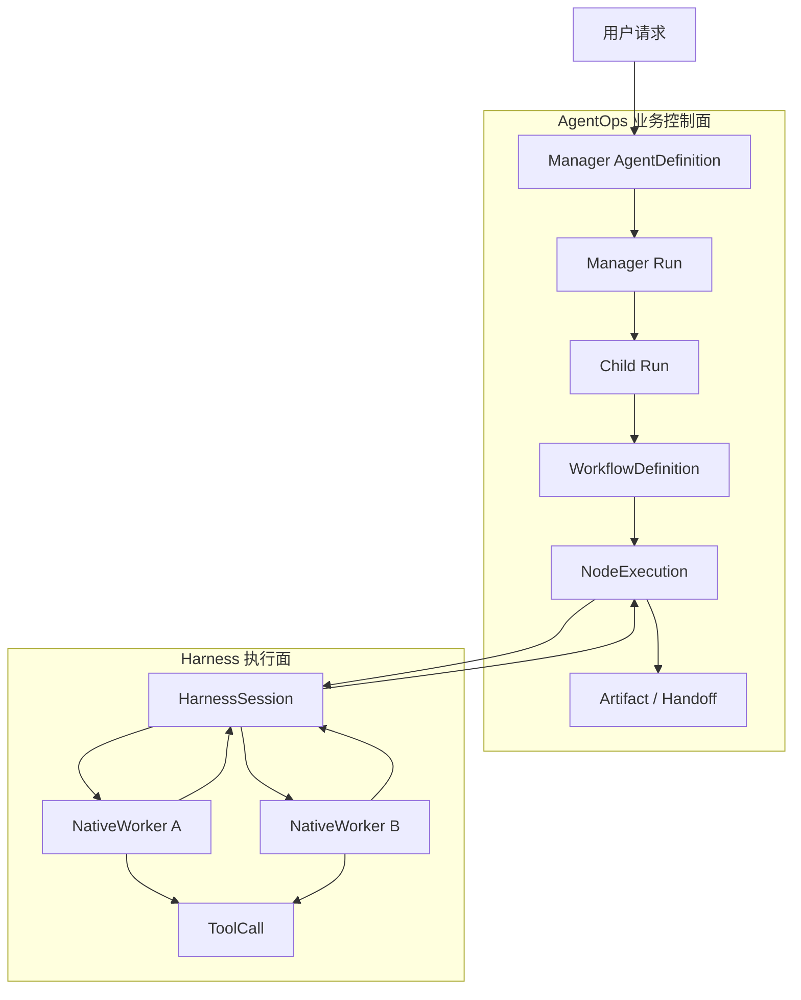
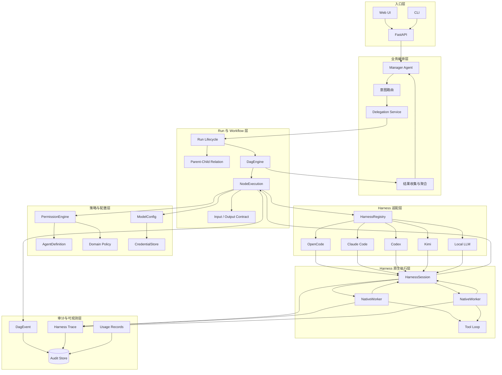
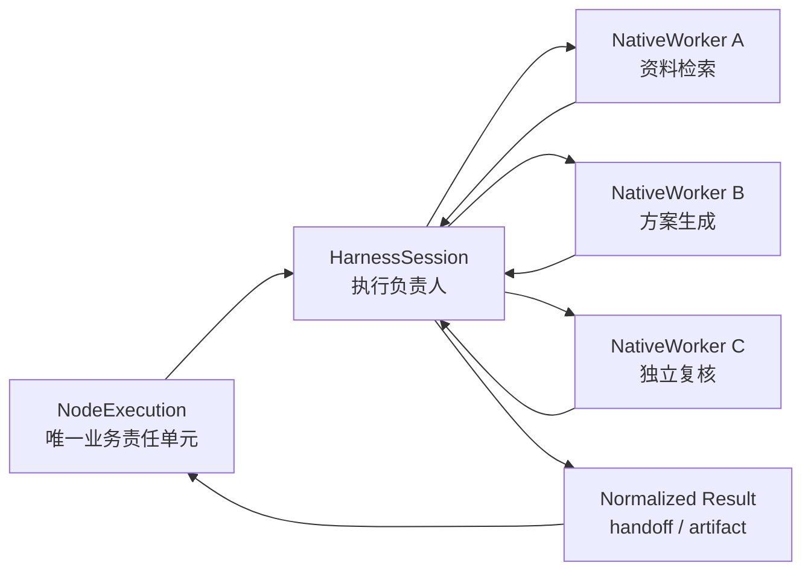
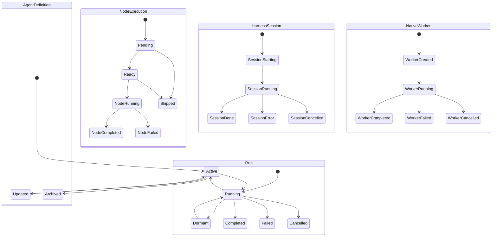
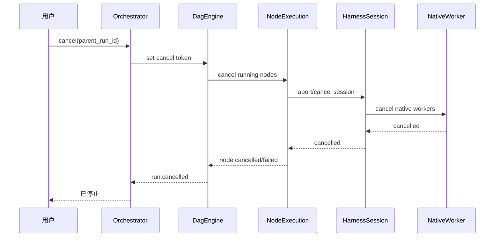
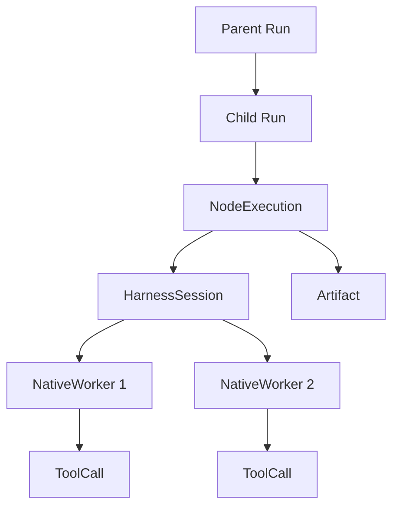
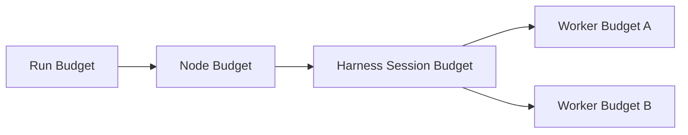
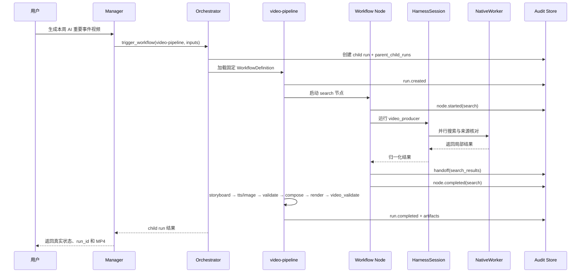
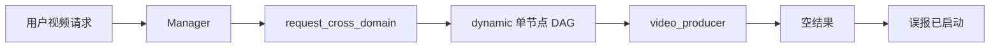
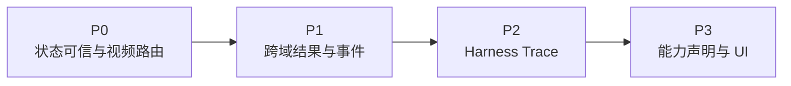

# AgentOps 业务 Agent 与 Harness 原生子 Agent 分层架构技术报告

> **文档编号**：ARC-AGENT-HARNESS-001  
> **版本**：1.0  
> **日期**：2026-07-19  
> **状态**：建议架构基线（部分能力已实现，差距项待落地）  
> **适用范围**：AgentOps Manager、业务 Agent、Workflow、Harness，以及 OpenCode、Claude Code、Codex、Kimi 等执行环境内的原生子 Agent  
> **关联文档**：[AgentOps 平台架构规划设计方案](DESIGN-architecture-v1.md)、[代码执行过程与业务逻辑](DESIGN-code-execution-and-business-logic.md)

---

## 摘要

AgentOps 同时存在两种容易混淆的“多 Agent”能力：一类是平台定义的 Manager 与业务 Agent，另一类是 OpenCode、Claude Code、Codex、Kimi 等 Harness 运行时内部提供的原生子 Agent、线程或临时工作单元。两者虽然都表现为“一个 Agent 把任务交给另一个 Agent”，但在业务身份、生命周期、权限、审计、状态归属和可移植性方面具有根本差异。

本报告提出一套控制面与执行面分离的分层模型：

1. **AgentOps Agent 是稳定的业务责任主体**，由配置定义身份、领域、权限、知识库、成本和输入输出契约。
2. **Workflow/Run 是业务任务实例与状态真相**，负责可恢复的业务拓扑、节点状态、产物和审计。
3. **Harness 是执行业务 Agent 的运行时适配层**，负责屏蔽不同模型与 Agent Runtime 的协议差异。
4. **Harness 原生子 Agent 是单次节点执行内部的临时协作者**，属于实现细节，不自动获得 AgentOps 业务身份。
5. **Manager 只编排 AgentOps 的业务 Run，不直接依赖特定 Harness 的内部子 Agent 语义**。
6. **业务状态必须由 AgentOps 证据驱动**；没有 child run、`run.created` 或 `node.started`，不得对用户宣称业务任务已启动。

该分层可避免双重编排、权限绕过、状态误报、审计断层和对特定 Harness 的锁定，并为后续接入更多 Agent Runtime 提供稳定边界。

---

## 1. 背景与问题定义

### 1.1 背景

AgentOps 的目标之一是使用统一平台管理不同业务 Agent，并允许每个 Workflow 节点选择不同 Harness 执行。目前系统同时包含：

- Manager Agent 与多个业务域 Agent；
- templated、conversational、task、hybrid 四类 RunMode；
- YAML 定义的固定 Workflow 与运行时动态 DAG；
- OpenCode、Claude Code、Codex、Kimi、local LLM、deterministic 等 Harness；
- Harness 内部可能再次创建子 Agent、线程、会话或并行工作单元。

如果没有明确分层，“业务子 Agent”和“执行器原生子 Agent”会在以下问题上发生冲突：

- Manager 到底应该调用业务 Agent，还是调用某个 Harness 的子 Agent？
- Harness 子 Agent 是否应该出现在 AgentOps 的 Agent 注册表和 DAG 中？
- Harness 子 Agent 是否能拥有独立权限、知识库和凭证？
- 一个 Harness 子 Agent 返回 `completed`，是否等于业务 Workflow 已启动或完成？
- 切换 OpenCode、Claude Code、Codex、Kimi 后，业务流程是否仍保持一致？
- 用户看到的状态、成本和审计记录应归属于哪个层级？

### 1.2 典型故障

`run_20260719_115333_833188` 暴露了该边界不清带来的直接后果：

1. 用户要求制作“本周 AI 重要事件”视频；
2. Manager 调用 `request_cross_domain(target_domain="video_production")`；
3. CrossDomainCoordinator 生成一个 `dynamic_*` 单节点 DAG；
4. 单节点调用 `video_producer`，但未加载固定的 `video-pipeline` Workflow；
5. 动态节点返回空结果 `{}`，跨域事件仍标记 `target_completed`；
6. Manager 对用户误报“视频制作已启动，目前进入搜索阶段”；
7. 审计中没有 `video-pipeline` 子 Run、没有 `search node.started`，也没有视频工作区产物。

该问题不是单纯的 Prompt 缺陷，而是业务编排与 Harness 内部执行缺少清晰架构边界。

### 1.3 报告目标

本报告解决以下核心问题：

- 定义 Manager、业务 Agent、Workflow、Harness、原生子 Agent 的关系；
- 确立控制面、执行面、工具面和审计面的职责边界；
- 规定不同任务应使用哪一层能力；
- 建立权限、生命周期、取消、成本和审计的继承规则；
- 给出 AgentOps 当前实现与目标架构之间的差距；
- 提供分阶段实施路线和可验证验收标准。

### 1.4 非目标

本报告不规定各厂商原生子 Agent 的具体 API，也不要求所有 Harness 提供相同的原生多 Agent 能力。厂商功能可以不同，但不得改变 AgentOps 的业务语义。

---

## 2. 架构结论

### 2.1 一句话定义

> **AgentOps Agent 是稳定的业务责任主体；Harness 是执行 Agent 的运行时；Harness 原生子 Agent 是该次执行内部的临时协作者。Manager 只编排 AgentOps 的业务 Run，不直接编排特定 Harness 的内部子 Agent。**

### 2.2 控制面与执行面

AgentOps 应被定义为**业务控制面**，Harness 应被定义为**执行面**。

| 层面 | 负责内容 | 不负责内容 |
|---|---|---|
| AgentOps 控制面 | 业务身份、意图路由、Workflow、Run、权限、状态、审计、产物、成本归属 | 不规定 Harness 内部如何拆分推理或并行工作 |
| Harness 执行面 | 模型调用、工具循环、文件操作、上下文管理、原生子 Agent 调度 | 不定义业务 Workflow，不自行宣布业务任务完成 |
| Harness 原生子 Agent | 节点内搜索、阅读、实现、复核、并行调查 | 不拥有独立业务域，不绕过父节点权限，不直接改变业务状态 |

### 2.3 核心不变量

1. **业务拓扑不变量**：禁用 Harness 原生子 Agent 后，Workflow 的节点、端口和完成标准仍然成立。
2. **Harness 可替换不变量**：同一业务 Agent 从 Codex 切换到 OpenCode 后，其业务身份、权限、输入输出和产物归属不变。
3. **权限不放大不变量**：任何内部子 Agent 的有效权限不得超过父节点权限。
4. **状态证据不变量**：用户可见状态必须能映射到 AgentOps Run 或 Node 事件。
5. **结果归属不变量**：原生子 Agent 的输出先返回父 Harness Session，再由父节点通过 handoff、artifact 或 final output 进入业务层。
6. **取消向下传播不变量**：取消父 Run 必须取消节点、Harness Session 和其内部全部子 Agent。
7. **成本向上归集不变量**：原生子 Agent 的 Token、工具调用和费用必须归集到所属节点与 Run。

---

## 3. 术语与对象模型

### 3.1 核心对象

| 对象 | 定义 | 是否持久配置 | 是否每次任务创建 | 是否具有业务身份 |
|---|---|---:|---:|---:|
| `AgentDefinition` | 业务角色定义，包含 agent_id、domain、Prompt、工具、知识库、成本和 Harness 策略 | 是 | 否 | 是 |
| `WorkflowDefinition` | 可重复执行的业务拓扑，定义节点、端口、边、条件和 Widget | 是 | 否 | 是 |
| `Run` | 一次业务任务实例，保存状态、输入、输出、成本和父子关系 | 否 | 是 | 是 |
| `NodeExecution` | Workflow 中一个业务节点的一次执行 | 否 | 是 | 是 |
| `HarnessSession` | 某个节点在具体执行器中的会话或进程 | 否 | 是 | 否 |
| `NativeWorker` | Harness 内部创建的原生子 Agent、线程或临时工作单元 | 否 | 按需 | 否 |
| `ToolCall` | Agent 或 NativeWorker 请求执行的类型化能力 | 否 | 按需 | 否 |
| `Artifact` | 文件、报告、音频、图像、视频等可交付产物 | 否 | 按需 | 归属于 Run/Node |
| `Handoff` | 节点之间通过声明式端口传递的数据 | 否 | 按需 | 归属于 Workflow |

### 3.2 对象层级



### 3.3 “Agent”一词的使用规范

为减少歧义，文档和代码建议使用以下命名：

| 场景 | 推荐名称 | 避免名称 |
|---|---|---|
| AgentOps 注册表中的稳定角色 | Business Agent / AgentDefinition | 泛称“子 Agent” |
| Manager 派发的独立任务实例 | Child Run / Agent Run | Harness child |
| Harness 内部并行协作者 | NativeWorker / Harness Worker | Business Agent |
| 厂商提供的线程对象 | Native Thread / Worker Thread | AgentOps Run |
| Workflow 的业务步骤 | NodeExecution | Subagent task |

在 UI 上，默认展示 Business Agent 与 Workflow Node；NativeWorker 只在“执行详情”中展开。

---

## 4. 总体分层架构

### 4.1 目标架构



### 4.2 调用方向

调用应遵循以下单向控制关系：

1. 用户调用 Manager 或明确入口 Agent；
2. Manager 调用 AgentOps 编排原语；
3. Orchestrator 创建 Run、Workflow 和 NodeExecution；
4. NodeExecution 选择并启动 HarnessSession；
5. HarnessSession 可选择创建 NativeWorker；
6. NativeWorker 只能通过父 Session 提供的工具面执行操作；
7. NativeWorker 结果返回父 Session；
8. HarnessSession 将归一化结果返回 NodeExecution；
9. NodeExecution 通过 handoff 或 artifact 进入业务 Workflow；
10. Manager 收集业务结果并回复用户。

反向直接调用被禁止：NativeWorker 不得直接修改 Run 状态，不得直接向用户宣称业务完成，不得绕过 Orchestrator 创建业务任务。

---

## 5. Manager 与业务子 Agent 的关系

### 5.1 关系本质

Manager 与业务 Agent 的关系不是“父模型调用子模型”，而是**任务合同创建者与责任履行者**。

Manager 负责：

- 识别用户意图；
- 判断直接回答、调用工具、跨域咨询、独立 Agent Run 或固定 Workflow；
- 创建可审计的 Delegation Contract；
- 获取 child run_id；
- 跟踪状态和异常；
- 收集结果并对用户负责。

业务 Agent 负责：

- 在自己的 domain 与权限边界内完成任务；
- 使用绑定知识库与工具；
- 产出符合契约的 handoff 或 artifact；
- 如实报告失败、阻塞和不完整结果；
- 不自行扩大任务范围和权限。

### 5.2 Delegation Contract

建议所有业务派发统一为以下逻辑契约：

```yaml
contract_id: dc_xxx
parent_run_id: run_parent
execution_kind: workflow | agent_task | domain_consultation
target:
  workflow_id: video-pipeline
  agent_id: video_producer
  domain: video_production
inputs:
  topic: 本周 AI 重要事件
  target_duration: 60
expected_outputs:
  - output_mp4
  - validation_result
policy:
  timeout_seconds: 3600
  cost_limit_usd: 5
  require_child_run: true
  completion_evidence:
    - run.completed
    - artifact.exists
correlation:
  request_id: xd_xxx
  initiated_by: manager
```

该契约是目标模型，不要求一次性增加新表；现有 `runs.inputs`、`parent_child_runs`、Workflow Definition 和 DagEvent 可先承载大部分字段。

### 5.3 Manager 不应感知的内容

Manager 不应依赖以下执行器内部细节：

- OpenCode 使用了多少内部 Session；
- Claude Code 是否创建 Explore/Review 类型子线程；
- Codex 如何拆分搜索和验证；
- Kimi 是否启用了内部并行；
- NativeWorker 的私有 Prompt 或上下文压缩方式。

这些内容可用于诊断和成本分析，但不能成为业务流程正确性的前提。

---

## 6. 业务 Agent 与 Harness 原生子 Agent 的关系

### 6.1 关系本质

业务 Agent 是节点交付的**唯一负责人**，NativeWorker 是其 HarnessSession 内的**临时协作者**。



### 6.2 NativeWorker 可执行的任务

适合下沉到 Harness 原生子 Agent 的任务包括：

- 并行读取多个互不依赖的文件；
- 从多个方向搜索资料；
- 独立提出候选方案；
- 一个 Worker 实现、另一个 Worker 验证；
- 大量同构对象的并行检查；
- 节点内部的质量复核或反例查找。

### 6.3 NativeWorker 不应承担的任务

以下任务应保留在 AgentOps 业务层：

- 启动一个可恢复的完整 Workflow；
- 执行需要独立权限审批的业务职责；
- 向用户提供独立会话；
- 产生需要单独 SLA、计费或审计的交付；
- 直接调用跨域业务 Agent；
- 独立持有 CredentialStore 凭证；
- 直接设置 `run.completed`、`run.failed` 或用户可见业务状态。

### 6.4 NativeWorker 晋升条件

当一个内部 Worker 满足以下多个条件时，应从执行细节晋升为 AgentOps Business Agent：

| 判断维度 | 晋升信号 |
|---|---|
| 稳定职责 | 在多次任务中承担同一长期职责 |
| 独立权限 | 需要与父 Agent 不同的 allow/deny 策略 |
| 独立知识 | 需要长期维护自己的知识库或记忆 |
| 多流程复用 | 被多个 Workflow 复用 |
| 可直接派发 | Manager 可以直接把业务请求交给它 |
| 独立交付 | 产物具有清晰输入输出合同 |
| 独立审计 | 需要单独 SLA、成本、风险和责任追踪 |
| 独立生命周期 | 需要暂停、恢复、重试或取消 |

建议规则：满足“独立权限”或“独立生命周期”任一项，或者其余条件中至少三项时，应评估晋升。

---

## 7. Workflow、跨域调用与原生子 Agent 的选择规则

### 7.1 决策表

| 任务特征 | 应使用的能力 | 原因 |
|---|---|---|
| 简单问答、无需外部动作 | Manager 直接回答 | 避免不必要编排 |
| 确定性转换、单一外部动作 | 类型化 Tool | 成本低、易权限控制和审计 |
| 可重复的多步骤业务流程 | `trigger_workflow` | 有固定拓扑、状态、恢复和产物 |
| 独立业务责任、需要自己的状态 | AgentOps Child Run | 有独立身份、权限和审计 |
| 跨域的短时、有限、无长期副作用咨询 | `request_cross_domain` | 返回有界结果，不代表启动完整 Workflow |
| 节点内部并行搜索、实现、复核 | Harness NativeWorker | 属于局部执行优化 |
| 大量同构并行任务且需要业务可见状态 | Workflow 并行节点 | 不能隐藏在 Harness 内部 |
| 需要审批、持久产物、恢复或重试 | Workflow/Child Run | 必须由 AgentOps 控制面管理 |

### 7.2 `trigger_workflow` 的语义

`trigger_workflow` 表示：

- 创建独立业务 Run；
- 分配 child run_id；
- 写入父子关系；
- 加载固定 WorkflowDefinition；
- 发出真实 `run.created` 和 `node.started`；
- 支持状态查询、取消、审计、恢复和产物归属。

完整视频生产、日志巡检、周报生成、内容策展等任务应使用该语义。

### 7.3 `request_cross_domain` 的语义

`request_cross_domain` 建议收敛为：

> 向另一个业务域请求一个有界结果，而不是隐式启动该域绑定的完整 Workflow。

适合示例：

- 询问运维域某台服务器当前健康状态；
- 请智能问数域返回一个统计结果；
- 请内容策展域评估一条素材是否值得归档。

不适合示例：

- 制作完整视频；
- 执行完整日志巡检；
- 生成并归档完整周报；
- 运行包含多个审批节点的业务流程。

如果跨域请求具有长耗时、外部副作用、持久产物或恢复需求，Coordinator 应将其升级为 Child Run，而不是继续内联执行。

### 7.4 Harness NativeWorker 的语义

NativeWorker 只表示：

> 父节点为了更高效或更可靠地完成当前节点，在执行环境内部创建的辅助线程。

NativeWorker 完成不等于 NodeExecution 完成；NodeExecution 完成也不自动等于 Workflow Run 完成。

---

## 8. 生命周期与状态模型

### 8.1 生命周期层级



### 8.2 状态归属规则

| 状态 | 唯一权威来源 |
|---|---|
| 用户会话 active/dormant | ConversationalEngine / RunState |
| Workflow running/completed/failed | DagEngine / RunState |
| Node pending/running/completed/failed/skipped | NodeExecutionState |
| Harness session running/done/error | Harness Adapter |
| NativeWorker running/completed/failed | Harness 原生事件或适配后的 trace |

低层状态不能自动覆盖高层状态。例如：

- NativeWorker completed：只表示一个内部协作者完成；
- HarnessSession done：只表示节点执行器停止；
- NodeExecution completed：只表示一个业务节点完成；
- 只有 DagEngine 满足全部拓扑和输出条件后，才能发出 `run.completed`。

### 8.3 取消传播



若某个 Harness 不支持原生取消，Adapter 应停止继续消费结果、关闭本地资源并标记“取消请求已发出但远端可能继续”，不得伪装为已立即终止。

---

## 9. 权限与安全模型

### 9.1 权限只收缩、不放大

建议有效权限采用集合交集：

`EffectivePermission = SystemPolicy ∩ DomainPolicy ∩ AgentPolicy ∩ WorkflowNodePolicy ∩ HarnessSessionPolicy ∩ NativeWorkerPolicy`

任一上层拒绝即为拒绝。NativeWorker 不得通过自身 Prompt、厂商默认工具或 Bash 获得父节点未授权的能力。

### 9.2 权限责任矩阵

| 权限类型 | AgentOps 控制面 | Harness | NativeWorker |
|---|---:|---:|---:|
| 业务域访问 | 决策 | 执行结果 | 不决策 |
| 工具 allow/deny | 决策 | 只暴露允许工具 | 只能使用已暴露工具 |
| 凭证读取 | CredentialStore 管理 | 通过 handler 注入 | 不直接读取 |
| 文件路径范围 | 节点与工具策略定义 | 强制工作区边界 | 不得越界 |
| 外部副作用 | 类型化 Tool + 审批 | 执行 | 不可绕过 Tool |
| 子 Agent 创建 | 配额与策略上限 | 实施 | 不可递归无限创建 |
| 成本预算 | Run/Node 预算 | 计量与限制 | 消耗父预算 |

### 9.3 Bash 与类型化工具

Bash 提供宽能力，但不利于权限、审计和 UI 呈现。以下操作应优先提升为类型化工具：

- 启动 Workflow；
- 发送通知；
- 数据库写操作；
- 审批提交；
- 凭证访问；
- 服务器重启；
- 删除、发布或其他难以撤销的操作。

Harness 原生子 Agent 可以使用 Bash 完成局部文件和代码任务，但不能通过 Bash 模拟平台级业务操作。

### 9.4 凭证边界

- 凭证属于 AgentOps 控制面或受控 Tool Handler；
- Agent、Harness 和 NativeWorker 只获得完成当前调用所需的最小能力；
- API key 不进入 Prompt、消息历史或 NativeWorker 私有上下文；
- Harness 原生子 Agent 不直接访问 CredentialStore；
- 所有外部调用必须带 run_id、node_id 和 tool_call_id 进行关联审计。

---

## 10. 审计与可观测性

### 10.1 两级审计模型

#### 业务审计：必须完整

业务审计回答：

- 谁创建了任务？
- Manager 派发给了哪个 Agent 或 Workflow？
- child run_id 是什么？
- 哪个节点开始、完成、失败或跳过？
- 输入、输出和产物是什么？
- 用户可见状态依据是什么？
- 总成本、错误和最终结果是什么？

现有 `runs`、`parent_child_runs`、`dag_events`、`messages`、`usage_records` 可承载这些信息。

#### 执行 Trace：按需展开

执行 Trace 回答：

- 节点用了哪个 Harness？
- Harness session ID 是什么？
- 创建了多少 NativeWorker？
- 每个 Worker 的任务、状态和用量是什么？
- 工具调用发生在哪个 Worker？
- Worker 失败是否影响父 Session？

执行 Trace 可以存储在 `raw_harness_events` 或新增统一 Span 表中，但不能代替业务审计。

### 10.2 关联层级



建议统一携带以下关联字段：

| 字段 | 用途 |
|---|---|
| `parent_run_id` | Manager 与子任务关联 |
| `run_id` | 业务任务实例 |
| `node_id` | Workflow 节点 |
| `harness` | 执行器类型 |
| `harness_session_id` | 执行器会话 |
| `native_worker_id` | 原生子 Agent/线程 |
| `request_id` | 跨域请求或委派请求 |
| `tool_call_id` | 工具调用 |
| `artifact_id/path` | 交付物 |

### 10.3 建议新增的 Trace 事件

以下为目标事件，不要求与业务 DagEvent 使用同一枚举：

- `harness.session.started`
- `harness.session.completed`
- `harness.session.failed`
- `harness.session.cancelled`
- `harness.worker.started`
- `harness.worker.progress`
- `harness.worker.completed`
- `harness.worker.failed`
- `harness.worker.cancelled`

业务事件仍以现有 `run.*`、`node.*`、`widget.*`、`usage` 和 `cross_domain` 为准。

### 10.4 用户可见状态证据

| 用户文案 | 最低证据要求 |
|---|---|
| “任务已派发” | child run_id 或明确 consultation request_id |
| “Workflow 已启动” | 对应 `run.created` |
| “进入搜索阶段” | `node.started` 且 node_id=`search` |
| “搜索已完成” | `node.completed` 且输出满足契约 |
| “视频已生成” | `render node.completed` + MP4 artifact 存在 |
| “任务已完成” | `run.completed` + 必需 outputs/artifacts 验证通过 |

任何 Harness 文本、NativeWorker `completed` 或空对象结果，都不足以支撑上述业务状态。

---

## 11. 成本、并发与资源治理

### 11.1 预算层级



建议规则：

- Run 预算是业务硬上限；
- Node 预算从 Run 预算中分配；
- HarnessSession 与 NativeWorker 共享 Node 预算；
- NativeWorker 不拥有独立于父节点之外的额度；
- 所有 Worker 用量最终向上汇总到 Node 和 Run；
- 超预算时先停止创建新 Worker，再取消低优先级 Worker，最终 fail-loud。

### 11.2 并发上限

建议同时限制：

- 单 Run 最大并行节点数；
- 单 Node 最大 NativeWorker 数；
- 单 Agent 最大并发 Run；
- 单 Provider 最大并发请求；
- 单用户/租户最大总成本；
- NativeWorker 最大递归深度。

默认建议只允许一层 Harness 原生子 Agent。若厂商运行时支持递归子 Agent，Adapter 仍应通过配置限制深度，避免指数级扩张。

### 11.3 失败归集

NativeWorker 失败分为：

| 类型 | 父节点处理 |
|---|---|
| 可选 Worker 失败 | 父 Session 可继续，但需在 Trace 记录降级 |
| 必需 Worker 失败 | 父 Session 应重试、替换 Worker 或失败 |
| 权限拒绝 | 不重试扩大权限，如实返回 |
| 超时 | 按 Node 策略取消并决定 fallback |
| Provider 临时错误 | 可按显式 FallbackChain 处理 |
| 协议/配置错误 | fail-loud，不静默切换 |

---

## 12. Harness 可移植性契约

### 12.1 可移植性目标

业务 Agent 不应与某个 Harness 的原生子 Agent API 绑定。以下代码和配置属于稳定面：

- AgentDefinition；
- WorkflowDefinition；
- 输入输出端口；
- ToolDefinition；
- PermissionPolicy；
- DagEvent；
- Artifact 与 workspace 规范。

以下内容属于适配面：

- Harness session 创建方式；
- 原生子 Agent/线程 API；
- 厂商特有工具事件；
- 上下文压缩与缓存；
- 原生取消、恢复和会话持久化；
- Token 字段与错误格式。

### 12.2 Harness 能力声明

建议 Harness Adapter 暴露能力矩阵：

```yaml
harness: opencode
capabilities:
  native_workers: true
  native_worker_events: partial
  cancellation: false
  session_resume: true
  shared_workspace: true
  tool_permission_intercept: true
  usage_per_worker: false
```

Orchestrator 根据能力决定是否启用优化，但不能改变业务合同：

- `native_workers=false`：父 Agent 自己完成节点；
- `native_worker_events=partial`：只提供 Session 级 Trace；
- `cancellation=false`：标注远端取消限制；
- `usage_per_worker=false`：费用汇总到 Session；
- 任何能力缺失都不能让业务 Workflow 消失。

### 12.3 归一化输出

所有 Harness 最终应归一化为现有 AgentEvent 和节点输出：

- TEXT：可见进度或最终文本；
- TOOL_USE/TOOL_RESULT：工具调用；
- USAGE：Token 与成本；
- ERROR：结构化错误；
- DONE：执行器结束；
- HANDOFF/ARTIFACT：业务输出由 AgentOps 层确认。

厂商原生 `completed` 只能映射为 HarnessSession DONE，不能直接映射为 Workflow `run.completed`。

---

## 13. 视频生产案例

### 13.1 正确业务链路



### 13.2 Harness 内部并行示例

在 `storyboard` 节点中，Harness 可以创建：

- Worker A：整理新闻事实和来源；
- Worker B：生成分镜候选；
- Worker C：检查旁白风格与“去 AI 味”；
- Worker D：检查时长和信息密度。

但 AgentOps 仍只认 `storyboard` 节点的统一输出：

- `storyboard` port；
- `narration` port；
- 对应文件 artifact；
- 节点 Token、耗时和状态。

### 13.3 错误链路分析

当前错误链路为：



问题点包括：

1. Manager Prompt 没有明确完整视频任务必须走 `video-pipeline`；
2. CrossDomainCoordinator 只构造单节点动态 DAG；
3. `video_producer` 的完整职责依赖 Workflow 节点上下文；
4. 动态节点没有输出端口，结果被收成 `{}`；
5. 空结果未被视为失败；
6. 嵌套事件 sequence 与父 Run 冲突，内部事件未正常展示；
7. Manager 在没有 child run 和 `search node.started` 的情况下生成了进度文案。

### 13.4 修复后的最低验收证据

完整视频任务启动后必须同时满足：

- `parent_child_runs` 存在 Manager Run → video-pipeline Run；
- `runs.workflow_id = 'video-pipeline'`；
- `run.created` 已落库；
- `node.started` 的 node_id 为 `search`；
- Manager 回复包含真实 child run_id；
- workspace 路径为 `workspace/video-pipeline/{child_run_id}/`；
- 最终完成需要 MP4 artifact 和视频质检结果。

---

## 14. 当前实现与目标架构的映射

### 14.1 已具备能力

| 目标能力 | 当前实现 |
|---|---|
| Agent 稳定定义 | [config/agents/](../../config/agents/) |
| Domain 与工具权限 | [config/domains/](../../config/domains/)、[PermissionEngine](../../orchestrator/permission_engine.py) |
| 固定业务 Workflow | [workflows/](../../workflows/) |
| Harness 统一注册与创建 | [HarnessRegistry](../../harness/register.py)、[DagEngine 节点执行](../../workflow/engine.py#L760-L855) |
| 业务事件 | [DagEvent 协议](../../orchestrator/protocol.py)、[EventStore](../../audit/store.py) |
| 父子 Run 关系 | [trigger_workflow](../../tools/trigger_workflow.py#L129-L155)、[parent_child_runs DDL](../../audit/store.py#L131-L143) |
| 跨域协调 | [CrossDomainCoordinator](../../orchestrator/cross_domain.py) |
| 文件产物与 handoff | [DagEngine finalize](../../workflow/engine.py#L418-L470) |

### 14.2 当前差距

| 优先级 | 差距 | 影响 |
|---|---|---|
| P0 | Manager 未把完整视频任务稳定路由到 `video-pipeline` | 业务任务未启动却误报 |
| P0 | CrossDomain 空结果仍标记 completed | 状态语义不可信 |
| P0 | 用户可见状态缺少证据校验 | 可能继续产生虚假进度 |
| P1 | 嵌套 DAG 事件 sequence 未重新映射 | 内部节点事件丢失 |
| P1 | Dynamic DAG 节点未声明默认结果 port | 跨域结果固定为空或丢失 |
| P1 | `raw_harness_events` 缺少稳定写入路径 | Harness 工具与子 Agent 行为不可追踪 |
| P1 | 尚无统一 HarnessSession/NativeWorker Trace 模型 | 厂商事件难以横向比较 |
| P2 | Harness 能力没有显式声明 | Orchestrator 无法安全启用原生优化 |
| P2 | NativeWorker 成本和并发预算未统一 | 可能出现成本不可见和递归扩张 |
| P2 | UI 没有业务层与执行层双层视图 | 用户容易把 Worker completed 当成业务 completed |

---

## 15. 目标接口与数据设计

### 15.1 委派接口

建议长期将 Manager 的业务派发统一为一个控制面服务，而不是让 Prompt 自行拼接多个工具语义：

```python
await delegation_service.dispatch(
    parent_run_id=parent_run_id,
    execution_kind="workflow",
    workflow_id="video-pipeline",
    inputs={"topic": topic, "target_duration": 60},
)
```

现阶段可继续使用 `trigger_workflow`，但 Tool 描述和 Manager Prompt 必须写清触发条件。

### 15.2 结果结构

建议统一返回：

```json
{
  "dispatch_status": "started",
  "execution_kind": "workflow",
  "parent_run_id": "run_parent",
  "child_run_id": "run_child",
  "workflow_id": "video-pipeline",
  "agent_id": "video_producer",
  "evidence": {
    "run_created": true,
    "first_node_started": "search"
  }
}
```

禁止用无 child run 的 `{status: "completed", result: {}}` 表示长流程已经启动。

### 15.3 Trace 数据模型

可在现有 `raw_harness_events` 上扩展字段，或新增 `execution_spans`：

```yaml
span_id: span_xxx
parent_span_id: span_parent
run_id: run_xxx
node_id: storyboard
harness: codex
harness_session_id: hs_xxx
native_worker_id: worker_xxx
span_type: harness_session | native_worker | tool_call
status: running | completed | failed | cancelled
started_at: 2026-07-19T12:00:00Z
finished_at: null
usage:
  input_tokens: 0
  output_tokens: 0
metadata: {}
```

业务 DagEvent 与执行 Span 分开保存，但通过 run_id/node_id 关联。

---

## 16. 实施路线

### 16.1 P0：恢复业务语义可信度

1. 在 Manager Agent 配置中明确列出 `video-pipeline`；
2. 完整视频制作必须直接调用 `trigger_workflow`；
3. Manager 回复“已启动”前校验 child run_id；
4. 空 `{}`、空字符串和无 output port 的跨域结果不得标记为有效业务完成；
5. 增加 `run_20260719_115333_833188` 场景回归测试。

### 16.2 P1：修复跨域结果与事件链

1. Dynamic DAG 声明默认 `result` output port；
2. CrossDomainCoordinator 传递 request_id、parent_run_id 和独立 child execution identity；
3. 嵌套事件进入父流前重新分配单调 sequence；
4. 对长耗时、产物型或副作用型跨域任务强制升级为 Child Run；
5. 恢复 `raw_harness_events` 的实际持久化。

### 16.3 P2：建立 Harness 执行 Trace

1. 引入 `HarnessSessionSpan` 与 `NativeWorkerSpan`；
2. 为每个 Harness 编写原生事件归一化适配；
3. Worker Token、工具调用和错误向 Node 聚集；
4. 建立 Node 级 Worker 并发和成本上限；
5. 统一取消向 Harness 和 Worker 传播。

### 16.4 P3：能力声明与 UI 分层

1. Harness Adapter 暴露 capabilities；
2. UI 默认展示业务 DAG；
3. 节点详情支持展开 HarnessSession 和 NativeWorker；
4. 区分“业务状态”与“执行 Trace”；
5. 提供按 Run、Node、Harness、Worker 的成本分析。

### 16.5 实施顺序



---

## 17. 验证与测试策略

### 17.1 功能测试

| 编号 | 场景 | 预期结果 |
|---|---|---|
| T1 | Manager 收到完整视频请求 | 创建独立 `video-pipeline` child run |
| T2 | Manager 收到短时跨域咨询 | 可使用 `request_cross_domain`，返回非空有界结果 |
| T3 | CrossDomain 返回空结果 | 标记 failed/incomplete，不得 completed |
| T4 | 节点使用 Harness NativeWorker | Workflow 拓扑不新增业务节点 |
| T5 | 禁用 NativeWorker | 节点仍能串行完成，业务语义不变 |
| T6 | Codex 切换为 OpenCode | 输入输出端口、Run 和 Artifact 结构不变 |
| T7 | NativeWorker 请求越权工具 | PermissionEngine 拒绝并记录审计 |
| T8 | 取消父 Run | 节点、Session、Worker 全部停止或明确标注限制 |
| T9 | Worker 产生 Token | 用量归集到 Node 和 Run |
| T10 | UI 展开节点详情 | 业务状态与执行 Trace 分层显示 |

### 17.2 视频任务验收

最小自动化断言：

```text
parent_child_runs.parent_run_id == manager_run_id
runs[child_run_id].workflow_id == "video-pipeline"
dag_events(child_run_id) contains run.created
dag_events(child_run_id) contains node.started where node_id == "search"
manager response contains child_run_id
manager response must not claim render/completed before corresponding evidence
```

### 17.3 Harness 可移植性测试

对同一测试 Workflow 分别使用两个 Harness，比较：

- 节点状态序列；
- 输出 port 名称；
- Artifact 路径；
- 错误分类；
- 取消行为；
- Usage 是否完整；
- 是否存在未经授权的工具调用。

不要求模型文本逐字一致，但业务协议必须一致。

### 17.4 审计完整性测试

每次包含 NativeWorker 的执行至少应能关联：

`parent_run_id → child_run_id → node_id → harness_session_id → native_worker_id → tool_call_id`

若厂商不提供 worker ID，允许退化为 Session 级 Trace，但必须显式标记能力缺失，不能伪造 Worker 级审计。

---

## 18. 风险与权衡

| 风险 | 表现 | 缓解措施 |
|---|---|---|
| 双重编排 | AgentOps DAG 与 Harness 子 Agent 同时承担业务拓扑 | 业务拓扑只存在于 AgentOps；NativeWorker 仅做节点内优化 |
| 身份膨胀 | 每个临时 Worker 都注册成业务 Agent | 使用晋升条件，默认保持 NativeWorker |
| 权限绕过 | 子 Agent 通过 Bash 或厂商默认工具扩大权限 | 权限交集、类型化工具、父 Session 工具过滤 |
| 状态误报 | Harness completed 被解释为 Workflow completed | 引入证据门槛，状态只由对应层权威组件产生 |
| 审计断层 | 子 Agent 工具和成本不可见 | Harness Trace、关联 ID、Usage 向上归集 |
| 厂商锁定 | Workflow 依赖某家子 Agent API | Harness capabilities + 归一化协议 |
| 成本失控 | 子 Agent 递归并发 | 深度、并发、Token 和成本预算 |
| 取消不彻底 | 父 Run 已取消但远端 Session 继续 | 能力声明、取消传播和状态诚实标注 |
| 结果丢失 | 动态节点无 output port | 默认 result port + 空结果校验 |
| UI 混淆 | 用户看到 Worker completed 误以为业务完成 | 业务视图与执行 Trace 双层展示 |

### 18.1 为什么不把所有协作都放进 AgentOps

优点是审计完整，但会导致：

- DAG 过度膨胀；
- 临时并行工作也需要长期 Agent 配置；
- 大量微型 Run 带来数据库和 UI 噪声；
- 失去厂商原生 Agent Runtime 的效率优势。

因此节点内部的短时并行应保留在 Harness。

### 18.2 为什么不把所有协作都交给 Harness

优点是实现简单，但会导致：

- 业务拓扑不可见；
- 无法统一恢复和重试；
- 权限与凭证难以治理；
- 状态、成本和产物归属不清；
- 更换 Harness 时业务逻辑失效。

因此长期业务过程必须保留在 AgentOps。

---

## 19. 架构决策记录

### ADR-001：AgentOps 是业务状态唯一真相源

- **决策**：Run、Node、Artifact 和用户可见状态由 AgentOps 控制面管理。
- **原因**：保证跨 Harness 一致性、审计、恢复和 UI 回放。
- **后果**：Harness 原生状态需要归一化，不能直接成为业务状态。

### ADR-002：Harness 原生子 Agent 默认为执行细节

- **决策**：原生子 Agent 不自动注册为 Business Agent，不自动创建业务 Run。
- **原因**：避免身份膨胀、厂商锁定和双重编排。
- **后果**：需要 Harness Trace 才能查看其内部行为。

### ADR-003：业务副作用必须通过 AgentOps 类型化工具

- **决策**：启动 Workflow、审批、通知、数据库写入等操作不能依赖 Bash 模拟。
- **原因**：需要权限、确认、审计和 UI 呈现。
- **后果**：需持续将高价值副作用提升为专用工具。

### ADR-004：完整视频生产必须启动固定 Workflow

- **决策**：完整视频请求直接触发 `video-pipeline`，不以 `request_cross_domain(video_production)` 代替。
- **原因**：视频生产是可恢复、多步骤、产物型业务过程。
- **后果**：Manager 必须获得并返回真实 child run_id。

### ADR-005：原生多 Agent 是可选优化

- **决策**：业务正确性不得依赖 Harness 是否支持原生子 Agent。
- **原因**：保证 Harness 可替换和降级能力。
- **后果**：无原生子 Agent 时允许父 Agent 串行执行。

---

## 20. 结论

AgentOps 与 OpenCode、Claude Code、Codex、Kimi 的原生多 Agent 能力不是重复建设，而是两个不同层级：

- AgentOps 负责**业务角色、业务流程、状态、权限、审计和结果责任**；
- Harness 负责**模型与工具执行、上下文管理和局部任务优化**；
- Harness 原生子 Agent 负责**节点内部的临时并行与协作**。

Manager 与业务 Agent 的关系应被建模为“任务合同与责任交付”，而不是“一个 LLM 随意调用另一个 LLM”。业务 Agent 与 Harness 原生子 Agent 的关系应被建模为“节点负责人和内部工作线程”，而不是两个同级业务实体。

该架构最重要的衡量标准不是系统里有多少个 Agent，而是：

1. 每个业务任务是否有明确责任主体；
2. 每个用户可见状态是否有可验证证据；
3. 每次外部动作是否经过权限和审计；
4. 每个结果是否能追溯到 Run、Node 和 Artifact；
5. 更换 Harness 后业务语义是否保持稳定；
6. 原生子 Agent 的性能优势是否能在不破坏控制面的前提下被安全利用。

最终目标是形成“**AgentOps 控制业务，Harness 执行任务，NativeWorker 优化局部**”的清晰分工，使平台同时获得企业级治理能力与各类 Agent Runtime 的原生执行效率。

---

## 附录 A：相关实现索引

| 主题 | 实现位置 |
|---|---|
| Manager Agent 配置 | [config/agents/manager.yaml](../../config/agents/manager.yaml) |
| 视频 Agent 配置 | [config/agents/video_producer.yaml](../../config/agents/video_producer.yaml) |
| 视频 Workflow | [workflows/video-pipeline.yaml](../../workflows/video-pipeline.yaml) |
| CrossDomainCoordinator | [orchestrator/cross_domain.py](../../orchestrator/cross_domain.py) |
| ConversationalEngine | [orchestrator/conversational.py](../../orchestrator/conversational.py) |
| LocalSdkOrchestrator | [orchestrator/local_sdk.py](../../orchestrator/local_sdk.py) |
| DagEngine | [workflow/engine.py](../../workflow/engine.py) |
| Harness Protocol | [harness/protocol.py](../../harness/protocol.py) |
| Harness Registry | [harness/register.py](../../harness/register.py) |
| Workflow 触发工具 | [tools/trigger_workflow.py](../../tools/trigger_workflow.py) |
| 权限引擎 | [orchestrator/permission_engine.py](../../orchestrator/permission_engine.py) |
| 审计存储 | [audit/store.py](../../audit/store.py) |
| DAG 事件协议 | [orchestrator/protocol.py](../../orchestrator/protocol.py) |

## 附录 B：评审检查表

- [ ] 业务 Agent 是否具有稳定职责和输入输出契约？
- [ ] 该任务是否真的需要 Agent，而不是一个 Tool？
- [ ] 多步骤流程是否已建模为 Workflow？
- [ ] 长耗时或产物型跨域任务是否创建 Child Run？
- [ ] NativeWorker 是否仅用于节点内部优化？
- [ ] NativeWorker 权限是否不超过父节点？
- [ ] 用户可见状态是否有 Run/Node/Artifact 证据？
- [ ] Harness 切换后业务协议是否保持一致？
- [ ] 取消是否能向 Harness 和 Worker 传播？
- [ ] Worker 用量是否归集到 Node 和 Run？
- [ ] 是否存在空结果却标记 completed 的路径？
- [ ] 是否能从 parent_run_id 追踪到 ToolCall 和 Artifact？
