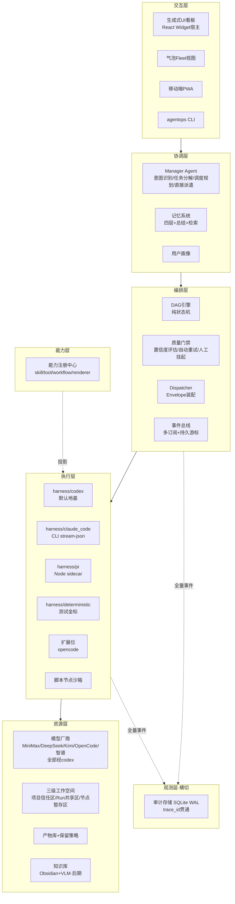
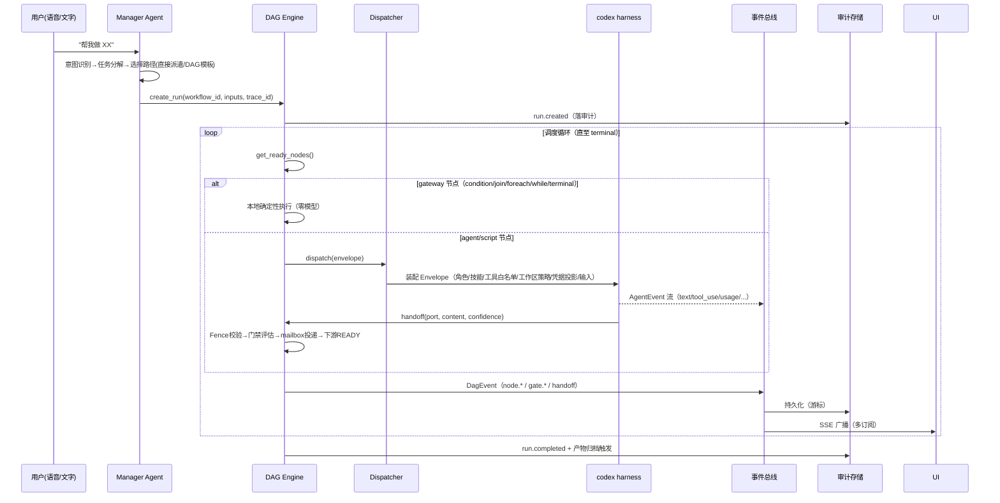
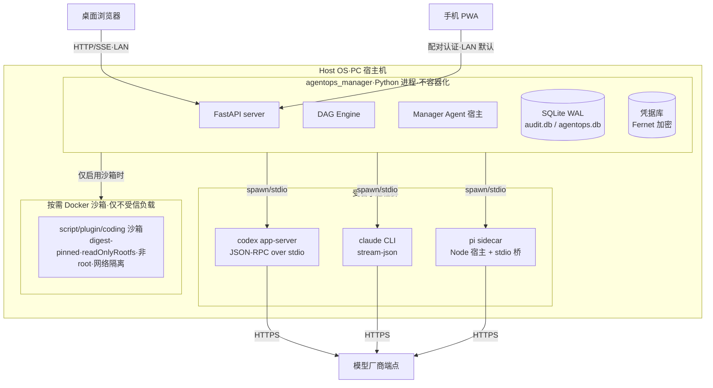
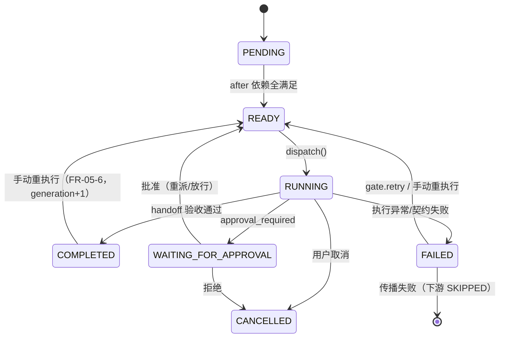
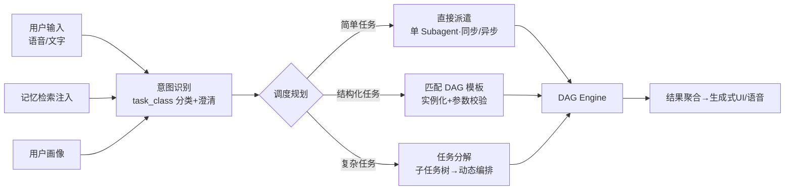
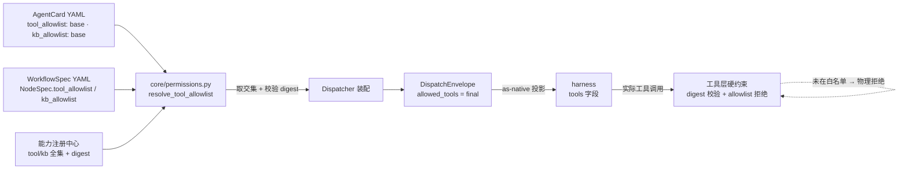
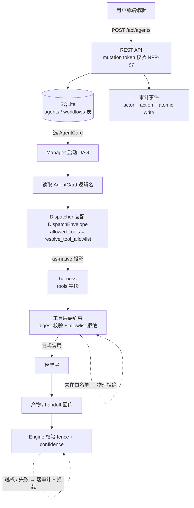
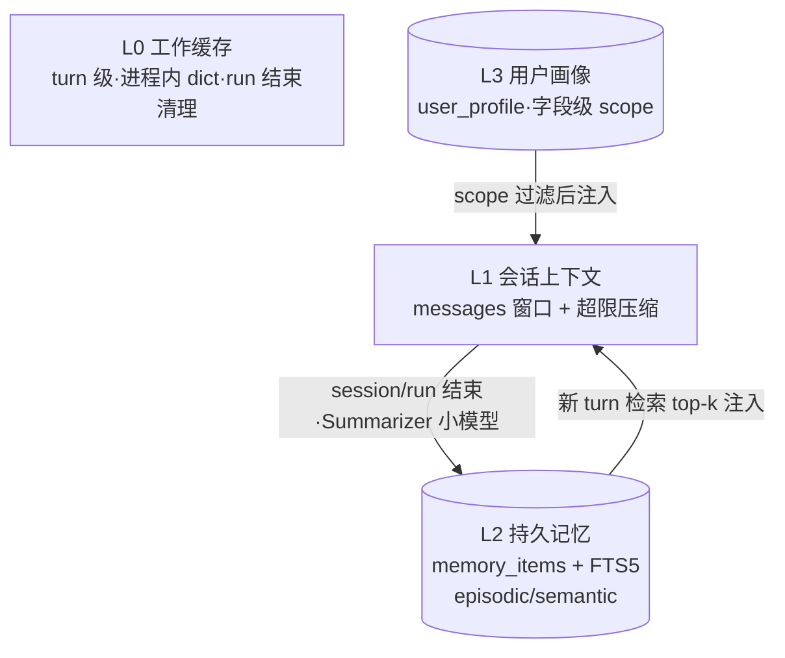
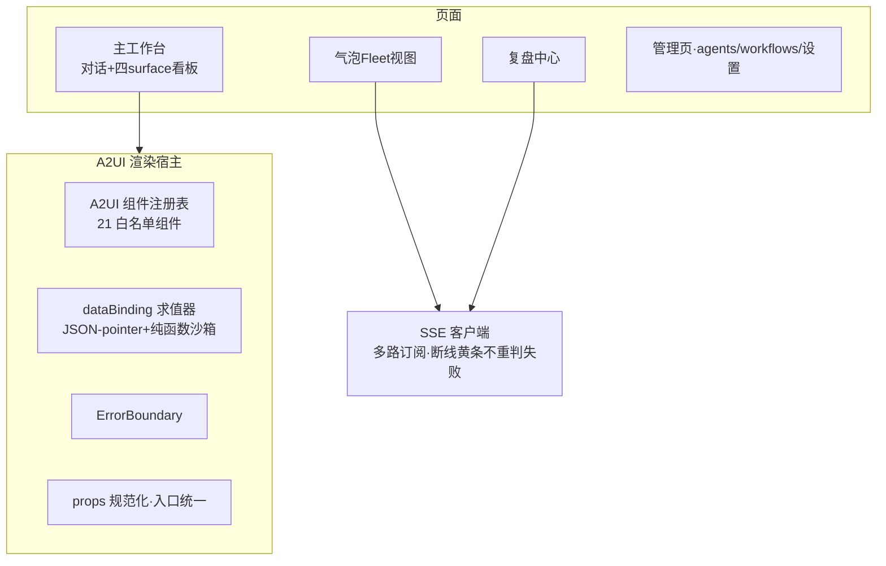

# AgentOps 总体架构设计（HLD）

> **文档版本**：v1.3（2026-07-30 修订：整合 `docs/research/agent-tool-kb-permission-design.zh-CN.md` 专题——§3.2 NodeSpec 加工具白名单合并语义与 AO_E_TOOL_ESCALATION；§3.4 AgentCard 加 KB ACL tag 格式；新增 §4.4.x 权限装配（Defense in Depth））
> **创建时间**：2026-07-29
> **依据**：`docs/agentops-platform-prd-2026-07-29.md` v1.4（需求编号 FR-xx / NFR-xx 全程回引）
> **项目形态**：全新 Python 3.11+ 工程（绿地重写），工程根 `E:\Project\Agent_Ops`
> **文档约定**：架构图一律 Mermaid；代码骨架为可落地的接口契约（非伪代码），注释用中文
> **读者**：开发者（含 AI 结对）、评审者

---

## 目录

1. [架构目标与决策总表](#1-架构目标与决策总表)
2. [总体架构](#2-总体架构)（含 2.4 仓库目录结构）
3. [核心协议设计（agentops/core）](#3-核心协议设计agentopscore)
4. [模块设计](#4-模块设计)（含 4.4.1 权限装配、4.10 config 配置文件设计）
5. [数据存储设计](#5-数据存储设计)
6. [安全设计](#6-安全设计)
7. [详细任务拆分（WBS）](#7-详细任务拆分wbs)
8. [实施计划](#8-实施计划)（含 8.4 测试策略）
9. [FR/NFR 追踪矩阵](#9-frnfr-追踪矩阵)
10. [附录](#10-附录)

---

## 1. 架构目标与决策总表

### 1.1 架构目标

| 目标 | 对应 PRD | 衡量标准 |
|---|---|---|
| 协议先行，契约为唯一真相源 | NFR-E1/E5 | 所有跨模块数据交换经 `core/` pydantic 模型，无裸 dict 传递 |
| 一切可观测、可审计 | FR-14、P10 | 任一产物可经 trace_id 反查全链路事件 |
| Harness 多产品可选（codex/Claude Code/pi），抽象可插拔 | §3.5、FR-10 | deterministic 金标对照，换 harness 不改业务代码 |
| 质量内建于流程 | FR-05、P6 | 节点产出必带置信度，门禁决策全量落审计 |
| 右尺寸工程化 | §1.1 教训清单 | 单文件 ≤500 行；SSE 多订阅；全仓 UTF-8 无 BOM |

### 1.2 技术选型决策

| # | 决策点 | 选定 | 理由 / 否决项 |
|---|---|---|---|
| D1 | 语言 | Python 3.11+ | 团队与前代积累；否决 TS 全栈（参考实现栈，团队不熟） |
| D2 | Web 框架 | FastAPI + uvicorn | 前代验证；原生 OpenAPI 文档；否决 Flask（异步弱） |
| D3 | 数据校验 | pydantic v2 | 协议层的核心；`model_config = ConfigDict(frozen=True)` 默认不可变 |
| D4 | 存储 | SQLite（WAL）stdlib `sqlite3` + `asyncio.to_thread` | 零依赖、本地优先；否决 SQLAlchemy（现阶段过度工程，schema 用手写 migration + `PRAGMA user_version`） |
| D5 | 全文检索 | SQLite FTS5 | 记忆检索 v1 够用；向量库为 Q6 预留 |
| D6 | 前端 | React 18 + Vite + TypeScript | 前代验证；组件库 AntD 5（管理页）+ 自研 Widget 渲染宿主（生成式 UI） |
| D7 | Harness 基座 | **多产品可选（首批：codex / Claude Code / pi）**，统一"受管子进程 + stdio JSON-RPC"接入；codex 为默认地基 | 用户拍板（§3.5）；Python 后端下三者均为外部进程；pi 因 Windows socket 问题走 sidecar 嵌入 |
| D8 | 事件机制 | 进程内多订阅 EventBus + SQLite 持久化游标 + SSE 广播 | 修复前代"SSE 单队列争抢"教训 |
| D9 | 进程模型 | 单 Manager 进程 + codex 受管子进程 + 按需 Docker 沙箱 | §4.4 右尺寸部署 |
| D10 | 密钥/签名 | Fernet（凭据）+ Ed25519（`cryptography`，turn envelope 签名） | 前代验证 Fernet；Ed25519 借鉴参考实现 |
| D11 | 测试 | pytest + deterministic 金标 + 契约测试套件 | NFR-E3/E4 |
| D12 | 代码规范 | ruff + 单文件 ≤500 行 + 全仓 UTF-8 无 BOM | 前代编码事故教训 |

---

## 2. 总体架构

### 2.1 分层架构



### 2.2 运行时拓扑（一次 DAG Run 的生命周期）



### 2.3 部署视图



**关键规则**：Manager 不容器化（secrets/SQLite/信号）；harness 受管子进程化（崩溃可感知可重启）；容器沙箱仅在执行不受信负载时启用（NFR-S9~S11）。

### 2.4 仓库目录结构

```text
E:\Project\Agent_Ops\                ← 工程根
├── docs/                            # 全部项目文档（PRD/架构设计/调研）
│   └── research/                    # 调研专题
├── agentops/                        # Python 主包
│   ├── core/                        # 协议与契约（纯契约，零实现依赖，单文件 ≤500 行）
│   │   ├── events.py                # AgentEvent/DagEvent/AuditEvent + trace_id
│   │   ├── dag_spec.py              # WorkflowSpec/NodeSpec/EdgeSpec/QualityGateSpec
│   │   ├── envelope.py              # DispatchEnvelope/Handoff/TransportFence
│   │   ├── agent_card.py            # AgentCard 胜任模型
│   │   ├── permissions.py           # 工具/KB 白名单合并（resolve_tool_allowlist + resolve_kb_allowlist）
│   │   ├── a2ui_catalog.py          # A2UI 组件/纯函数目录（单一真相源，锁定上游 commit）
│   │   ├── a2ui_ir.py               # A2UI 节点/文档/事务模型 + schema 校验
│   │   ├── a2ui_eval.py             # dataBinding 解析 + 纯函数沙箱求值
│   │   ├── memory.py                # MemoryItem/UserProfile 模型
│   │   ├── errors.py                # 错误码三元组
│   │   └── ids.py                   # trace_id/span_id/run_id 生成
│   ├── orchestrator/                # DAG 引擎（纯状态机）+ 调度 + 门禁
│   │   ├── engine.py                # DagEngine 状态机
│   │   ├── state.py                 # NodeState/RunState 枚举与转移表
│   │   ├── dispatcher.py            # Envelope 装配与派发接口
│   │   ├── quality_gate.py          # 置信度评估/重试策略/挂起
│   │   ├── script_runner.py         # 脚本节点执行（受限命名空间）
│   │   └── gateways.py              # condition/join/foreach/while/terminal 本地执行
│   ├── manager/                     # Manager Agent
│   │   ├── agent.py                 # 意图识别/任务分解/调度规划主流程
│   │   ├── prompts.py               # system prompt 组装
│   │   ├── direct_dispatch.py       # 直接派遣（同步/异步）
│   │   └── intervention.py          # live-steer/急停/人工决策入口
│   ├── harness/                     # 适配层
│   │   ├── base.py                  # HarnessAdapter ABC + HarnessCapability
│   │   ├── codex_client.py          # codex app-server JSON-RPC 客户端（反腐蚀层）
│   │   ├── codex_exec.py            # codex exec --json 兜底模式
│   │   ├── codex_compat.py          # 厂商兼容矩阵（model id 归一化等）
│   │   ├── claude_code.py           # Claude Code CLI 子进程适配（stream-json + resume）
│   │   ├── pi_sidecar.py            # pi sidecar stdio JSON-RPC 客户端
│   │   ├── sidecar/pi/              # pi Node sidecar 宿主（package.json + bridge.mjs）
│   │   ├── deterministic.py         # 金标测试适配器
│   │   └── factory.py               # 适配器注册与选择
│   ├── capability/                  # 能力注册中心
│   │   ├── registry.py              # 六类对象登记 + 互引校验 + digest
│   │   ├── projection.py            # as-native 投影到当前 harness
│   │   └── lifecycle.py             # install/enable/disable/upgrade/rollback
│   ├── memory/                      # 记忆系统
│   │   ├── store.py                 # L2 持久记忆（SQLite + FTS5）
│   │   ├── session.py               # L1 会话窗口 + 压缩
│   │   ├── scratch.py               # L0 工作缓存
│   │   ├── summarizer.py            # 记忆总结（小模型）
│   │   ├── retriever.py             # top-k 检索注入
│   │   └── profile.py               # L3 用户画像 + 字段 scope
│   ├── workspace/                   # 工作空间与产物
│   │   ├── manager.py               # 三级工作空间 + safe_join + 信任授权
│   │   ├── artifacts.py             # 产物登记/提升/归档（tar.gz）
│   │   ├── janitor.py               # 保留策略清理（dry-run/pin/symlink 防护）
│   │   └── git_integration.py       # clone/commit/分支保护
│   ├── audit/                       # 审计与事件
│   │   ├── event_bus.py             # 多订阅总线 + 背压
│   │   ├── event_store.py           # SQLite WAL 持久化 + 游标
│   │   ├── review.py                # 复盘中心查询服务
│   │   └── redaction.py             # 三层脱敏
│   ├── server/                      # FastAPI
│   │   ├── app.py                   # app 工厂 + lifespan
│   │   ├── routes_chat.py           # Manager 对话（SSE）
│   │   ├── routes_runs.py           # run 管理 + SSE 事件流
│   │   ├── routes_agents.py         # AgentCard CRUD + 胜任检索
│   │   ├── routes_workflows.py      # 模板 CRUD + validate + instantiate
│   │   ├── routes_audit.py          # 复盘中心查询
│   │   ├── routes_artifacts.py      # 产物列表/下载/预览
│   │   ├── routes_memory.py         # 记忆治理 + 画像
│   │   ├── routes_devices.py        # 移动端配对/吊销
│   │   ├── routes_settings.py       # provider/凭据/保留策略/确认模式
│   │   └── auth.py                  # mutation token / 配对认证
│   ├── voice/                       # 语音（FR-16，M2 启用）：ASR/TTS 适配、commentary 旁白
│   ├── knowledge/                   # 知识库（FR-15，M3 启用）：Obsidian 挂载、VLM 索引、KB ACL
│   ├── db/                          # 存储基础设施
│   │   ├── connection.py            # SQLite 连接 + WAL + asyncio 包装
│   │   ├── schema.sql               # DDL（PRAGMA user_version 管理）
│   │   └── migrations/              # 版本化迁移脚本
│   ├── credentials/                 # 凭据库
│   │   ├── store.py                 # Fernet 加解密 + 优先级链
│   │   └── providers.py             # Provider→Endpoint→Model 三级解析
│   └── cli.py                       # 命令行入口
├── web/                             # React 18 + Vite 前端
│   ├── src/
│   │   ├── pages/                   # 主工作台 / Fleet 气泡 / 复盘中心 / 管理页 / 移动端
│   │   ├── a2ui/                    # A2UI 21 白名单组件渲染器（每组件一个文件）
│   │   ├── host/                    # A2uiNode 宿主 / ErrorBoundary / 求值器 / normalize
│   │   ├── fleet/                   # 气泡 Fleet 视图组件
│   │   ├── api/                     # REST + SSE 客户端（断线守则封装）
│   │   └── App.tsx
│   └── package.json
├── workflows/                       # DAG 模板 YAML（不含 endpoint/secret/model）
├── config/
│   ├── agents/                      # AgentCard YAML（manager.yaml 等）
│   ├── models.yaml                  # provider/endpoint/model + fallback_chains
│   ├── settings.yaml                # 平台设置（端口/保留策略/确认模式）
│   └── knowledge/                   # 知识库配置（M3 启用）
├── scripts/                         # 开发/运维脚本
│   ├── a2ui-spec-differ.py          # A2UI 上游 catalog 比对（CI 周检）
│   └── backup.py                    # DB 快照备份
├── tests/                           # pytest
│   ├── contract/                    # harness 契约套件 + 金标 fixture
│   ├── unit/
│   ├── integration/
│   └── e2e/
└── pyproject.toml
```

**说明**：`voice/` 与 `knowledge/` 先建空包占位（接口预留，M2/M3 填充实现）；`core/` 禁止 import 任何实现层模块（防契约污染，CI 用 import-linter 强制）。

---

## 3. 核心协议设计（agentops/core）

> 原则：**跨模块交换的一切数据都是 pydantic 模型**；协议只放契约，不放实现；所有模型默认 `frozen=True`。

### 3.1 事件体系与 trace_id（`core/events.py`）

三类事件：**AgentEvent**（harness 层，模型执行流）、**DagEvent**（编排层，节点/边/门禁）、**AuditEvent**（审计层，统一落库信封）。W3C Trace Context 简化版：`trace_id`（32 hex）+ `span_id`（16 hex）。

```python
from __future__ import annotations

import time
import uuid
from enum import StrEnum
from typing import Any, Literal

from pydantic import BaseModel, ConfigDict, Field


def new_trace_id() -> str:
    return uuid.uuid4().hex


def new_span_id() -> str:
    return uuid.uuid4().hex[:16]


class Model(BaseModel):
    """全部协议模型的基座：不可变 + 禁止额外字段（坏数据在入口拒绝）。"""
    model_config = ConfigDict(frozen=True, extra="forbid")


# ---------- harness 层：AgentEvent ----------

class AgentEventType(StrEnum):
    TEXT = "text"                    # 最终文本增量
    PROGRESS = "progress"            # 进度说明
    COMMENTARY = "commentary"        # 旁白（语音场景预留）
    THINKING = "thinking"            # 思考过程（气泡卡片数据源）
    TOOL_USE = "tool_use"            # 工具调用请求
    TOOL_RESULT = "tool_result"      # 工具调用结果
    USAGE = "usage"                  # token 用量增量
    ERROR = "error"
    TURN_COMPLETE = "turn_complete"
    DONE = "done"                    # 收尾（必须携带汇总 usage/duration）


class TokenUsage(Model):
    input_tokens: int = 0
    output_tokens: int = 0
    cache_read_tokens: int = 0
    cost_usd: float = 0.0


class AgentEvent(Model):
    """harness 适配层输出的统一事件。各适配器负责把私有事件流规整为此模型。"""
    type: AgentEventType
    text: str | None = None
    tool_name: str | None = None
    tool_call_id: str | None = None
    tool_input: dict[str, Any] | None = None
    tool_output: str | None = None
    is_error: bool = False
    usage: TokenUsage | None = None     # ERROR/DONE/USAGE 均可携带，异常路径 token 不丢失（前代 D-022 教训）
    duration_ms: int | None = None
    raw: dict[str, Any] | None = None   # 原始事件（调试留证，redaction 后）


# ---------- 编排层：DagEvent ----------

class DagEventType(StrEnum):
    RUN_CREATED = "run.created"
    RUN_COMPLETED = "run.completed"
    RUN_FAILED = "run.failed"
    RUN_CANCELLED = "run.cancelled"
    NODE_READY = "node.ready"
    NODE_STARTED = "node.started"
    NODE_PROGRESS = "node.progress"
    NODE_HANDOFF = "node.handoff"
    NODE_COMPLETED = "node.completed"
    NODE_FAILED = "node.failed"
    NODE_SKIPPED = "node.skipped"
    GATE_EVALUATED = "gate.evaluated"        # 质量门禁决策（置信度/阈值/动作）
    GATE_RETRY = "gate.retry"
    RUN_WAITING_APPROVAL = "run.waiting_approval"
    APPROVAL_RESOLVED = "approval.resolved"
    WIDGET_UPDATE = "widget.update"
    USAGE = "usage"


class DagEvent(Model):
    """编排层事件。事件名一律带点（run.created），禁止下划线变体（前代教训）。"""
    type: DagEventType
    run_id: str
    node_id: str | None = None
    payload: dict[str, Any] = Field(default_factory=dict)
    seq: int = 0                            # 由 event_store 分配，单调递增（去重/重放游标）
    ts: float = Field(default_factory=time.time)


# ---------- 审计层：统一信封 ----------

class AuditEvent(Model):
    """落库统一信封。trace_id 贯穿 Manager/Engine/Harness/工具调用。"""
    trace_id: str
    span_id: str = Field(default_factory=new_span_id)
    parent_span_id: str | None = None
    actor: str                              # manager / engine:<run_id> / node:<run_id>:<node_id> / user / janitor
    action: str                             # run.created / tool_use / handoff / gate.evaluated / approval.resolved ...
    target: str | None = None
    input_digest: str | None = None         # sha256 摘要，不落敏感明文（NFR-S6）
    output_digest: str | None = None
    detail: dict[str, Any] = Field(default_factory=dict)
    ts: float = Field(default_factory=time.time)
```

### 3.2 DAG Spec v1（`core/dag_spec.py`）

```python
from enum import StrEnum
from typing import Any, Literal

from pydantic import Field, model_validator

from .events import Model


class NodeKind(StrEnum):
    AGENT = "agent"            # 调用模型（经 harness）
    SCRIPT = "script"          # 确定性脚本/检查器（零模型，原则 P11）
    CONDITION = "condition"    # 条件路由（本地）
    JOIN = "join"              # 汇聚 n_of_m / all / any（本地）
    FOREACH = "foreach"        # 有限数组逐项（本地）
    WHILE = "while"            # 受控循环（静态上限，本地）
    TERMINAL = "terminal"      # 终态声明（本地）


GATEWAY_KINDS = frozenset(
    {NodeKind.CONDITION, NodeKind.JOIN, NodeKind.FOREACH, NodeKind.WHILE, NodeKind.TERMINAL}
)  # 本地确定性执行，禁止模型调用（AC：可审计断言）


class QualityGateSpec(Model):
    """质量门禁（FR-05）。挂 agent 节点。"""
    min_confidence: float = 0.7              # 放行阈值（自评置信度）
    max_retries: int = 2                     # 自动重试上限
    retry_strategy: Literal["same", "correction", "escalate_model"] = "correction"
    require_verified: bool = False           # 是否要求下游 verifier 核验分量
    on_exhausted: Literal["suspend", "force_pass", "fail"] = "suspend"  # 超限→挂起等人工


class NodeSpec(Model):
    id: str
    kind: NodeKind
    agent: str | None = None                 # kind=agent：引用 AgentCard 逻辑名（胜任模式 §3.1）
    script: str | None = None                # kind=script：注册脚本 id（能力注册中心 digest 校验）
    inputs: dict[str, str] = Field(default_factory=dict)    # port -> 模板表达式
    outputs: list[str] = Field(default_factory=list)        # 声明的输出 port
    skip_if: str | None = None               # "{{not validate.passed}}" 形式
    gate: QualityGateSpec | None = None
    tool_allowlist: list[str] | None = None  # 节点级覆盖；**必须是 AgentCard.tool_allowlist 的子集**（deny-by-default）；⊄ → 启动期 AO_E_TOOL_ESCALATION
    kb_allowlist: list[str] | None = None    # 节点级 KB ACL tag 子集（`kb:read:xxx`）；同 deny-by-default
    workspace_policy: dict[str, list[str]] | None = None    # {writable_paths, readonly_paths}
    timeout_seconds: int = 600
    approval_required: bool = False          # WAITING_FOR_APPROVAL 人工介入节点

    @model_validator(mode="after")
    def _check(self) -> "NodeSpec":
        if self.kind == NodeKind.AGENT and not self.agent:
            raise ValueError(f"agent 节点 {self.id} 必须引用 agent")
        if self.kind == NodeKind.SCRIPT and not self.script:
            raise ValueError(f"script 节点 {self.id} 必须声明 script")
        if self.kind in GATEWAY_KINDS and (self.agent or self.script):
            raise ValueError(f"gateway 节点 {self.id} 禁止模型/脚本执行体")
        if self.gate and self.kind != NodeKind.AGENT:
            raise ValueError("质量门禁仅挂 agent 节点")
        return self


class EdgeSpec(Model):
    from_node: str
    to_node: str
    from_port: str | None = None              # None = 控制依赖（after）；有值 = 数据边（隐含完成依赖）
    to_port: str | None = None
    condition: Literal["always", "on_success", "on_failure"] = "on_success"


class WorkflowSpec(Model):
    """DAG 模板。禁止出现 endpoint/secret/model（schema 级拒绝，FR-03-1）。"""
    workflow_id: str
    version: int = 1
    params_schema: dict[str, Any] = Field(default_factory=dict)
    nodes: list[NodeSpec]
    edges: list[EdgeSpec]

    @model_validator(mode="after")
    def _acyclic_and_wired(self) -> "WorkflowSpec":
        ids = {n.id for n in self.nodes}
        for e in self.edges:
            if e.from_node not in ids or e.to_node not in ids:
                raise ValueError(f"边引用未知节点: {e.from_node}->{e.to_node}")
        # 拓扑排序验环（省略实现：Kahn 算法，成环即拒绝）
        return self
```

### 3.3 DispatchEnvelope / Handoff / Fence（`core/envelope.py`）

```python
from typing import Any

from pydantic import Field

from .events import Model


class CredentialProjection(Model):
    """凭据投影（FR-04-5）：broker 引用优先，env 注入受限。"""
    mode: Literal["manager_broker", "env"]
    name: str                                 # broker 引用名 / env 变量名
    env_var: str | None = None                # mode=env 时目标变量名（禁敏感前缀）


class DispatchEnvelope(Model):
    """Manager → 执行体的完整传递物。"""
    run_id: str
    node_id: str
    trace_id: str
    agent_id: str
    system_prompt: str
    model: str                                # 已由 RuntimeProfile 解析注入
    provider: str
    inputs: dict[str, Any] = Field(default_factory=dict)   # 上游 handoff 数据
    allowed_tools: list[str] = Field(default_factory=list)
    workspace: str | None = None              # Run 共享区路径
    workspace_policy: dict[str, list[str]] | None = None
    credential_projections: list[CredentialProjection] = Field(default_factory=list)
    fence: "TransportFence"
    timeout_seconds: int = 600


class TransportFence(Model):
    """防重放/防过期围栏（NFR-S2）：handoff 回传必须四元组一致。"""
    round_id: str
    actor_id: str
    generation: int
    command_id: str | None = None


class Confidence(Model):
    """置信度（§3.2 决策二）：自评分量 + 可选核验分量。"""
    score: float                              # 0~1
    reason: str
    by: Literal["self", "verifier", "human"] = "self"


class Handoff(Model):
    """执行体 → Engine 的结果回传。"""
    run_id: str
    node_id: str
    port: str
    content: Any
    confidence: Confidence                    # 缺置信度即契约失败（FR-05-1）
    artifact_refs: list[str] = Field(default_factory=list)  # 产物引用（FR-17-3，存在性校验）
    fence: TransportFence
    usage: "TokenUsage | None" = None

from .events import TokenUsage  # noqa: E402  避免循环引用
Handoff.model_rebuild()
```

### 3.4 AgentCard（`core/agent_card.py`，胜任模型 §3.1）

```python
from .events import Model
from pydantic import Field


class AgentCard(Model):
    """Subagent 能力配置（FR-06）：不绑定拓扑、不含 provider/model/secret。"""
    agent_id: str
    version: int = 1
    role: str                                 # planner / coder / reviewer / verifier / auditor ...
    description: str = ""
    system_prompt: str = ""
    capabilities: list[str] = Field(default_factory=list)   # ["read:repo", "write:src", "search:web"]
    skills: list[str] = Field(default_factory=list)         # 能力注册中心 skill 引用
    tool_allowlist: list[str] = Field(default_factory=list)         # Agent 基础工具集合；deny-by-default：未列出的 tool 在执行层物理拒绝
    kb_allowlist: list[str] = Field(default_factory=list)           # **ACL tag 格式**（如 `kb:read:projects`），节点级取交集子集
    constraints: list[str] = Field(default_factory=list)    # 职责边界（继承龙门客栈）
    forbidden: list[str] = Field(default_factory=list)      # 禁止事项（负向约束，注入 prompt + 工具层硬约束）
    status: Literal["active", "disabled"] = "active"

from typing import Literal  # noqa: E402
AgentCard.model_rebuild()
```

### 3.5 生成式 UI 渲染协议：A2UI v1.0 严格子集（`core/a2ui_*.py`）

> **选型决策（2026-07-29 用户拍板）**：采用 Google A2UI v1.0 标准的**严格受限子集**，而非自研 Widget IR。

- **组件白名单**：A2UI 标准 21 组件（Text / Image / Icon / Video / AudioPlayer / Row / Column / List / Card / Tabs / Modal / Divider / Button / TextField 等），目录以 `core/a2ui_catalog.py` 为**单一真相源**（组件名/类别/引入版本/弃用状态全部机读化）。
- **纯函数白名单**：A2UI 标准 13 个 pure function；**显式排除 `openUrl` / `regex` 类危险函数**；求值器无动态代码执行（dataBinding 仅 JSON-pointer 解析 + 纯函数沙箱求值，注入用例全拒）。
- **硬限**：单 surface ≤64KB / ≤128 组件 / 深度 ≤8 / 单容器子项 ≤24 / source items ≤50；超限节点**拒绝入库**并渲染 fallback（前代教训：坏数据入口拒绝，而非渲染期兜底）。
- **fallback 强制**：每节点必带 `{title, summary, items?}`（schema 级必填），渲染失败也有可读兜底。
- **事务文档模型**：`A2uiDocument { scope, revision, nodes[] }`（四 surface：task / execution / result / ambient）；`put / patch / remove` 事务——原子 + 幂等（fingerprint）+ 冲突检测（base_revision）+ 可重放（FR-07-6）。
- **上游跟踪**：`a2ui_catalog.py` 锁定 upstream commit；`scripts/a2ui-spec-differ.py` 定期比对上游 catalog（added / removed / deprecated / signature_changed），CI 周检告警（借鉴参考实现机制）。
- **媒体与 PPT 边界**：图片/视频/音频原生组件；HTML 走沙箱 iframe + CSP；PPT 不原生渲染（幻灯片视图卡片 + PDF/HTML 导出物，PRD §3.3）。

### 3.6 记忆与画像模型（`core/memory.py` 要点）

```python
class MemoryLayer(StrEnum):
    SCRATCH = "L0"       # turn 级工作缓存，run 结束清理
    SESSION = "L1"       # 会话上下文（窗口 + 压缩）
    PERSISTENT = "L2"    # 跨 session 持久记忆（episodic/semantic）
    PROFILE = "L3"       # 用户画像（显式、可治理）


class MemoryItem(Model):
    memory_id: str = Field(default_factory=lambda: uuid4().hex)
    layer: Literal["L2"] = "L2"              # 仅 L2 落库；L0/L1 在进程内
    kind: Literal["episodic", "semantic"]
    content: str
    source_refs: list[str] = Field(default_factory=list)   # 可溯源（session/run 引用）
    tags: list[str] = Field(default_factory=list)
    created_at: float = Field(default_factory=time.time)
    ttl_days: int | None = None


class UserProfile(Model):
    identity: dict[str, str] = Field(default_factory=dict)      # 姓名/角色/行业...
    preferences: dict[str, Any] = Field(default_factory=dict)   # 偏好设置
    subscriptions: list[dict[str, Any]] = Field(default_factory=list)  # 早报/推送订阅
    field_scopes: dict[str, list[str]] = Field(default_factory=dict)   # 字段级可见 scope（FR-13-2）
    revision: int = 0
```

### 3.7 错误码体系（`core/errors.py`）

```python
class AgentOpsError(Exception):
    """统一错误三元组（NFR-E2）：code + userMessage + remediation。"""
    code: str = "AO_E_UNKNOWN"          # AO_E_DAG_CYCLE / AO_E_GATE_EXHAUSTED / AO_E_CRED_LEAK ...
    user_message: str = "发生未知错误"
    remediation: str = "请查看审计日志或联系管理员"

    def __init__(self, message: str, *, user_message: str | None = None,
                 remediation: str | None = None, trace_id: str | None = None):
        super().__init__(message)
        if user_message: self.user_message = user_message
        if remediation: self.remediation = remediation
        self.trace_id = trace_id
```

---

## 4. 模块设计

### 4.1 `agentops/orchestrator/` — DAG 引擎与调度（FR-03/FR-05）

**职责**：纯状态机（无 IO）+ 调度循环 + 质量门禁 + 脚本节点执行。

**状态机**（FR-03-3）：



**核心骨架**：

```python
class DagEngine:
    """纯状态机：不直接做 IO，副作用经 EventSink 与 dispatcher 接口注入。"""

    def __init__(self, spec: WorkflowSpec, run_id: str, sink: EventSink):
        self._spec, self._run_id, self._sink = spec, run_id, sink
        self._states: dict[str, NodeState] = {n.id: NodeState.PENDING for n in spec.nodes}
        self._mailbox: dict[str, dict[str, Any]] = {}        # node_id -> {port: content}
        self._after_deps = self._build_after_deps(spec)       # 数据边隐含完成依赖
        self._promote_initial()

    def get_ready_nodes(self) -> list[NodeSpec]:
        return [n for n in self._spec.nodes if self._states[n.id] == NodeState.READY]

    def handoff(self, h: Handoff) -> GateDecision:
        self._verify_fence(h.fence)                           # NFR-S2 四元组校验
        self._states[h.node_id] = NodeState.COMPLETED
        self._route_to_mailbox(h)                             # port → 下游 inputs
        decision = self._gate.evaluate(h)                     # 质量门禁（FR-05）
        if decision.action == GateAction.RETRY:
            self._states[h.node_id] = NodeState.READY        # generation+1 重派
        elif decision.action == GateAction.SUSPEND:
            self._states[h.node_id] = NodeState.WAITING_FOR_APPROVAL
        self._try_promote_downstream(h.node_id)
        return decision

    def tick(self, dispatcher: Dispatcher) -> int:
        """取 READY 节点：gateway 本地执行；agent/script 交 dispatcher。无新调度即等待。"""
```

**脚本节点**（FR-03-10）：注册脚本经能力注册中心装载（digest 校验），在进程内受限命名空间执行（禁网络/禁文件系统越界）；不受信第三方脚本走 Docker 沙箱（§4.4）。脚本结论可作为门禁输入（原则 P11）。

### 4.2 `agentops/manager/` — Manager Agent（FR-01/FR-02）



- **意图识别**：codex harness 跑 Manager 自身，system prompt = 角色 + 工具目录 + 决策规则；输出结构化 `IntentDecision { task_class, confidence, path, dag_template?, subtasks?, need_clarify? }`，写 `decision` 审计事件（FR-01-2/4）。
- **干预入口**：live-steer 经 codex thread 追加消息；不支持的命令降级为节点间干预（FR-01-5）。

### 4.3 `agentops/harness/` — 适配层（FR-10）

**ABC**（契约测试强制实现）：

```python
class HarnessAdapter(ABC):
    """统一适配接口。事件流必须规整为 AgentEvent；异常/中断路径 token 不丢失。"""

    @abstractmethod
    async def run(self, prompt: str, tools: list[ToolSpec],
                  ctx: RunContext) -> AsyncIterator[AgentEvent]: ...

    @abstractmethod
    async def resume(self, session_id: str) -> RunContext | None: ...

    @abstractmethod
    async def interrupt(self) -> None: ...

    @property
    @abstractmethod
    def capabilities(self) -> HarnessCapability: ...
    # HarnessCapability: live_steer / commentary / thinking / parallel_tools / session_resume
```

**首批三个适配器（全部一等公民，PRD §3.5）**：

| 适配器 | 进程形态 | 会话/resume | live-steer | commentary | thinking | 备注 |
|---|---|---|---|---|---|---|
| `codex` | `codex app-server` 受管子进程（JSON-RPC over stdio） | thread/resume ✓ | ⚠️ 部分 | ✅ 原生流 | ✅ | 默认地基；另备 `codex exec --json` 兜底模式 |
| `claude_code` | `claude` CLI 子进程（`-p --output-format stream-json`） | `--resume <session_id>` ✓ | ✅ 成熟 | ❌（走 thinking/text） | ✅ | steering/思考流首选；后续可升级 SDK sidecar |
| `pi` | Node sidecar（pi-agent-core 嵌入 + stdio JSON-RPC 桥） | Session JSONL + navigate ✓ | ✅ `steer()` 一等 | ⚠️ phase 分类器 | ✅ | **原生多 provider（minimax/deepseek/kimi 内置）** |

**codex 客户端（默认地基）**：

```python
class CodexAppServerClient:
    """codex app-server（JSON-RPC over stdio）受管子进程客户端（反腐蚀层）。

    设计要点：
    - thread/turn 模型：start_thread() → start_turn(input_items) → 通知流
    - 私有通知 → AgentEvent 规整映射（版本锁定 + 兼容测试，codex 升级先跑契约套件）
    - usage 归集：turn 结束汇总，中断/异常路径同样 emit USAGE+DONE（前代 D-022 教训）
    - 厂商兼容矩阵：model id 归一化行为在此层集中处理并记录（§3.5）
    """

    async def start(self) -> None:
        self._proc = await asyncio.create_subprocess_exec(
            "codex", "app-server",
            stdin=asyncio.subprocess.PIPE, stdout=asyncio.subprocess.PIPE)
        await self._rpc("initialize", {...})

    async def run_thread(self, ctx: RunContext) -> AsyncIterator[AgentEvent]:
        thread_id = await self._rpc("thread/start", {"model": ctx.model, "cwd": ctx.workspace, ...})
        await self._rpc("turn/start", {"threadId": thread_id, "input": ctx.prompt_items, "tools": ctx.tools})
        async for note in self._notifications():
            event = self._map_notification(note)      # 反腐蚀映射
            if event: yield event
            if note.get("method") == "turn/complete": break


class CodexExecClient:
    """兜底模式：`codex exec --json` 单次执行（简单派遣/无状态节点）。JSONL → AgentEvent。"""
```

**Claude Code 客户端**：

```python
class ClaudeCodeClient:
    """Claude Code CLI 子进程适配。

    - 启动：`claude -p --output-format stream-json --verbose`（每 turn 一个 JSONL 事件流）
    - session 透传：首轮从结果事件取 session_id 落库，后续 `--resume <sid>` 续接（中断恢复）
    - 事件规整：assistant / tool_use / result / usage JSONL → AgentEvent；thinking 直接映射
    - live-steer：stdin 流式追加 user 消息；interrupt 经 SIGTERM + 状态兜底
    - 权限与工具：`--permission-mode` 受控；`--allowedTools` 注入节点白名单（FR-04-2）
    - 升级路径：后续可换 @anthropic-ai/claude-agent-sdk 的 Node sidecar（同 stdio 桥协议）
    """
```

**pi 客户端（Node sidecar）**：

```python
class PiSidecarClient:
    """pi-mono sidecar 适配（关键决策依据 docs/report/ 两份 pi 调研）。

    - 为什么 sidecar 而不是 pi-server：pi-server 的 IPC 是 Unix domain socket，
      **Windows 原生不支持（P0 阻塞）**；pi-agent-core 是 library，
      嵌入自研 Node sidecar（sidecar/pi/bridge.mjs）即可全平台运行
    - sidecar 暴露与 codex 客户端同族的 stdio JSON-RPC：Python 侧三个适配器协议同构
    - **session 单一真相源**：pi 自带 JSONL session 仅作 harness 内部状态；
      平台 session store / transcript 由平台事件流生成——
      **禁止以 pi JSONL 为审计依据**（防双写不一致，调研 P0-2）
    - steer 语义映射：平台 interrupt/插话 → pi steer()/abort()，
      语义差异在适配层收敛（M2 前置 spike 验证清单，Q11）
    - commentary：OpenAI Responses 系模型经 TextContent.phase 分类器切流；
      Anthropic/DeepSeek 降级 thinking_delta（能力矩阵驱动）
    - 权限互补：pi 无内置权限系统 → 平台经 beforeToolCall hook
      注入 workspace_policy / 工具白名单 / 危险输出拦截（FR-04）
    """
```

**deterministic**：金标适配器——按脚本化响应表回放 AgentEvent 序列，支撑无网契约测试与 CI。

> **接口预留（FR-16 语音，M2 启用）**：ASR/TTS 经厂商语音端点适配（前代 mmx CLI 经验），实现于 `voice/` 占位包；语音旁白走 `AgentEvent.COMMENTARY` 事件位，harness 不支持时按能力矩阵降级为 text（FR-10-3）。

### 4.4 `agentops/capability/` — 能力注册中心（FR-09）

- 六类对象统一登记：`skill / tool / workflow / action / renderer / kind`，pydantic manifest + 互引校验（缺引用即拒绝）+ digest（sha256）。
- **as-native 投影**：把 skill/工具描述渲染为当前 harness 的原生形态（codex 的 instructions/tools 格式），换 harness 只换投影器。
- 生命周期：install（校验）→ enable → disable → upgrade → rollback，全程审计。

> **接口预留（FR-15 知识库，M3 启用）**：Obsidian + VLM 知识库以注册工具形态接入（`knowledge/` 占位包）；节点级 KB ACL 已在 `NodeSpec.kb_allowlist` 预留（FR-04-3），检索工具与普通工具同白名单管理。

#### 4.4.1 权限装配与 Defense in Depth（FR-04 / 整合自 `docs/research/agent-tool-kb-permission-design.zh-CN.md`）

**原则**：deny-by-default + 物理拒绝（禁止的调用**不到达模型层**）。

**配置装载与生效链路**：



**合并语义**（`core/permissions.py`）：

```python
def resolve_tool_allowlist(
    agent_allowlist: list[str],       # AgentCard.tool_allowlist
    node_allowlist: list[str] | None, # NodeSpec.tool_allowlist（可缺省）
    registered_tools: set[str],       # 能力注册中心全集（含 digest）
) -> list[str]:
    """deny-by-default：节点级永远是 AgentCard 级的更窄子集。

    - node is None         → 使用 agent_allowlist
    - node ⊆ agent         → 取交集 ∩ registered_tools
    - node ⊄ agent (非子集) → 启动期 raise AgentOpsError(AO_E_TOOL_ESCALATION)
    """
    if node_allowlist is None:
        return [t for t in agent_allowlist if t in registered_tools]
    if not set(node_allowlist).issubset(set(agent_allowlist)):
        raise AgentOpsError(
            f"NodeSpec.tool_allowlist {node_allowlist} 不是 AgentCard {agent_allowlist} 的子集",
            code="AO_E_TOOL_ESCALATION",
        )
    return list(set(node_allowlist) & registered_tools)
```

KB ACL 同构（`resolve_kb_allowlist`），采用 ACL tag 格式如 `kb:read:projects`、`kb:write:archive`，可读、可组合；M3 启动前补"tag 解析为路径"ADR。

**Defense in Depth 全链路**：



**安全条款映射**：

| 设计点 | 对应 |
|---|---|
| 工具白名单两级覆盖 | FR-04-2 |
| KB 节点级 ACL（ACL tag） | FR-04-3 |
| 凭据投影（broker 引用优先） | FR-04-5、NFR-S3 |
| 静态输出拦截 | FR-04-6 |
| mutation token + 二次确认 | NFR-S7 |
| skill digest 钉定 | NFR-S4 |
| A2UI 组件/纯函数白名单 | NFR-S5 |
| 凭据 Fernet 加密 | NFR-S3 |

**M1/M3 待补项**（来自专题研究 §7）：

| 优先级 | 待补 | 建议时机 | 估时 |
|---|---|---|---|
| 🔴 P0 | `resolve_tool_allowlist` 实现 + 单元测试（含 `AO_E_TOOL_ESCALATION` 用例） | M0 T10 前完成 | 0.5d |
| 🟡 P1 | `kb_allowlist` 元素格式最终方案（ACL tag vs KB 名 vs 路径）+ tag→路径解析 | M3 启动前 ADR | 0.5d |
| 🟡 P1 | 工具白名单运行时热生效 vs pending run 锁旧值 | M1 G4（capability 生命周期） | 0.5d |
| 🟡 P1 | 前端管理页表单 vs YAML 编辑器 vs 混合 | M1 UX 任务 | 1d |
| 🟡 P1 | 工具/KB 禁用语义：disable 而非删除 | M1 G4 | 0.5d |
| 🟢 P2 | KB 路径级 ACL（知识库内目录精细化权限） | M3 | 1d |
| 🟢 P2 | 权限审批工作流（变更二次确认 / 谁批） | M1 | 1d |

### 4.5 `agentops/memory/` — 记忆系统（FR-12/FR-13）



- **Summarizer 协议**：`summarize(messages) -> list[MemoryItem]`，默认经 codex 小模型执行，失败降级为规则摘要；摘要必带 `source_refs`（FR-12-2）。
- **检索注入**：FTS5 + 时间衰减排序 top-k（默认 k=6），检索行为落审计（FR-12-3）。
- **治理 API**：查看/编辑/删除/导出；删除级联失效派生摘要（FR-12-4）。

### 4.6 `agentops/workspace/` — 工作空间与产物（FR-17）

```python
class WorkspaceManager:
    """三级工作空间（§3.6）。路径解析全部经 safe_join（防 traversal）。"""

    def project_dir(self, project_id: str) -> Path: ...      # L1 项目信任区（授权审计）
    def run_dir(self, run_id: str) -> Path: ...              # L2 workspace/<run_id>/
    def scratch_dir(self, run_id: str, node_id: str) -> Path: ...  # L3 节点暂存
    def trust_project(self, path: Path, *, actor: str) -> None: ... # 显式信任 + 审计


class RetentionJanitor:
    """保留策略执行器（FR-17-5~8）。

    安全规则（与参考实现逐条对照）：
    - 仅清理 terminal run；active/pinned/孤儿目录/符号链接一律跳过
    - 清理默认 dry-run 预览，确认后执行；全部操作留审计
    - 策略原子写入（enabled/success_days/failure_days/interval_ms）
    """
```

**产物库**：`ArtifactRegistry.declare/promote()`——handoff 产物契约校验、workspace 产物 run 终结自动 tar.gz 归档（limits 封顶，FR-17-10/11）；**Git 集成**：项目区 clone/commit（默认需审批）+ 分支保护（FR-17-12）。

### 4.7 `agentops/audit/` — 事件存储与复盘（FR-14）

```python
class EventBus:
    """多订阅事件总线（修复前代 SSE 单队列争抢教训）。

    - publish(event): 先落 SQLite（分配单调 seq），再扇出给全部订阅者
    - subscribe(run_id, since_seq) -> AsyncIterator：增量游标投递（去重/重放）
    - 订阅者互不抢占：每个订阅独立队列（asyncio.Queue，背压丢弃最旧并标记 gap）
    """

class EventStore:
    """SQLite WAL 持久层：dag_events / audit_events / runs / handoffs ..."""
```

### 4.8 `agentops/server/` — FastAPI 服务（FR-01/14/18）

| 路由组 | 端点要点 |
|---|---|
| `/api/chat` | Manager 对话（POST message → SSE 流回） |
| `/api/runs` | 创建/查询/取消/重执行 run；`/api/runs/{id}/events`（SSE，多订阅安全） |
| `/api/agents` | AgentCard CRUD + 胜任检索 |
| `/api/workflows` | 模板 CRUD + validate + instantiate |
| `/api/audit` | 复盘中心查询（按 trace/run/时间/状态/自然语言） |
| `/api/artifacts` | 产物列表/下载/预览 |
| `/api/memory` `/api/profile` | 记忆治理与画像 |
| `/api/devices` | 移动端配对（扫码 token）/吊销（FR-18-3） |
| `/api/settings` | Provider/凭据/保留策略/确认模式 |

**认证**：本地默认免登录（单用户）；移动端/远程访问必须配对 token；变更类端点要求 mutation token（NFR-S7）。

### 4.9 `web/` — 前端（FR-07/FR-08/FR-14-4）



- **A2uiNode 渲染宿主**：按组件名路由 21 白名单渲染器；props 入口统一 schema 校验 + 规范化（unwrap/normalize 集中一处，前代教训）；dataBinding 求值器沙箱化（无动态代码执行）；单节点崩溃不黑屏（ErrorBoundary）。
- **气泡 Fleet**：状态机 idle/working/done/error/waiting_approval 五色；点击展开卡片（thinking 流 + 当前节点 + 进度 + 产物 + 置信度）。
- **SSE 守则**：断连只标连接状态不判 run 失败；runStatus 只跟 `run.*` 事件走（前代教训沉淀为前端规约）。

### 4.10 `config/` 配置文件设计

**`config/models.yaml`**（Provider→Endpoint→Model 三级，FR-10-4；凭据只存引用名）：

```yaml
providers:
  minimax:
    display_name: MiniMax
    endpoints:
      default:
        base_url: https://api.minimaxi.com/v1
        protocol: openai_compatible        # openai_compatible / anthropic_compatible / responses
        api_key_ref: minimax.default       # 凭据库引用名，文件不落明文
    models:
      - { id: MiniMax-M3, capabilities: [tools, vision] }
      - { id: MiniMax-M2.7-highspeed, capabilities: [tools] }
  deepseek:
    endpoints:
      default: { base_url: https://api.deepseek.com, protocol: openai_compatible, api_key_ref: deepseek.default }
    models:
      - { id: deepseek-v4-pro, capabilities: [tools, reasoning] }
      - { id: deepseek-v4-flash, capabilities: [tools] }
  zhipu: {}      # 智谱 GLM，同上结构
  kimi: {}       # 同上结构
  opencode: {}   # 同上结构
fallback_chains:                              # 仅 rate_limit/timeout 触发；用户显式配置才切换（fail-loud）
  minimax: [deepseek, zhipu]
```

**`config/agents/<agent_id>.yaml`**（AgentCard 文件态，FR-06）：

```yaml
agent_id: manager
version: 1
role: manager
description: 顶层协调者
harness: codex                    # 引用 harness 适配器；模型由 RuntimeProfile 运行时注入
system_prompt_file: prompts/manager.md
capabilities: [dispatch, plan, memory_read_cross_session]
tool_allowlist: [run_workflow, dispatch_agent, search_memory]
constraints: [不直接修改工作区文件]
forbidden: [禁止向用户泄露凭据]
```

**`config/settings.yaml`**（平台设置）：

```yaml
server: { host: 127.0.0.1, port: 19191, lan_only: true }   # lan_only=false 时必须配对 token（FR-18-4）
workspace:
  retention: { enabled: true, success_days: 7, failure_days: 14, interval_ms: 21600000 }
confirmations:
  default_mode: confirm          # confirm / auto（NFR-PR5）
memory:
  retrieval_top_k: 6
  session_archive_days: 30
```

**加载顺序**：`settings.yaml` < env 覆盖 < UI 运行时修改（原子写入 + 审计）；凭据永远只在凭据库（Fernet），配置文件只存 `api_key_ref` 引用名。

---

## 5. 数据存储设计

单库 `~/.agentops/agentops.db`（WAL），凭据独立 `~/.agentops/credentials.db`（Fernet）。关键表：

```sql
CREATE TABLE runs (                       -- DAG 运行（FR-03）
  run_id TEXT PRIMARY KEY, workflow_id TEXT NOT NULL, workflow_version INT NOT NULL,
  status TEXT NOT NULL, inputs TEXT NOT NULL, outcome TEXT,
  trace_id TEXT NOT NULL, started_at REAL, finished_at REAL);

CREATE TABLE node_runs (                  -- 节点执行实例（含重试代际）
  run_id TEXT NOT NULL, node_id TEXT NOT NULL, generation INT NOT NULL,
  state TEXT NOT NULL, agent_id TEXT, attempts INT DEFAULT 0,
  started_at REAL, finished_at REAL, PRIMARY KEY (run_id, node_id, generation));

CREATE TABLE dag_events (                 -- 事件流（seq 单调，重放游标）
  seq INTEGER PRIMARY KEY AUTOINCREMENT, run_id TEXT NOT NULL,
  type TEXT NOT NULL, node_id TEXT, payload TEXT NOT NULL, ts REAL NOT NULL);
CREATE INDEX idx_dag_events_run ON dag_events(run_id, seq);

CREATE TABLE handoffs (                   -- 交接记录
  run_id TEXT, node_id TEXT, generation INT, port TEXT,
  content TEXT, confidence_score REAL, confidence_reason TEXT,
  confidence_by TEXT, artifact_refs TEXT, ts REAL);

CREATE TABLE confidence_records (         -- 置信度评估史（FR-05-8）
  run_id TEXT, node_id TEXT, generation INT,
  self_score REAL, self_reason TEXT, verified_score REAL, verifier TEXT,
  gate_decision TEXT, ts REAL);

CREATE TABLE agents (                     -- AgentCard（FR-06）
  agent_id TEXT, version INT, card TEXT NOT NULL, status TEXT,
  PRIMARY KEY (agent_id, version));

CREATE TABLE sessions (                   -- 三层 session（FR-11）
  session_id TEXT PRIMARY KEY, type TEXT, run_id TEXT, status TEXT,
  started_at REAL, closed_at REAL, archived_at REAL);

CREATE TABLE session_messages (           -- L1（归档时压缩迁移）
  session_id TEXT, seq INT, role TEXT, content TEXT, ts REAL,
  PRIMARY KEY (session_id, seq));

CREATE TABLE memory_items (               -- L2 持久记忆（FR-12）
  memory_id TEXT PRIMARY KEY, kind TEXT, content TEXT,
  source_refs TEXT, tags TEXT, created_at REAL, ttl_days INT);
-- FTS5：CREATE VIRTUAL TABLE memory_fts USING fts5(content, tags, content='memory_items');

CREATE TABLE user_profile (               -- L3 画像（单行+revision）
  id INT PRIMARY KEY CHECK (id = 1), doc TEXT NOT NULL, revision INT NOT NULL);

CREATE TABLE artifacts (                  -- 产物库（FR-17）
  artifact_id TEXT PRIMARY KEY, run_id TEXT, node_id TEXT, type TEXT,
  uri TEXT, retention_class TEXT, preview_ref TEXT, meta TEXT, created_at REAL);

CREATE TABLE workspaces (                 -- 工作空间绑定（FR-17）
  scope TEXT, ref_id TEXT, path TEXT, trust_state TEXT, pinned INT DEFAULT 0,
  PRIMARY KEY (scope, ref_id));

CREATE TABLE devices (                    -- 移动端配对（FR-18-3）
  device_id TEXT PRIMARY KEY, name TEXT, token_hash TEXT,
  paired_at REAL, last_seen REAL, revoked INT DEFAULT 0);

CREATE TABLE audit_events (               -- 审计（trace_id 贯通）
  seq INTEGER PRIMARY KEY AUTOINCREMENT, trace_id TEXT, span_id TEXT,
  actor TEXT, action TEXT, target TEXT, detail TEXT, ts REAL);
CREATE INDEX idx_audit_trace ON audit_events(trace_id);
```

---

## 6. 安全设计

| PRD | 落地 |
|---|---|
| NFR-S1/S2 | turn envelope：Ed25519 签名 + replay cache（Redis 不要，SQLite nonce 表即可）；Fence 四元组校验 |
| NFR-S3/S6 | 凭据 Fernet 加密独立库；`manager_broker` 引用优先；输出 `contains_credential` 拦截 + 日志/审计/UI 三层 redaction |
| NFR-S4 | skill digest 钉定，装载时严格匹配 |
| NFR-S5 | A2UI 组件/纯函数白名单 + 硬限 + URI 白名单；html_sandbox 仅 iframe + CSP |
| NFR-S7 | mutation token 与审批 token 分离；危险操作二次确认挑战 |
| NFR-S9~S11 | Manager 不容器化；harness 受管子进程；沙箱按需 + attestation/漂移检测（借鉴参考实现） |
| FR-04-6 | 静态输出拦截：节点可配 forbidden / 需审批 危险命令模式 |

---

## 7. 详细任务拆分（WBS）

> 粒度约定：M0 到 0.5~2 天任务级；M1 到任务组；M2 粗粒度。估时为 1 人 + AI 结对的有效开发日。

### 7.1 M0（第 1~3 周，共 15 工作日）

| ID | 任务 | 估时 | 依赖 | 验收 |
|---|---|---|---|---|
| M0-T01 | 工程骨架：pyproject/ruff/pytest/pre-commit/CI/编码门禁/单文件行数检查 | 0.5d | — | CI 绿；非 UTF-8 文件提交被拒 |
| M0-T02 | `core/events.py` 三类事件 + trace_id 工具 | 1d | T01 | 模型单测；frozen+extra=forbid 生效 |
| M0-T03 | `core/dag_spec.py` + YAML 装载 + 校验（环/引用/凭据拒绝） | 1.5d | T02 | validate CLI 拒绝坏 spec 的用例集 |
| M0-T04 | `audit/`：EventStore（SQLite WAL）+ EventBus 多订阅 | 1.5d | T02 | 3 订阅者并发消费无争抢；重放游标准确 |
| M0-T05 | `harness/` ABC + deterministic 金标适配器 | 1d | T02 | deterministic 回放事件序列断言通过 |
| M0-T06 | DAG 引擎最小集：状态机 + mailbox + script/condition/terminal 节点 | 2d | T03/T04 | 纯状态机单测覆盖状态全转移 |
| M0-T07 | CLI：`validate / run / replay` + hello-world DAG | 0.5d | T05/T06 | `cli.py run workflows/hello-world.yaml` 通过 |
| M0-T08 | Provider 三级配置 + Fernet 凭据库 + 预设厂商模板 | 1d | T01 | 凭据不落明文；优先级链测试 |
| M0-T09 | codex app-server 客户端（反腐蚀层 + usage 归集） | 2.5d | T05 | 真实 codex 跑通 turn；中断/异常路径 token 不丢 |
| M0-T10 | agent 节点执行：Envelope 装配 + workspace 策略 + 凭据投影 | 1.5d | T06/T08/T09 | 白名单外工具被拒；broker 引用不见明文 |
| M0-T11 | handoff 契约校验 + Fence 四元组 + 失败传播 | 1d | T10 | 重放/过期 handoff 被拒；下游 skip 正确 |
| M0-T12 | harness 契约测试套件（codex vs deterministic 金标对照） | 1d | T09 | 同一 DAG 双 harness 事件语义一致 |
| M0-T13 | codex 厂商兼容矩阵 smoke：MiniMax/DeepSeek/Kimi/智谱 各一例 | 1d | T09 | 兼容矩阵文档 + 全部 smoke 通过 |
| M0-T14 | SSE 事件流端点 + 前端 SSE 客户端守则 | 1d | T04 | 断线黄条不误判失败；多页面同时订阅 |
| M0-T15 | 最小 Web 看板：run 列表 + 事件时间线 + DAG 状态图 | 2d | T14 | 浏览器实时看到 DAG 状态推进 |
| M0-T16 | WorkspaceManager 三级 + safe_join + 信任目录授权审计 | 1d | T01 | traversal 用例全拒；授权留痕 |
| M0-T17 | 产物登记 + RetentionJanitor（dry-run/pin/符号链接防护） | 1.5d | T16 | dry-run 与实删一致；pinned 跳过 |
| M0-T18 | trace_id 全链路贯通 + 结构化日志（JSON lines） | 0.5d | T04/T09 | 任一事件可经 trace_id 反查全链 |
| M0-T19 | M0 出口验收 + 文档补齐（README/开发指南/协议说明） | 0.5d | 全部 | **出口标准达成** |

**M0 出口标准**：一个真实 codex 执行的 agent 节点 + 若干 script 节点的 DAG 端到端跑通；全程事件可审计、可重放；确定性金标与 codex 契约对照通过。

### 7.2 M1（第 4~8 周）任务组

| 组 | 内容 | 估时 | 对应 FR |
|---|---|---|---|
| G1 | Manager Agent v1：意图识别/任务分解/调度规划/澄清卡片 | 8d | FR-01-1~4 |
| G2 | 直接派遣（同步）+ Envelope 完整装配 | 3d | FR-02-1/2 |
| G3 | 质量门禁 v1：自评置信度 + 阈值重试 + 校正轮 + 挂起 | 5d | FR-05-1~5 |
| G4 | Agent 注册中心 + 胜任引用 + constraints/forbidden | 4d | FR-06-1/2 |
| G5 | 节点能力控制：工具白名单/workspace policy/凭据投影/危险拦截 | 4d | FR-04 |
| G6 | 生成式 UI v1：A2UI 严格子集（catalog + 求值器 + 21 组件渲染宿主）+ 四 surface + 事务文档 + fallback | 9d | FR-07-1~3/5/6 |
| G7 | 气泡 Fleet 视图 v1 + 卡片下钻 | 4d | FR-08-1~4 |
| G8 | 三层 Session + checkpoint + 中断恢复 | 3d | FR-11-1/4 |
| G9 | 三级工作空间完整 + 项目信任目录 + git 审批 | 3d | FR-17-1~3、FR-17-12 |
| G10 | HIL 人工审批节点 + 审批卡片 | 2d | FR-03-9 |
| G11 | Harness 适配：Claude Code 接入（CLI stream-json + session resume + 契约金标） | 3d | FR-10-1 |

### 7.3 M2（第 9~16 周）粗粒度

记忆系统全量（6d）/ 画像与个性化（4d）/ 能力注册中心（6d）/ 置信度全量含核验分量与手动重执行（5d）/ 脚本节点与审批 DAG 模板（5d）/ 生成式 UI v2 媒体与 Action（5d）/ 移动端 PWA + 配对（5d）/ 复盘中心（4d）/ Session 归档 + checkpoint 清理（2d）/ **pi sidecar 接入（5d，含 P0 问题 spike 验证：session 单一真相源 + steer 语义映射）**/ 语音 ASR/TTS（4d）/ 可靠性与备份（3d）。

### 7.4 M3/M4

按 PRD §8 执行，M3 启动前评审 Q1/Q3/Q4/Q6 开放问题。

---

## 8. 实施计划

### 8.1 M0 三周计划（日历级）

| 周 | 目标 | 日级里程碑 |
|---|---|---|
| **W1** | 骨架 + 协议 + 最小引擎 | D1 T01+T02 起；D2 T02 完/T03 起；D3 T03 完/T04 起；D4 T04 完/T05；D5 T05 完 + **周末检查点：hello deterministic DAG 跑通（T06/T07 可利用周末缓冲）** |
| **W2** | codex 接入 | D6 T06/T07 收尾 + T08；D7 T09 起；D8 T09；D9 T09 完/T10；D10 T10 完 + **检查点：codex 真实 agent 节点跑通** |
| **W2.5~W3** | 契约 + 可观测 | D11 T11/T12；D12 T13 兼容矩阵；D13 T14/T15 起；D14 T15 完/T16；D15 T17/T18/T19 **M0 出口评审** |

**检查点机制**：每周五对照出口标准；落后 >2 天启动砍 scope（顺序：T15 看板简化 → T13 矩阵减厂商 → 不砍协议与安全）。

### 8.2 协作与质量规则

- 分支：`feat/M0-Txx-*`；Conventional Commits（en）；PR 必带 pytest 绿 + ruff 绿
- 每个 PR 更新任务看板；协议变更（core/）单独 PR 并同步更新本设计文档
- AI 结对约束：先定验收标准再编码（Goal-Driven）；不越任务边界"顺手改进"（Surgical Changes）

### 8.3 首要风险与对策（M0 视角）

| 风险 | 对策 |
|---|---|
| codex app-server 协议版本漂移 | 版本锁定 + 反腐蚀层 + 契约套件先行（T09/T12）；升级 codex 必须先跑套件 |
| pi 接入 P0 问题（Windows socket / session 双写 / steer 语义） | sidecar 嵌入 + 平台 session 唯一真相源 + M2 前置 spike（依据 docs/report/ pi 调研两册） |
| codex 厂商兼容坑（前代实测） | T13 兼容矩阵前置验证；问题集中到适配层处理并文档化 |
| 协议设计返工 | T02/T03 先行评审；core/ 冻结后再开引擎 |
| 单人不熟悉 codex 接入 | T09 前先写最小 spike（0.5d 探针脚本验证 thread/turn 流程） |

### 8.4 测试策略

**金字塔**：

| 层 | 范围 | 工具 | 占比目标 |
|---|---|---|---|
| 单元测试 | core 协议校验、引擎状态机、门禁、janitor、A2UI 求值器 | pytest | 60% |
| 契约测试 | harness 适配器（金标对照）、handoff 契约、A2UI schema | pytest + fixture | 25% |
| 集成测试 | 引擎 + EventBus + EventStore + SSE 全链 | pytest + asyncio | 10% |
| E2E | CLI run + Web 冒烟 | pytest + Playwright | 5% |

**金标 fixture 组织**：`tests/contract/fixtures/<scenario>.yaml` 录制事件序列（deterministic 回放生成）；任一 harness 接入必须重放同一 fixture 并断言事件类型序列语义等价——这是"换 harness 不改业务代码"的强制验证手段。

**A2UI 专项**：catalog manifest 与上游 diff 用例；21 组件 × 合法/非法 props 用例矩阵；求值器注入用例（openUrl / regex / 原型链 / 超长绑定）全拒。

**CI 门禁**：ruff 零告警 / pytest 全绿 / 前端 typecheck 通过 / 非 UTF-8 文件拒绝 / 单文件 >500 行拒绝 / `core/` 变更必须伴随契约测试变更 / `core/` 禁止 import 实现层（import-linter）。

---

## 9. FR/NFR 追踪矩阵

| 模块 | 覆盖 PRD 需求 |
|---|---|
| core/ | NFR-E1/E2/E5、FR-03-1/2、FR-04-2/3、FR-05-1、FR-06-1、FR-07-2/5 |
| orchestrator/ | FR-03-3/4/9/10、FR-05 全项 |
| manager/ | FR-01 全项、FR-02 全项、FR-12-3、FR-13-1/3 |
| harness/ | FR-10-1/2/3、NFR-E3/E4 |
| capability/ | FR-04-2/3、FR-09 全项 |
| memory/ | FR-11-2/3/6/7、FR-12 全项、FR-13 全项 |
| workspace/ | FR-17 全项、FR-04-4/5 |
| audit/ | FR-14-1/2/3/6、NFR-R5 |
| server/ | FR-01、FR-14-4/5、FR-18 全项、NFR-S7 |
| web/ | FR-07 全项、FR-08 全项、FR-14-4 |
| 安全横切 | NFR-S1~S11、FR-04-6 |
| codex 接入/兼容矩阵 | FR-10-4/5、§3.5 |

---

## 10. 附录

### 10.1 本设计对 PRD 的细化决策（新增，不涉及需求变更）

| # | 决策 | 说明 |
|---|---|---|
| AD-1 | codex 双接入形态：app-server 为主、`exec --json` 兜底 | PRD §3.5 只说 app-server 一等接入；实现层补充无状态兜底模式 |
| AD-2 | 存储用 stdlib sqlite3 而非 ORM | 零依赖、迁移可控；后续需要再升级 |
| AD-3 | EventBus 单进程内实现（不引 Redis） | 本地优先；多机部署（Q13）时再评估外部队列 |
| AD-4 | 生成式 UI 协议 = **A2UI v1.0 严格子集**（21 组件 + 13 纯函数，2026-07-29 用户拍板） | catalog manifest 锁定上游 + spec-differ CI 周检；求值器沙箱化、禁 openUrl/regex；放弃自研 Widget IR |
| AD-5 | HIL 审批经 WAITING_FOR_APPROVAL 节点态 + 审批卡片 | 与龙门客栈"三级决策转人工"对齐 |
| AD-6 | Harness 基座 = **多产品可选**（codex / Claude Code / pi 首批一等，2026-07-29 二次拍板） | 推翻"codex 单一地基"（v1.0/v1.1）；三个适配器共享同一契约金标；pi 采用 Node sidecar 嵌入（规避 Windows Unix socket P0）；Claude Code 走 CLI stream-json（可升级 SDK sidecar） |

### 10.2 文档维护

- 本设计随 M0 推进滚动修订；与 PRD 冲突时以 PRD 为准并回写修订。
- 下一篇文档：《M0 开发指南（README）》（随 T19 产出）。
