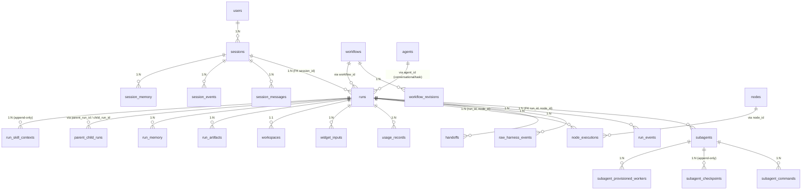

# AgentOps 架构 v3 改造方案

> **范围**：将 v2 架构（session_id 统一）改造为 v3 架构（sessions / runs / subagents 三层清晰拆分）。
> **核心问题**：v2 把"用户↔agent 对话"和"DAG 执行"都叫 `session_id`，导致语义重叠、字段名错位（DagEvent.run_id 字段指向 session_id 列）、status 字段掺杂（dormant 对 run 无意义）。
> **目标**：清晰划分 `session_id`（对话）/ `run_id`（DAG 执行）/ `subagent_id`（一次性执行体）三层身份，配套独立的状态机、生命周期、表结构。
> **不涉及**：历史数据迁移（按用户要求，存量数据不保留）。
> **报告日期**：2026-08-09

---

## 0. v3 vs v2 对比

| 维度 | v2（当前） | v3（目标） |
|---|---|---|
| ID 命名 | `session_id` 一个 ID 装两类东西 | `session_id`（对话）/ `run_id`（DAG 执行）/ `subagent_id`（一次性执行体）三类 |
| 持久化主表 | `sessions`（吸收 runs 功能）| `sessions`（仅对话）+ `runs`（DAG 执行）+ `subagents`（执行体实例） |
| 父子关系 | `parent_child_sessions` | `parent_child_runs`（run 嵌套）+ `session_runs`（对话与 run 关联） |
| status 语义 | active/dormant/running/completed/... 混合 | sessions：active/dormant/archived；runs：pending/running/waiting/completed/failed/cancelled |
| 状态字段名错位 | DagEvent.run_id 字段 → session_id 列 | 各归各位：run_events.run_id → runs.run_id |
| 一次性原则 | 不显式建模 | `subagents` 表显式建模"容器级一次性"，配合 lease_generation |
| Manager ↔ DAG 隔离 | 隐式（parent_child_sessions） | 显式：manager session ≠ dag run，独立状态机 |

---

## 1. 业务逻辑设计

### 1.1 三层架构清晰化

```
┌─────────────────────────────────────────────────────────────┐
│  Layer 1: Session（用户↔Manager Agent 对话层）              │
│  ┌───────────────────────────────────────────────────────┐  │
│  │  sessions.session_id                                  │  │
│  │  - 1 个 / 用户对话                                    │  │
│  │  - 长寿命，可 dormant（120s idle）→ active            │  │
│  │  - 状态：active / dormant / archived                  │  │
│  │  - 用户离开或服务重启 → 关闭                         │  │
│  └───────────────────────────────────────────────────────┘  │
└──────────────────────────┬──────────────────────────────────┘
                           │ session 触发 run (1:N)
                           ▼
┌─────────────────────────────────────────────────────────────┐
│  Layer 2: Run（DAG 执行层）                                 │
│  ┌───────────────────────────────────────────────────────┐  │
│  │  runs.run_id                                         │  │
│  │  - 1 个 / 1 次 DAG 跑（templated / hybrid / task）   │  │
│  │  - 短寿命，pending → completed/failed                 │  │
│  │  - 状态：pending / running / waiting / completed /    │  │
│  │         failed / cancelled                            │  │
│  │  - 挂载在某个 session 下（FK session_id）            │  │
│  │  - 可嵌套：run 内可触发子 run                        │  │
│  └───────────────────────────────────────────────────────┘  │
└──────────────────────────┬──────────────────────────────────┘
                           │ run 派发 subagent (1:N)
                           ▼
┌─────────────────────────────────────────────────────────────┐
│  Layer 3: Subagent（一次性执行体层）                        │
│  ┌───────────────────────────────────────────────────────┐  │
│  │  subagents.subagent_id                               │  │
│  │  - 1 个 / 1 次 dispatch（type=agent 节点执行体）      │  │
│  │  - 容器级一次性，launch → terminate                  │  │
│  │  - 状态：provisioning / running / handoff / cleanup / │  │
│  │         failed / completed                           │  │
│  │  - 挂载在某个 run 的某个 node 下                     │  │
│  │  - 同一 (run_id, node_id) 可多次 lease（纠错重派）   │  │
│  └───────────────────────────────────────────────────────┘  │
└─────────────────────────────────────────────────────────────┘
```

### 1.2 三类身份边界（强制分离）

| 身份 | 标识 | 寿命 | 创建者 | 终止条件 |
|---|---|---|---|---|
| **Session** | `session_id` | 用户对话期（可 dormant 复活） | 用户首次对话 | 用户主动关闭 / 服务重启 / idle 超时 120s 转 dormant → 长期未唤醒转 archived |
| **Run** | `run_id` | DAG 跑一次（pending → 终态）| Manager LLM 调 `trigger_workflow` | run 内所有 node 终态 / 整体 failed / 用户 cancel |
| **Subagent** | `subagent_id` | 一次 dispatch（launch → terminate）| RunEngine 派发 `type: agent` 节点 | 节点 handoff / 节点 timeout / 节点 failed |

**强制规则**：
- Session ≠ Run。一个 session 下可挂 0..N 个 run（用户一次对话可能触发多次 DAG）。
- Run ≠ Subagent。一个 run 内可有 0..N 个 subagent（每个 type=agent 节点 1 个 subagent，virtual 节点 0 个）。
- Subagent 寿命 ⊂ Run 寿命。一个 run 完成后，其下所有 subagent 立即清理。
- Session 寿命 ⊇ Run 寿命。Run 终止后 session 可继续 dormant / active。

### 1.3 状态机分别建模

> **Breaking Change 说明**：v2 的 `RunStatus` 枚举（[orchestrator/protocol.py](orchestrator/protocol.py)）混合了 session 状态（`ACTIVE`/`DORMANT`）和 run 状态（`PENDING`/`RUNNING`/`COMPLETED`/`FAILED`/`CANCELLED`/`PAUSED`）。v3 拆分后：
>
> - `RunStatus` 删除 `ACTIVE`/`DORMANT`/`PAUSED`，只保留 `PENDING`/`RUNNING`/`WAITING`/`COMPLETED`/`FAILED`/`CANCELLED`
> - 新增 `SessionStatus` 枚举：`ACTIVE`/`DORMANT`/`ARCHIVED`
> - 新增 `SubagentStatus` 枚举：`PROVISIONING`/`RUNNING`/`HANDOFF`/`CLEANUP`/`COMPLETED`/`FAILED`
> - 所有引用 `RunStatus.ACTIVE`/`RunStatus.DORMANT` 的代码需改为 `SessionStatus.ACTIVE`/`SessionStatus.DORMANT`

#### Session 状态机

```
[无] ──create──▶ active ──idle 120s──▶ dormant ──user message──▶ active
                   │                          │
                   │                          └──30d 未唤醒──▶ archived
                   │
                   └──user close──▶ archived
```

#### Run 状态机

```
[无] ──create──▶ pending ──engine.run()──▶ running ──完成──▶ completed
                     │                        │
                     │                        ├── 任一 node failed──▶ failed
                     │                        │
                     │                        ├── 等 widget input──▶ waiting
                     │                        │                       │
                     │                        │      widget submit ──┘
                     │                        │
                     │                        └── user cancel──▶ cancelled
                     │
                     └── validation error──▶ failed
```

#### Subagent 状态机

```
[无] ──provision──▶ provisioning ──launch──▶ running ──handoff──▶ handoff
                       │                          │                │
                       │                          │                └─cleanup──▶ cleanup ──terminate──▶ completed
                       │                          │
                       │                          ├── max_correction 用尽──▶ failed
                       │                          ├── timeout──▶ failed
                       │                          │
                       │                          └── 节点 retry──▶ provisioning (新 lease_generation)
                       │
                       └── provision 失败──▶ failed
```

### 1.4 一次性 Subagent 原则（参考外部方案 [DESIGN-dag-subagent-vs-codex-session.md](../DESIGN-dag-subagent-vs-codex-session.md)）

**铁律**：每个 subagent 是一次性任务，**不与 Manager Agent 的 session 共享同一个事务，只回写结构化结果**。

具体业务规则：

1. **物理隔离**：每次 dispatch = 一个独立 subagent（独立 LLM 上下文、独立 harness 实例）。同 actor 跨纠错通过 `lease_generation` 区分（[外部参考方案 workerId 生成模式](../../../00-platform/architecture/DESIGN-dag-subagent-vs-codex-session.md)）。
2. **不污染 Manager session**：subagent 的 LLM 循环消息（如 122 条 messages）**绝不**写入 Manager Agent 的 session thread。
3. **只回写结构化结果**：subagent 终结时通过 `handoff` 工具投递结构化 payload（port + content + summary），DAG Engine 收到后写 `handoffs` 表 + 触发下游节点。
4. **不暴露过程**：Manager Agent 拿到的是签名化产物（`actor=X, status=ready, summary=..., items=[...]`），不是聊天记录。
5. **清理即销毁**：subagent 进入 `cleanup` 状态后立即 terminate，LLM 上下文销毁，`subagents.terminated_at` 写时间戳，`raw_harness_events` 保留原始事件供回放。

### 1.5 Skill 激活 + DAG 路由 + 跨域协调

#### 1.5.1 Skill 激活（三层知识分离）

```
Manager LLM 想启动 DAG：
  1. 调 read_skill("dag-ops")  ← SkillRegistry 按需加载完整 body
  2. 拿到：DAG 目录（id / 描述 / 输入 schema） + run_mode 决策 + 监督命令 + fallback 链
  3. 调 trigger_workflow(workflow_id, inputs, run_mode)
  4. 拿 run_id，调 get_run_supervision 查进度
  5. 调 collect_child_result({run_id}) 阻塞等终态
```

Skill 存储：
- `skills/<skill_id>/SKILL.md`：frontmatter (id / name / description / domain / depends_on) + body
- 启动时 `SkillRegistry.scan()` 解析 frontmatter 构建 metadata 索引
- system_prompt 只注入 metadata 列表（id + description），不全量 inline body
- LLM 按需调 `read_skill(skill_id)` 加载完整 body

#### 1.5.2 DAG 路由决策（[orchestrator/router.py](orchestrator/router.py)）

> **当前实现状态**：关键词匹配已实现；LLM 兜底分类**未实现**（代码注释："当前返回 manager 动态编排"），以下为目标设计。

```
用户消息 → DomainRouter.route()
  ├─ 1 个域匹配 → 查 template_routes 命中 workflow_id → 固定模板
  ├─ 0 个匹配 → LLM 兜底（fallback 到 manager 域动态编排）  [未实现，当前直接 fallback]
  └─ ≥2 个匹配 → Manager 跨域编排（request_cross_domain）
```

Manager 决策后：
- 有固定模板 → `trigger_workflow(workflow_id, inputs, run_mode="templated")`
- 无固定模板 → `trigger_workflow(workflow_id=auto_generated, inputs, run_mode="templated")` 动态生成 DynamicDagSpec

#### 1.5.3 跨域协调（[orchestrator/cross_domain.py](orchestrator/cross_domain.py)）

- `request_cross_domain(target_domain, task)` 工具
- CrossDomainCoordinator 闭包注入 `caller_session_id` + `parent_run_id` + `coordinator`
- 跨域任务作为新 run 启动，`parent_child_runs` 表记录
- 12 步跨域事件流：`cross_domain.requested` → `cross_domain.acknowledged` → ... → `cross_domain.completed`

### 1.6 Manager ↔ DAG 交互铁律

来自 [config/agents/manager.yaml](config/agents/manager.yaml) 的"操作铁律"：

| 铁律 | 实现位置 |
|---|---|
| **触发 workflow 必须用 trigger_workflow 工具** | [tools/trigger_workflow.py](tools/trigger_workflow.py) — 唯一入口，禁止 bash+curl / 子 agent 直调 |
| **派发子任务的标准闭环** | `trigger_workflow` → `collect_child_result`（阻塞等终态） → `emit_widget`（整合） → `finalize` |
| **workflow 触发后告知用户进度** | 立即 `emit_widget` 推 progress_status 卡片，run_id 写入 widget metadata |
| **不调子 agent** | `denied_tools: trigger_workflow`（子 agent 看不到此工具）|

---

## 2. 表结构关系设计

### 2.1 设计原则

1. **身份分离**：session / run / subagent 三类实体独立成表，独立 PK
2. **强约束状态机**：CHECK 约束 + 部分 UNIQUE 索引保证合法状态转换
3. **追加而非覆盖**：audit 数据（events / handoffs / raw_harness）append-only，BEFORE UPDATE 触发器阻断
4. **内容寻址**：关键字段 SHA256 校验（`handoff_payload_sha256` / `event_digest`）
5. **乐观锁**：UI 文档 / surface 表用 `expected_*_revision` vs `committed_*_revision`
6. **冷启动恢复**：DB 在 → 重启后可重建运行队列（不需要 transcript 文件双写）
7. **去 actor 表，保留 actor_id 列**：actor = (run_id, node_id, lease_generation) 三元组逻辑身份，**不再单独建 actor 表**，但在 `subagents` 表保留 `actor_id TEXT` 列（值 `"<run_id>:<node_id>"`），便于跨表 JOIN（usage_records / handoffs 找「这个 actor 所有调用」/ 调试日志可读性）。配合表达式索引 `idx_subagents_actor ON subagents(actor_id)` + `idx_subagents_actor_lease ON subagents(actor_id, lease_generation DESC)` 支持"找 actor 最新 lease"高效查询

### 2.2 ER 全景



### 2.3 DDL 详述

#### 2.3.1 sessions（用户↔agent 对话）

```sql
CREATE TABLE sessions (
    session_id          TEXT PRIMARY KEY,                    -- "session_<timestamp>"
    user_id             TEXT NOT NULL,
    agent_id            TEXT NOT NULL,                        -- manager / coding_agent / knowledge_agent
    title               TEXT,
    status              TEXT NOT NULL DEFAULT 'active',       -- active / dormant / archived
    last_activity_at    TEXT NOT NULL,
    dormant_at          TEXT,
    archived_at         TEXT,
    message_count       INTEGER NOT NULL DEFAULT 0,
    attached_run_count  INTEGER NOT NULL DEFAULT 0,           -- trigger_workflow 派发的 run 数
    thread_id           TEXT,                                  -- harness thread（opencode/codex 复用）
    thread_name         TEXT,
    thread_tool_digest  TEXT,
    voice_active        INTEGER NOT NULL DEFAULT 0,
    metadata            JSON,
    created_at          TEXT NOT NULL,
    updated_at          TEXT NOT NULL,
    CHECK (status IN ('active', 'dormant', 'archived'))
);

CREATE INDEX idx_sessions_user ON sessions(user_id);
CREATE INDEX idx_sessions_status ON sessions(status);
CREATE INDEX idx_sessions_agent ON sessions(agent_id);
CREATE INDEX idx_sessions_last_activity ON sessions(last_activity_at DESC);
```

**关键约束**：
- `agent_id NOT NULL`：每个 session 必须挂一个长寿命 Agent（manager / coding_agent / knowledge_agent 等）。v2 代码中 `agent_id` 允许 NULL（templated DAG session 无单一 agent），v3 拆分后 session 只负责对话所以必填
- `status` 不含 `running` / `completed` / `failed`（这些是 run 的状态，不是 session 的）
- `dormant_at` 是 **v3 新增字段**（v2 代码只有 `archived_at`），dormant 可复活，archived 不可复活
- `attached_run_count` 保留（v2 已有），trigger_workflow 派发时递增

#### 2.3.2 runs（DAG 执行实例）

```sql
CREATE TABLE runs (
    run_id              TEXT PRIMARY KEY,                     -- "run_<timestamp>_<nano>"
    session_id          TEXT NOT NULL,                        -- 挂载到哪个 session
    parent_run_id       TEXT,                                 -- 嵌套 run 的父 run（NULL = 顶层）
    workflow_id         TEXT NOT NULL,                        -- workflows.workflow_id
    workflow_revision   INTEGER NOT NULL DEFAULT 1,           -- workflow_revisions.revision
    run_mode            TEXT NOT NULL,                        -- templated / hybrid / task / conversational
    agent_id            TEXT,                                 -- conversational/task 模式必填
    initial_message     TEXT,                                 -- conversational/task 模式必填
    status              TEXT NOT NULL DEFAULT 'pending',      -- pending / running / waiting / completed / failed / cancelled
    inputs              JSON,
    final_outputs       JSON,
    error               TEXT,
    started_at          TEXT,
    finished_at         TEXT,
    total_tokens_in     INTEGER NOT NULL DEFAULT 0,
    total_tokens_out    INTEGER NOT NULL DEFAULT 0,
    total_cost_usd      REAL NOT NULL DEFAULT 0.0,
    cancellation_reason TEXT,
    metadata            JSON,
    created_at          TEXT NOT NULL,
    updated_at          TEXT NOT NULL,
    FOREIGN KEY (session_id) REFERENCES sessions(session_id) ON DELETE RESTRICT,
    FOREIGN KEY (parent_run_id) REFERENCES runs(run_id) ON DELETE SET NULL,
    FOREIGN KEY (workflow_id, workflow_revision) REFERENCES workflow_revisions(workflow_id, revision),
    CHECK (status IN ('pending', 'running', 'waiting', 'completed', 'failed', 'cancelled')),
    CHECK ((run_mode IN ('conversational', 'task') AND agent_id IS NOT NULL AND initial_message IS NOT NULL)
        OR (run_mode IN ('templated', 'hybrid') AND workflow_id IS NOT NULL))
);

CREATE INDEX idx_runs_session ON runs(session_id);
CREATE INDEX idx_runs_parent ON runs(parent_run_id);
CREATE INDEX idx_runs_workflow ON runs(workflow_id, workflow_revision);
CREATE INDEX idx_runs_status ON runs(status);
CREATE INDEX idx_runs_started ON runs(started_at DESC);
CREATE INDEX idx_runs_agent ON runs(agent_id);
```

**关键约束**：
- `session_id NOT NULL`：每个 run 必须挂一个 session（即使是编程触发的"无 session run"，也需要先建临时 session）
- `parent_run_id`：支持 run 嵌套（子 run 完成后再触发父 run 后续节点）
- `status` 不含 `dormant`（dormant 是 session 概念）
- CHECK 约束保证 conversational/task 必须有 agent_id + initial_message；templated/hybrid 的 `workflow_id IS NOT NULL` 在 CHECK 中是冗余的（列已 `NOT NULL`），但保留可读性
- 典型场景：manager session 的 `agent_id=manager`，其下 templated run 的 `agent_id=NULL`（DAG 节点各自有 agent_id，run 级别无单一 agent）

#### 2.3.3 subagents（一次性执行体实例）

```sql
CREATE TABLE subagents (
    subagent_id         TEXT PRIMARY KEY,                     -- "sub_<run_id>_<node_id>_<lease_gen>_<nano>" 物理身份
    actor_id            TEXT NOT NULL,                        -- 逻辑身份：run_id:node_id（外部参考方案模式）
    run_id              TEXT NOT NULL,                        -- 挂载的 run
    node_id             TEXT NOT NULL,                        -- 拓扑节点 ID（type=agent 的节点）
    lease_generation    INTEGER NOT NULL DEFAULT 1,           -- 同一 (run_id, node_id) 跨纠错的代数
    harness_type        TEXT NOT NULL,                        -- opencode / codex / local_llm / ...
    harness_instance_id TEXT,                                  -- 物理执行体 ID（容器 ID / thread ID）
    status              TEXT NOT NULL DEFAULT 'provisioning', -- provisioning / running / handoff / cleanup / completed / failed
    runtime_placement   TEXT NOT NULL DEFAULT 'in_process',   -- in_process / docker_container / subprocess
    workspace_ref       TEXT,                                  -- 子工作目录（相对路径）
    container_id        TEXT,                                  -- Docker container ID（如有）
    process_id          INTEGER,                               -- 子进程 PID（如有）
    thread_id           TEXT,                                  -- harness thread ID（opencode/codex）
    started_at          TEXT,
    finished_at         TEXT,
    terminated_at       TEXT,                                  -- cleanup 触发时间
    cleanup_status      TEXT,                                  -- pending / cleaning / released / failed
    error               TEXT,
    metadata            JSON,
    created_at          TEXT NOT NULL,
    updated_at          TEXT NOT NULL,
    FOREIGN KEY (run_id) REFERENCES runs(run_id) ON DELETE CASCADE,
    CHECK (status IN ('provisioning', 'running', 'handoff', 'cleanup', 'completed', 'failed')),
    CHECK (runtime_placement IN ('in_process', 'docker_container', 'subprocess')),
    CHECK (actor_id = run_id || ':' || node_id)               -- 强制 actor_id 与 (run_id, node_id) 一致
);

CREATE INDEX idx_subagents_run ON subagents(run_id);
CREATE INDEX idx_subagents_actor ON subagents(actor_id);
CREATE INDEX idx_subagents_actor_lease ON subagents(actor_id, lease_generation DESC);
CREATE INDEX idx_subagents_status ON subagents(status);
CREATE UNIQUE INDEX uq_subagents_active_actor
    ON subagents(run_id, node_id)
    WHERE status IN ('provisioning', 'running', 'handoff');
```

**关键约束**：
- 部分 UNIQUE 索引：同一 `(run_id, node_id)` 同时只能有 1 个 active subagent（provisioning / running / handoff）
- `lease_generation` 区分纠错轮次（初派=1，每次纠错重派+1）
- `actor_id = run_id || ':' || node_id` 是逻辑身份（外部参考方案模式，与 `subagent_id` 物理身份解耦），CHECK 约束保证一致性；写入时由应用层 `f"{run_id}:{node_id}"` 生成，**不要**让 LLM 自由填
- 不单独建 actor 表（actor 的所有信息都在 subagents 行里），但保留 actor_id 列便于跨表 JOIN（usage_records / handoffs 找「这个 actor 所有调用」）+ 调试日志可读性

#### 2.3.4 workflow_revisions（工作流版本快照）

```sql
CREATE TABLE workflows (
    workflow_id         TEXT PRIMARY KEY,                     -- "weekly-report"
    name                TEXT NOT NULL,
    description         TEXT,
    current_revision    INTEGER NOT NULL DEFAULT 1,
    is_active           INTEGER NOT NULL DEFAULT 1,
    created_at          TEXT NOT NULL,
    updated_at          TEXT NOT NULL
);

CREATE TABLE workflow_revisions (
    workflow_id         TEXT NOT NULL,
    revision            INTEGER NOT NULL,
    yaml_text           TEXT NOT NULL,
    yaml_hash           TEXT NOT NULL,                        -- 内容寻址（UNIQUE）
    node_ids            JSON NOT NULL,                        -- 编译期提取的所有 node_id
    agent_ids           JSON NOT NULL,                        -- 编译期提取的所有 agent_id
    created_at          TEXT NOT NULL,
    PRIMARY KEY (workflow_id, revision),
    UNIQUE (yaml_hash),
    FOREIGN KEY (workflow_id) REFERENCES workflows(workflow_id) ON DELETE CASCADE
);

CREATE INDEX idx_workflow_revisions_workflow ON workflow_revisions(workflow_id, revision DESC);
```

**关键约束**：
- 每次 workflow yaml 变更 → 新 revision + 新 yaml_hash
- run 表 FK 到 `(workflow_id, revision)`，保证 run 永远跑固定版本（不被新版本污染）

#### 2.3.5 run_events（run 级事件流）

```sql
CREATE TABLE run_events (
    id                  INTEGER PRIMARY KEY AUTOINCREMENT,
    run_id              TEXT NOT NULL,
    sequence            INTEGER NOT NULL,                     -- 单调递增
    event_type          TEXT NOT NULL,                        -- run.created / node.started / node.handoff / ...
    node_id             TEXT,                                 -- 节点事件时填
    subagent_id         TEXT,                                 -- subagent 事件时填
    payload             JSON NOT NULL,
    payload_digest      TEXT NOT NULL,                        -- SHA256(payload) 64字符 hex
    occurred_at         TEXT NOT NULL,
    UNIQUE (run_id, sequence),
    FOREIGN KEY (run_id) REFERENCES runs(run_id) ON DELETE CASCADE
);

CREATE INDEX idx_run_events_run ON run_events(run_id, sequence);
CREATE INDEX idx_run_events_node ON run_events(run_id, node_id);
CREATE INDEX idx_run_events_subagent ON run_events(run_id, subagent_id);
CREATE INDEX idx_run_events_type ON run_events(run_id, event_type);
```

**字段名错位修复**：v2 的 `dag_events.run_id` 字段映射到 `session_id` 列（字段名与列名不一致），v3 的 `run_events.run_id` 字段直接对应 `runs.run_id` 列。

**payload_digest 实现说明**：写入时需计算 `hashlib.sha256(json.dumps(payload, sort_keys=True, ensure_ascii=False).encode()).hexdigest()`（64 字符 hex）。v2 的 `dag_events` 表没有此字段，v3 新增用于审计完整性校验。

#### 2.3.6 raw_harness_events（双通道原始事件）

```sql
CREATE TABLE raw_harness_events (
    id                  INTEGER PRIMARY KEY AUTOINCREMENT,
    run_id              TEXT NOT NULL,
    subagent_id         TEXT NOT NULL,
    node_id             TEXT,
    harness             TEXT NOT NULL,                        -- "opencode" / "codex" / "local_llm"
    event_type          TEXT NOT NULL,                        -- vendor native event type
    raw_payload         JSON NOT NULL,                        -- 脱敏后
    payload_digest      TEXT NOT NULL,
    received_at         TEXT NOT NULL,
    FOREIGN KEY (run_id) REFERENCES runs(run_id) ON DELETE CASCADE,
    FOREIGN KEY (subagent_id) REFERENCES subagents(subagent_id) ON DELETE CASCADE
);

CREATE INDEX idx_raw_events_run ON raw_harness_events(run_id);
CREATE INDEX idx_raw_events_subagent ON raw_harness_events(subagent_id);
CREATE INDEX idx_raw_events_harness ON raw_harness_events(harness, event_type);
```

**与 run_events 的关系**：
- `run_events`：business channel（`NODE_HANDOFF` / `RUN_COMPLETED` 等语义化事件）
- `raw_harness_events`：raw channel（vendor 原生事件，用于调试 + 回放）
- 两个通道独立持久化，不互相翻译

#### 2.3.7 handoffs（节点间交接记录）

```sql
CREATE TABLE handoffs (
    id                  INTEGER PRIMARY KEY AUTOINCREMENT,
    run_id              TEXT NOT NULL,
    from_node_id        TEXT NOT NULL,
    from_subagent_id    TEXT NOT NULL,
    to_node_id          TEXT NOT NULL,
    port                TEXT NOT NULL DEFAULT 'default',
    payload             JSON NOT NULL,
    payload_digest      TEXT NOT NULL,
    payload_size        INTEGER NOT NULL,
    summary             TEXT,                                 -- human-readable 摘要（兜底）
    status              TEXT NOT NULL DEFAULT 'pending',      -- pending / applied / failed / corrected
    applied_at          TEXT,                                  -- 被下游节点 applied 的时间
    failure_reason      TEXT,                                  -- response_handoff_failed 时的原因
    occurred_at         TEXT NOT NULL,
    FOREIGN KEY (run_id) REFERENCES runs(run_id) ON DELETE CASCADE,
    FOREIGN KEY (from_subagent_id) REFERENCES subagents(subagent_id) ON DELETE CASCADE,
    CHECK (status IN ('pending', 'applied', 'failed', 'corrected'))
);

CREATE INDEX idx_handoffs_run ON handoffs(run_id);
CREATE INDEX idx_handoffs_from ON handoffs(run_id, from_node_id);
CREATE INDEX idx_handoffs_to ON handoffs(run_id, to_node_id);
CREATE INDEX idx_handoffs_status ON handoffs(run_id, status);
```

**关键约束**：
- 每次节点 `handoff` 调用 = 1 条 handoff 记录（`pending`）
- 下游节点 `_run_node()` 时从 `pending_handoffs` 读取 → 标 `applied`
- `BLOCKED` 检测失败 → 标 `failed`
- 纠错重派 → 旧 handoff 标 `corrected`，新 handoff 入库

#### 2.3.8 node_executions（节点执行记录）

```sql
CREATE TABLE node_executions (
    id                  INTEGER PRIMARY KEY AUTOINCREMENT,
    run_id              TEXT NOT NULL,
    node_id             TEXT NOT NULL,
    node_type           TEXT NOT NULL,                        -- agent / parallel_branch / gateway
    lease_generation    INTEGER NOT NULL DEFAULT 1,
    subagent_id         TEXT,                                 -- virtual 节点为 NULL
    status              TEXT NOT NULL DEFAULT 'pending',      -- pending / ready / waiting / running / completed / failed / skipped
    started_at          TEXT,
    finished_at         TEXT,
    duration_ms         INTEGER,
    tokens_in           INTEGER NOT NULL DEFAULT 0,
    tokens_out          INTEGER NOT NULL DEFAULT 0,
    cost_usd            REAL NOT NULL DEFAULT 0.0,
    resolved_provider   TEXT,
    resolved_model      TEXT,
    error               TEXT,
    error_type          TEXT,                                 -- auth_error / rate_limit / timeout / protocol_mismatch / execution_blocked / ...
    upstream_inputs     JSON,                                 -- 上游节点交付的 inputs（用于回放）
    outputs             JSON,                                 -- 本节点产出的 outputs（handoff payload）
    skip_if_expr        TEXT,                                 -- 跳过的 skip_if 表达式
    file_outputs        JSON,                                 -- 文件收割的产物路径
    metadata            JSON,
    UNIQUE (run_id, node_id, lease_generation),
    FOREIGN KEY (run_id) REFERENCES runs(run_id) ON DELETE CASCADE,
    FOREIGN KEY (subagent_id) REFERENCES subagents(subagent_id) ON DELETE SET NULL,
    CHECK (status IN ('pending', 'ready', 'waiting', 'running', 'completed', 'failed', 'skipped'))
);

CREATE INDEX idx_node_executions_run ON node_executions(run_id);
CREATE INDEX idx_node_executions_status ON node_executions(run_id, status);
CREATE INDEX idx_node_executions_subagent ON node_executions(subagent_id);
```

**关键约束**：
- 唯一 `(run_id, node_id, lease_generation)`：同一节点跨纠错的代数历史全部保留
- virtual 节点（parallel_branch / gateway）`subagent_id` 为 NULL

#### 2.3.9 usage_records（节点级用量明细）

```sql
CREATE TABLE usage_records (
    id                      INTEGER PRIMARY KEY AUTOINCREMENT,
    run_id                  TEXT NOT NULL,
    node_id                 TEXT NOT NULL,
    subagent_id             TEXT,
    provider_id             TEXT NOT NULL,
    model                   TEXT NOT NULL,
    input_tokens            INTEGER NOT NULL DEFAULT 0,
    output_tokens           INTEGER NOT NULL DEFAULT 0,
    cache_read_tokens       INTEGER NOT NULL DEFAULT 0,
    cache_creation_tokens   INTEGER NOT NULL DEFAULT 0,
    duration_ms             INTEGER NOT NULL DEFAULT 0,
    cost_usd                REAL NOT NULL DEFAULT 0.0,
    fallback_from_provider  TEXT,                              -- D-029 fallback 切换的原 provider
    created_at              TEXT NOT NULL,
    FOREIGN KEY (run_id) REFERENCES runs(run_id) ON DELETE CASCADE
);

CREATE INDEX idx_usage_run ON usage_records(run_id);
CREATE INDEX idx_usage_node ON usage_records(run_id, node_id);
CREATE INDEX idx_usage_provider ON usage_records(provider_id);
CREATE INDEX idx_usage_created ON usage_records(created_at);
```

#### 2.3.10 widget_inputs（HIL 介入点）

```sql
CREATE TABLE widget_inputs (
    id                  INTEGER PRIMARY KEY AUTOINCREMENT,
    run_id              TEXT NOT NULL,
    widget_id           TEXT NOT NULL,
    node_id             TEXT,                                 -- 关联节点（NULL = session 级 HIL）
    input_payload       JSON NOT NULL,
    user_id             TEXT NOT NULL,
    session_id          TEXT NOT NULL,                        -- 冗余存储便于 JOIN
    submitted_at        TEXT NOT NULL,
    FOREIGN KEY (run_id) REFERENCES runs(run_id) ON DELETE CASCADE,
    FOREIGN KEY (session_id) REFERENCES sessions(session_id) ON DELETE CASCADE
);

CREATE INDEX idx_widget_inputs_run ON widget_inputs(run_id);
CREATE INDEX idx_widget_inputs_widget ON widget_inputs(widget_id);
```

#### 2.3.11 workspaces（run 工作目录）

```sql
CREATE TABLE workspaces (
    run_id              TEXT PRIMARY KEY,
    workflow_id         TEXT NOT NULL,
    workspace_root      TEXT NOT NULL,                        -- 相对路径（如 "workspace/log-patrol/run_xxx/"）
    absolute_root       TEXT NOT NULL,                        -- 绝对路径
    mode                INTEGER NOT NULL DEFAULT 448,         -- 0o700 = decimal 448, Unix 文件权限
    size_bytes          INTEGER,
    cleanup_at          TEXT,                                 -- 计划清理时间
    created_at          TEXT NOT NULL,
    FOREIGN KEY (run_id) REFERENCES runs(run_id) ON DELETE CASCADE
);
```

#### 2.3.12 run_artifacts（run 产物）

```sql
CREATE TABLE run_artifacts (
    run_id              TEXT NOT NULL,
    name                TEXT NOT NULL,                        -- 产物名（如 "weekly-report.md"）
    artifact_id         TEXT UNIQUE NOT NULL,
    file_path           TEXT NOT NULL,
    file_size           INTEGER NOT NULL,
    file_digest         TEXT NOT NULL,                        -- SHA256
    mime_type           TEXT,
    upload_token_hash   TEXT,                                 -- 支持 worker 上传到 manager
    upload_expires_at   TEXT,
    created_at          TEXT NOT NULL,
    PRIMARY KEY (run_id, name),
    FOREIGN KEY (run_id) REFERENCES runs(run_id) ON DELETE CASCADE
);

CREATE INDEX idx_run_artifacts_run ON run_artifacts(run_id);
```

#### 2.3.13 run_memory（run 摘要记忆）

```sql
CREATE TABLE run_memory (
    id                  INTEGER PRIMARY KEY AUTOINCREMENT,
    session_id          TEXT NOT NULL,                        -- 摘要回灌到哪个 session
    run_id              TEXT NOT NULL,                        -- 来源 run
    memory_type         TEXT NOT NULL,                        -- run_summary / topic_summary / user_preference
    content             TEXT NOT NULL,
    tokens              INTEGER NOT NULL DEFAULT 0,
    importance          REAL NOT NULL DEFAULT 0.5,
    created_at          TEXT NOT NULL,
    expires_at          TEXT,
    UNIQUE (session_id, memory_type, run_id),
    FOREIGN KEY (session_id) REFERENCES sessions(session_id) ON DELETE CASCADE,
    FOREIGN KEY (run_id) REFERENCES runs(run_id) ON DELETE CASCADE,
    CHECK (memory_type IN ('run_summary', 'topic_summary', 'user_preference'))
);

CREATE INDEX idx_run_memory_session ON run_memory(session_id, importance DESC, created_at DESC);
```

#### 2.3.14 parent_child_runs（run 嵌套关系）

```sql
CREATE TABLE parent_child_runs (
    id                  INTEGER PRIMARY KEY AUTOINCREMENT,
    parent_run_id       TEXT NOT NULL,
    child_run_id        TEXT NOT NULL,
    parent_session_id   TEXT NOT NULL,                        -- 冗余：父 run 所属 session
    child_session_id    TEXT NOT NULL,                        -- 冗余：子 run 所属 session（通常 = 父 session）
    created_via         TEXT NOT NULL,                        -- trigger_workflow / request_cross_domain / dynamic_dag
    created_at          TEXT NOT NULL,
    UNIQUE (parent_run_id, child_run_id),
    FOREIGN KEY (parent_run_id) REFERENCES runs(run_id) ON DELETE CASCADE,
    FOREIGN KEY (child_run_id) REFERENCES runs(run_id) ON DELETE CASCADE
);

CREATE INDEX idx_parent_child_parent ON parent_child_runs(parent_run_id);
CREATE INDEX idx_parent_child_child ON parent_child_runs(child_run_id);
CREATE INDEX idx_parent_child_parent_session ON parent_child_runs(parent_session_id);
```

**与 v2 区别**：
- v2 `parent_child_sessions` 表把父子都标为 session
- v3 `parent_child_runs` 表只记录 run 嵌套关系
- session_id 冗余存储便于查询"某 session 下所有 run 派发的所有子 run"
- **注意**：冗余的 `parent_session_id` / `child_session_id` 存在数据一致性风险（run 的 session_id 变更时冗余字段不自动更新）。建议通过应用层保证 session_id 在 run 创建后不可变，或改用 VIEW 在查询时 JOIN runs 表获取 session_id

#### 2.3.15 run_skill_contexts（run 注入的 skill 上下文）

```sql
CREATE TABLE run_skill_contexts (
    id                  INTEGER PRIMARY KEY AUTOINCREMENT,
    run_id              TEXT NOT NULL,
    skill_id            TEXT NOT NULL,
    context_digest      TEXT NOT NULL,                        -- SHA256
    context_json        JSON NOT NULL,
    injected_at         TEXT NOT NULL,
    FOREIGN KEY (run_id) REFERENCES runs(run_id) ON DELETE CASCADE
);

CREATE INDEX idx_run_skill_contexts_run ON run_skill_contexts(run_id);
```

**append-only**：BEFORE UPDATE 触发器阻断修改（v2 没显式建模，v3 显式）。

#### 2.3.16 session_messages（Thread 模式消息持久化）

```sql
CREATE TABLE session_messages (
    id                  INTEGER PRIMARY KEY AUTOINCREMENT,
    session_id          TEXT NOT NULL,
    sequence            INTEGER NOT NULL,
    role                TEXT NOT NULL,                        -- user / assistant / system
    content             TEXT NOT NULL,                        -- JSON 序列化的 str/dict/list
    turn_id             TEXT,                                 -- 所属 turn（user+assistant 成对）
    message_type        TEXT NOT NULL DEFAULT 'text',         -- text / transcript / tool_result / error
    metadata            JSON,
    created_at          TEXT NOT NULL,
    UNIQUE (session_id, sequence),
    FOREIGN KEY (session_id) REFERENCES sessions(session_id) ON DELETE CASCADE,
    CHECK (role IN ('user', 'assistant', 'system')),
    CHECK (message_type IN ('text', 'transcript', 'tool_result', 'error'))
);

CREATE INDEX idx_session_messages_session ON session_messages(session_id, sequence);
CREATE INDEX idx_session_messages_turn ON session_messages(session_id, turn_id);
```

**关键约束**：FK 到 `sessions`，**不 FK 到 runs**（session_messages 是 session 级，不属于某个 run）

> **v3 新增列**：`session_events.run_id` + FK 到 `runs`（ON DELETE SET NULL），用于关联由 run 触发的事件。v2 的 `session_events` 表没有 `run_id` 列。

#### 2.3.17 session_events（Thread 模式事件流）

```sql
CREATE TABLE session_events (
    id                  INTEGER PRIMARY KEY AUTOINCREMENT,
    session_id          TEXT NOT NULL,
    sequence            INTEGER NOT NULL,
    event_type          TEXT NOT NULL,                        -- turn.started / turn.progress / turn.completed / session.dormant / ...
    node_id             TEXT,
    run_id              TEXT,                                 -- 关联 run（如果事件由 run 触发）
    payload             JSON NOT NULL,
    occurred_at         TEXT NOT NULL,
    UNIQUE (session_id, sequence),
    FOREIGN KEY (session_id) REFERENCES sessions(session_id) ON DELETE CASCADE,
    FOREIGN KEY (run_id) REFERENCES runs(run_id) ON DELETE SET NULL
);

CREATE INDEX idx_session_events_session ON session_events(session_id, sequence);
CREATE INDEX idx_session_events_type ON session_events(session_id, event_type);
CREATE INDEX idx_session_events_run ON session_events(run_id);
```

#### 2.3.18 session_memory（session 长期记忆）

```sql
CREATE TABLE session_memory (
    id                  INTEGER PRIMARY KEY AUTOINCREMENT,
    session_id          TEXT NOT NULL,
    memory_type         TEXT NOT NULL,                        -- run_summary / topic_summary / user_preference / cross_session_fact
    source_run_id       TEXT,                                 -- run_summary 类型时必填
    content             TEXT NOT NULL,
    tokens              INTEGER NOT NULL DEFAULT 0,
    importance          REAL NOT NULL DEFAULT 0.5,
    created_at          TEXT NOT NULL,
    expires_at          TEXT,
    UNIQUE (session_id, memory_type, source_run_id),
    FOREIGN KEY (session_id) REFERENCES sessions(session_id) ON DELETE CASCADE,
    FOREIGN KEY (source_run_id) REFERENCES runs(run_id) ON DELETE SET NULL,
    CHECK (memory_type IN ('run_summary', 'topic_summary', 'user_preference', 'cross_session_fact'))
);

CREATE INDEX idx_session_memory_session ON session_memory(session_id, importance DESC, created_at DESC);
```

**关键约束**：`source_run_id` FK 到 runs（替代 v2 的 `source_session_id`），语义清晰。

#### 2.3.19 subagent_commands（subagent 命令投递）

```sql
CREATE TABLE subagent_commands (
    command_id          TEXT PRIMARY KEY,
    subagent_id         TEXT NOT NULL,
    run_id              TEXT NOT NULL,
    node_id             TEXT NOT NULL,
    command_type        TEXT NOT NULL,                        -- interrupt / cancel / retry / reassign / inject_hil
    payload             JSON NOT NULL,
    status              TEXT NOT NULL DEFAULT 'pending',      -- pending / delivered / claimed / acknowledged / failed
    idempotency_key     TEXT NOT NULL,
    delivered_at        TEXT,
    claimed_at          TEXT,
    acknowledged_at     TEXT,
    failed_at           TEXT,
    failure_reason      TEXT,
    created_at          TEXT NOT NULL,
    UNIQUE (subagent_id, idempotency_key),
    FOREIGN KEY (subagent_id) REFERENCES subagents(subagent_id) ON DELETE CASCADE,
    FOREIGN KEY (run_id) REFERENCES runs(run_id) ON DELETE CASCADE,
    CHECK (status IN ('pending', 'delivered', 'claimed', 'acknowledged', 'failed'))
);

CREATE INDEX idx_subagent_commands_subagent ON subagent_commands(subagent_id);
CREATE INDEX idx_subagent_commands_run ON subagent_commands(run_id);
CREATE INDEX idx_subagent_commands_status ON subagent_commands(status);
```

#### 2.3.20 subagent_checkpoints（subagent checkpoint 追加流）

```sql
CREATE TABLE subagent_checkpoints (
    subagent_id         TEXT NOT NULL,
    checkpoint_version  INTEGER NOT NULL,
    checkpoint_json     JSON NOT NULL,
    checkpoint_sha256   TEXT NOT NULL,                        -- 内容寻址
    created_at          TEXT NOT NULL,
    PRIMARY KEY (subagent_id, checkpoint_version),
    FOREIGN KEY (subagent_id) REFERENCES subagents(subagent_id) ON DELETE CASCADE,
    CHECK (length(checkpoint_sha256) = 64)
);

-- BEFORE UPDATE 触发器：append-only 阻断
CREATE TRIGGER trg_subagent_checkpoints_no_update
    BEFORE UPDATE ON subagent_checkpoints
    FOR EACH ROW
    BEGIN
        SELECT RAISE(ABORT, 'subagent_checkpoints is append-only');
    END;

CREATE INDEX idx_subagent_checkpoints_subagent ON subagent_checkpoints(subagent_id, checkpoint_version DESC);
```

#### 2.3.21 subagent_provisioned_workers（执行体 ↔ 物理容器映射）

```sql
CREATE TABLE subagent_provisioned_workers (
    subagent_id         TEXT NOT NULL,
    lease_generation    INTEGER NOT NULL,
    worker_id           TEXT NOT NULL,                        -- "provisioned-<run>-<node>-<uuid>"
    runtime_placement   TEXT NOT NULL,                        -- in_process / docker_container / subprocess
    container_id        TEXT,                                 -- Docker container ID（如有）
    process_id          INTEGER,                              -- 子进程 PID（如有）
    thread_id           TEXT,                                 -- harness thread ID
    status              TEXT NOT NULL DEFAULT 'active',       -- active / releasing / released / failed
    started_at          TEXT NOT NULL,
    released_at         TEXT,
    cleanup_status      TEXT,
    UNIQUE (subagent_id, lease_generation),
    UNIQUE (worker_id),
    FOREIGN KEY (subagent_id) REFERENCES subagents(subagent_id) ON DELETE CASCADE,
    CHECK (status IN ('active', 'releasing', 'released', 'failed'))
);

CREATE INDEX idx_subagent_workers_subagent ON subagent_provisioned_workers(subagent_id);
CREATE INDEX idx_subagent_workers_status ON subagent_provisioned_workers(status);
```

**关键约束**：`worker_id` 每次 dispatch 都唯一（外部参考方案 `provisioned-<run>-<node>-<randomUUID>` 模式）

#### 2.3.22 agents（长寿命 Agent 注册）

```sql
CREATE TABLE agents (
    agent_id            TEXT PRIMARY KEY,                     -- "manager" / "coding_agent" / "knowledge_agent" / "weekly_reporter"
    domain              TEXT NOT NULL,                        -- 业务域
    display_name        TEXT NOT NULL,
    description         TEXT,
    harness             TEXT NOT NULL,                        -- opencode / codex / local_llm / ...
    model               TEXT,                                 -- JSON: {provider, id}
    system_prompt       TEXT,
    output_files        JSON,                                 -- {port: file_path_template}
    permissions         JSON,                                 -- {allowed_tools: [...], denied_tools: [...]}
    knowledge_bases     JSON,                                 -- [kb_name, ...]
    max_concurrent_runs INTEGER NOT NULL DEFAULT 1,
    timeout_seconds     INTEGER NOT NULL DEFAULT 600,
    cost_limit_per_run  REAL,
    yaml_hash           TEXT,                                 -- 对应 config/agents/<agent_id>.yaml 的内容哈希
    is_active           INTEGER NOT NULL DEFAULT 1,
    created_at          TEXT NOT NULL,
    updated_at          TEXT NOT NULL
);

CREATE INDEX idx_agents_domain ON agents(domain);
CREATE INDEX idx_agents_active ON agents(is_active);
```

**关键约束**：
- v3 把 `config/agents/*.yaml` 的内容同步到 `agents` 表（启动时扫描一次）
- `yaml_hash` 用于检测 yaml 变更触发热加载

#### 2.3.23 nodes（工作流节点定义）

```sql
CREATE TABLE nodes (
    workflow_id         TEXT NOT NULL,
    node_id             TEXT NOT NULL,
    name                TEXT NOT NULL,
    type                TEXT NOT NULL,                        -- agent / parallel_branch / gateway
    agent_id            TEXT,                                 -- type=agent 时必填
    harness             TEXT,
    model               TEXT,
    domain              TEXT,
    business_role       TEXT,
    role_prompt         TEXT,
    timeout_seconds     INTEGER,
    skip_if             TEXT,
    inputs              JSON,
    outputs             JSON,
    branches            JSON,
    gateway_kind        TEXT,
    condition           TEXT,
    config              JSON,
    created_at          TEXT NOT NULL,
    PRIMARY KEY (workflow_id, node_id),
    FOREIGN KEY (workflow_id) REFERENCES workflows(workflow_id) ON DELETE CASCADE,
    CHECK (type IN ('agent', 'parallel_branch', 'gateway'))
);

CREATE INDEX idx_nodes_workflow ON nodes(workflow_id);
```

#### 2.3.24 users（用户表）

```sql
CREATE TABLE users (
    user_id             TEXT PRIMARY KEY,
    display_name        TEXT,
    email               TEXT,
    role                TEXT NOT NULL DEFAULT 'user',         -- user / admin
    is_active           INTEGER NOT NULL DEFAULT 1,
    metadata            JSON,
    created_at          TEXT NOT NULL,
    updated_at          TEXT NOT NULL
);
```

#### 2.3.25 lint_issues（知识库 lint）

```sql
CREATE TABLE lint_issues (
    id                  TEXT PRIMARY KEY,
    domain              TEXT NOT NULL,
    type                TEXT NOT NULL,
    severity            TEXT NOT NULL,                        -- critical / warning / info
    page_a              TEXT,
    page_b              TEXT,
    description         TEXT NOT NULL,
    auto_fixable        INTEGER NOT NULL DEFAULT 0,
    detected_at         TEXT NOT NULL,
    status              TEXT NOT NULL DEFAULT 'pending',      -- pending / resolved / ignored
    resolved_at         TEXT,
    resolved_by         TEXT,
    resolution_note     TEXT,
    CHECK (severity IN ('critical', 'warning', 'info')),
    CHECK (status IN ('pending', 'resolved', 'ignored'))
);
-- 注意：SQLite 不支持在表定义 UNIQUE 约束中使用 COALESCE 表达式，
-- 去重通过下方部分索引实现（与 v2 代码一致）
CREATE UNIQUE INDEX uq_lint_issues_dedup
    ON lint_issues(domain, type, COALESCE(page_a, ''), COALESCE(page_b, ''));

CREATE INDEX idx_lint_issues_domain_status ON lint_issues(domain, status);
CREATE INDEX idx_lint_issues_status ON lint_issues(status);
```

### 2.4 索引策略总览

| 表 | 关键索引 | 用途 |
|---|---|---|
| sessions | `(user_id)` / `(status)` / `(agent_id)` / `(last_activity_at DESC)` | 用户会话列表、活跃 session 监控、idle 扫描 |
| runs | `(session_id)` / `(parent_run_id)` / `(workflow_id, workflow_revision)` / `(status)` / `(started_at DESC)` | session 下 run 列表、run 嵌套查询、监控大屏 |
| subagents | `(run_id, node_id, lease_generation DESC)` / `(status)` + 部分 UNIQUE | actor lease 查询、active subagent 唯一性 |
| run_events | `(run_id, sequence)` / `(run_id, node_id)` / `(run_id, event_type)` | 事件时间序、节点事件过滤、事件类型统计 |
| handoffs | `(run_id, from_node_id)` / `(run_id, to_node_id)` / `(run_id, status)` | 上下游节点追溯、pending handoff 查询 |
| node_executions | `(run_id, node_id, lease_generation)` UNIQUE | 节点执行历史（每次纠错一条） |
| usage_records | `(run_id)` / `(provider_id)` / `(created_at)` | run 内用量聚合、provider 用量趋势 |
| session_messages | `(session_id, sequence)` / `(session_id, turn_id)` | 消息时间序、按 turn 分组 |
| session_memory | `(session_id, importance DESC, created_at DESC)` | 重要记忆优先加载 |

---

## 3. 改造清单

### 3.1 数据层改造

#### 3.1.1 表拆分

| v2 表 | v3 改造 | 说明 |
|---|---|---|
| `sessions` | → `sessions` + `runs` | sessions 只装对话，runs 装 DAG 执行 |
| `sessions.agent_id` | 保留（= manager / coding_agent 等长寿命 agent） | 必填 |
| `sessions.workflow_id` | 删除（移到 `runs`） | |
| `sessions.run_mode` | 删除（移到 `runs`） | |
| `sessions.inputs` | 删除（移到 `runs`） | |
| `sessions.final_outputs` | 删除（移到 `runs`） | |
| `sessions.status` | 收窄为 `active / dormant / archived` | 不再含 running / completed / failed / cancelled |
| `dag_events` | → `run_events` | FK 从 sessions.session_id 改为 runs.run_id |
| `session_events` | 保留 | 仍 FK 到 sessions |
| `parent_child_sessions` | → `parent_child_runs` | 只记录 run 嵌套关系 |
| `agent_sessions` / `agent_messages` | 已删除（v2 已合并到 sessions + session_messages） | v2 已完成合并，v3 无需再改 |

#### 3.1.2 新增表

| v3 表 | 来源 | 用途 |
|---|---|---|
| `runs` | 新增 | DAG 执行实例 |
| `subagents` | 新增 | 一次性执行体实例 |
| `workflow_revisions` | 新增 | workflow yaml 版本快照 |
| `node_executions` | 新增 | 节点执行记录（跨 lease_generation） |
| `handoffs` | 新增 | 节点交接签名记录 |
| `workspaces` | 新增 | run 工作目录元数据 |
| `run_artifacts` | 新增 | run 产物文件 |
| `run_memory` | 新增 | run 摘要回灌到 session |
| `parent_child_runs` | 新增 | run 嵌套关系 |
| `run_skill_contexts` | 新增 | run 注入的 skill 上下文（append-only） |
| `subagent_commands` | 新增 | subagent 干预命令 |
| `subagent_checkpoints` | 新增 | subagent checkpoint 追加流 |
| `subagent_provisioned_workers` | 新增 | subagent ↔ 物理容器映射 |
| `agents` | 新增 | 长寿命 Agent 注册（同步 config/agents/*.yaml） |
| `nodes` | 新增 | 工作流节点定义 |
| `users` | 新增 | 用户表（v2 没显式建模） |

#### 3.1.3 触发器 / 约束

```sql
-- subagent_checkpoints append-only
CREATE TRIGGER trg_subagent_checkpoints_no_update
    BEFORE UPDATE ON subagent_checkpoints
    FOR EACH ROW
    BEGIN
        SELECT RAISE(ABORT, 'subagent_checkpoints is append-only');
    END;

-- run_skill_contexts append-only
CREATE TRIGGER trg_run_skill_contexts_no_update
    BEFORE UPDATE ON run_skill_contexts
    FOR EACH ROW
    BEGIN
        SELECT RAISE(ABORT, 'run_skill_contexts is append-only');
    END;

-- handoffs 状态机 CHECK
-- （已包含在表定义 CHECK 约束）

-- subagents 状态机 CHECK
-- （已包含在表定义 CHECK 约束）

-- 同一 (run_id, node_id) 只能有 1 个 active subagent
-- （已包含在部分 UNIQUE 索引）
```

### 3.2 代码层改造

| 文件 | v2 → v3 改造 |
|---|---|
| [audit/store.py](audit/store.py) | 重写 `_SCHEMA` DDL（新增 runs / subagents / handoffs / node_executions 等表）；`EventStore` ABC 拆分 `SessionStore` + `RunStore` + `SubagentStore`；方法名 rename：`init_session` → `create_run`；`finalize_session` → `finalize_run`；`record_parent_child` → `record_parent_child_run` |
| [orchestrator/protocol.py](orchestrator/protocol.py) | 新增 `SubagentStatus` 枚举；`RunStatus` 删除 `ACTIVE`/`DORMANT`（移入 `SessionStatus` 新枚举）；`DagEvent.run_id` 字段终于是 run_id 语义（不再映射到 session_id 列） |
| [orchestrator/local_sdk.py](orchestrator/local_sdk.py) | `run_id = "run_<timestamp>"`（不再是 `session_<>`）；分流 `RunStore` + `SubagentStore` 调用；`continue_conversation` 等方法改为 session_id + run_id 分离 |
| [workflow/engine.py](workflow/engine.py) | `_run_node` 改写：先创建 `subagents` 行（status=provisioning）→ 派发 → status=running → handoff → status=handoff → cleanup → status=completed；`AgentRunContext.session_id` 拆为 `session_id`（manager session）+ `run_id`（DAG run） |
| [orchestrator/session_engine.py](orchestrator/session_engine.py) | SessionEngine 内部改为调 `SessionStore`（管 sessions + session_messages + session_events + session_memory）；DAG 派发改用 `RunStore`（注意：本文件是 Thread 模式引擎，不是 Store 层） |
| [orchestrator/conversational.py](orchestrator/conversational.py) | **已标记 DEPRECATED**，被 `session_engine.py` 取代。v3 改造时需将 `make_conversational_tools` / `_load_agent_extra_tools` 等仍被 `engine.py` 引用的函数迁移到 `session_engine.py` 或独立模块，然后删除本文件 |
| [orchestrator/manager.py](orchestrator/manager.py) | `ManagerAgent` 当前**直接构造 `DagEngine`**（`DagEngine(workflow, event_sink=...)`），v3 改为统一通过 `RunStore.create_run` + `engine.run(run_id)` |
| [tools/trigger_workflow.py](tools/trigger_workflow.py) | `record_parent_child` → `record_parent_child_run(parent_run_id, child_run_id, ...)`；`init_session` → `create_run` |
| [tools/collect_child_result.py](tools/collect_child_result.py) | 等待 `runs.status` 终态（不再等 `sessions.status`）；**修复已有 bug**：`_load_from_audit` 当前 SQL 查 `FROM runs WHERE run_id=?`，但 v2 已无 runs 表（合并到 sessions），此函数在 v2 下永远抛异常。v3 恢复 runs 表后此 bug 自然消失，但需确认 SQL 列名与 v3 DDL 一致 |
| [harness/protocol.py](harness/protocol.py) | `AgentRunContext.session_id` 拆为 `session_id`（manager session）+ `run_id`（DAG run） |
| [orchestrator/cross_domain.py](orchestrator/cross_domain.py) | 跨域子任务用 `parent_child_runs` 记录，`cross_domain` 事件带 `parent_run_id` |
| [orchestrator/session_manager.py](orchestrator/session_manager.py) | `SessionState` 补充 `dormant_at` 时间戳字段（v3 sessions 表新增 `dormant_at` 列）；`attach_run` / `list_attached_runs` 改用 `parent_child_runs` 表 |
| [orchestrator/router.py](orchestrator/router.py) | 当前 LLM 兜底分类**未实现**（代码注释："当前返回 manager 动态编排"），v3 需补全或标注为 Phase 2+ |

### 3.3 API 接口改造

| v2 endpoint | v3 endpoint | 说明 |
|---|---|---|
| `POST /api/sessions` | `POST /api/sessions` | 创建对话 session（不变） |
| `POST /api/sessions/<sid>/turns` | `POST /api/sessions/<sid>/turns` | 用户发送 turn（不变） |
| `POST /api/sessions/<sid>/runs` | `POST /api/sessions/<sid>/runs` | session 触发 run（v3 新增显式 endpoint） |
| `GET /api/runs/<rid>` | `GET /api/runs/<rid>` | 查询 run 状态（不变） |
| `GET /api/runs/<rid>/events` | `GET /api/runs/<rid>/events` | 查 run_events（不变） |
| `GET /api/runs/<rid>/subagents` | `GET /api/runs/<rid>/subagents` | 查 subagents 列表（v3 新增） |
| `GET /api/runs/<rid>/handoffs` | `GET /api/runs/<rid>/handoffs` | 查 handoffs 表（v3 新增） |
| `POST /api/runs/<rid>/cancel` | `POST /api/runs/<rid>/cancel` | 取消 run（不变） |
| `POST /api/runs/<rid>/subagents/<sid>/interrupt` | `POST /api/runs/<rid>/subagents/<sid>/interrupt` | subagent 干预（v3 新增） |
| `POST /api/runs/<rid>/inject` | `POST /api/runs/<rid>/inject` | HIL 注入（不变） |
| `GET /api/sessions/<sid>/messages` | `GET /api/sessions/<sid>/messages` | 查 session_messages（不变） |
| `GET /api/sessions/<sid>/children` | `GET /api/sessions/<sid>/runs` | 改：列出 session 下所有 runs（v2 叫 children） |

---

## 4. 边界规则（强制约束）

### 4.1 session ↔ run 边界

| 规则 | 实现 |
|---|---|
| 每个 run 必须挂 session（FK NOT NULL） | `runs.session_id` NOT NULL + FK |
| session dormant 不影响已派发的 run | runs 独立 status，不受 session status 影响 |
| session archived 后 run 可继续跑 | runs 独立 status，FK 不受 archived 影响；archived session 的 run_memory 仍可写入，但 Manager 不会主动加载 archived session 的记忆 |
| run 完成 → 不修改 session status（session 是 session，run 是 run）| `runs.status` 变更不触发 `sessions.status` 联动 |
| run 派发计数 | `sessions.attached_run_count++`（manager 通过 trigger_workflow 派发时）|

### 4.2 run ↔ node 边界

| 规则 | 实现 |
|---|---|
| 每个节点在 run 内最多 1 个 active subagent | `node_executions` + `subagents` 联合唯一性 |
| 节点纠错重派 = 新 lease_generation | `subagents.lease_generation++`，旧 subagent 进入 cleanup |
| virtual 节点不创建 subagent | `node_executions.subagent_id = NULL` for parallel_branch / gateway |
| 节点 forward-only：状态只能 PENDING → READY → RUNNING → COMPLETED/FAILED | CHECK 约束 + 状态机代码 |
| 节点 SKIPPED 触发下游 SKIPPED | `_mark_downstream_skipped` 递归 |
| BLOCKED 检测：所有 output port BLOCKED → 节点 FAILED | `_all_ports_blocked` 检查 |

### 4.3 node ↔ subagent 边界

| 规则 | 实现 |
|---|---|
| 1 个 subagent = 1 次 dispatch | `subagents.subagent_id` UNIQUE 包含 lease_generation |
| 1 个 subagent 跑 1 个节点 | `node_executions` UNIQUE (run_id, node_id, lease_generation) |
| subagent 一次性：handoff 后即 cleanup | `status` 流：running → handoff → cleanup → completed |
| subagent 不直接写 session | `raw_harness_events` FK 到 runs，不 FK 到 sessions |
| subagent 不写 Manager session thread | SessionEngine 写入前检查 subagent_id NOT NULL 时拒绝 |
| 跨纠错 = 新 subagent | `lease_generation++`，旧 subagent 进 cleanup |
| 容器清理 = subagent 销毁 | `subagent_provisioned_workers.status = released` |

---

## 5. 业务逻辑验证场景

### 5.1 场景 1：用户触发 weekly-report DAG

```
[用户] → POST /api/sessions/<sid>/turns {"message": "帮我生成本周周报"}
[SessionEngine] → 持久化 user message → sessions.last_activity_at = now
[SessionEngine] → LLM 决定调 trigger_workflow(workflow_id="weekly-report", inputs={...}, run_mode="templated")
[trigger_workflow]:
  - 创建 run：runs.run_id = "run_<ts>"，runs.session_id = "<sid>", runs.workflow_id = "weekly-report", runs.status = pending
  - 关联父子：parent_child_runs(parent_run_id=NULL, child_run_id=run_id, created_via="trigger_workflow")
  - 写 run_events：seq=1, event_type="run.created", payload={workflow_id, inputs, layout}
  - 启动 DagEngine
[DagEngine.run()]:
  - 拓扑分层：start_collect → (query_kb, collect) → classify → prioritize → summarize → validate → gate → archive
  - 状态机驱动：
    ├─ start_collect (virtual) → 完成
    ├─ query_kb / collect (parallel)
    │   ├─ 创建 subagents(subagent_id="sub_<run>_query_kb_1", status=provisioning)
    │   ├─ harness.run() → status=running
    │   ├─ 产出 handoff(port="patterns", payload={...}) → handoffs 表
    │   ├─ status=handoff → cleanup → status=completed
    │   └─ 写 run_events: node.started → node.handoff → node.completed
    ├─ classify（接收 query_kb.patterns + collect.collected_items）
    │   └─ 同上流程
    ├─ ...（每个 agent 节点都创建 subagents 行）
    └─ archive（terminal）
  - run 终止：runs.status = completed, finished_at = now, final_outputs = {...}
  - 摘要回灌：run_memory(session_id, run_id, memory_type="run_summary", content="...", importance=0.8)
[SessionEngine] → emit_widget 推 progress_status + artifact_ref → 前端 SSE
[trigger_workflow] → 返回 {run_id, status: "started"} 给 Manager LLM
[Manager LLM] → collect_child_result({run_id}) 阻塞等终态
[Manager LLM] → 拿到 final_outputs → emit_widget 整合 → finalize
```

### 5.2 场景 2：subagent 纠错重派（lease_generation 自增）

```
[run_events seq=N] node.failed {node_id: "query_kb", error: "rate_limit", error_type: "rate_limit"}
[DagEngine._run_agent_node]:
  - error_type = "rate_limit"
  - _try_resolve_fallback(node, "rate_limit", current_provider="minimax")
  - 切换 fallback provider="deepseek"
  - 重置 nstate
  - 重试 → 失败（fallback 也 rate_limit）
  - emit NODE_FAILED {fallback_from: "minimax"}

[人工干预 or 自动 retry]:
  - session_mgr 或 manager 决定 retry
  - 创建新 subagent：subagent_id="sub_<run>_query_kb_2", lease_generation=2
  - subagents.active 旧条目（lease_generation=1）→ status=cleanup → cleanup_completed
  - 新 subagent → status=provisioning → running → ...
  - node_executions 新增 (run_id, query_kb, lease_generation=2)
```

### 5.3 场景 3：HIL 介入（widget input）

```
[前端 UI] 用户提交 form widget
[POST /api/runs/<rid>/widget-input] {widget_id, input_payload}
[EventStore]:
  - widget_inputs(run_id, widget_id, node_id, input_payload, user_id, session_id, submitted_at)
  - 找到 waiting 节点（run_events 最近一条 node.waiting）
  - 注入到节点 waiting queue
  - node_executions.status: waiting → ready → running
[SessionEngine/DagEngine] → 继续执行节点 → emit NODE_PROGRESS
```

### 5.4 场景 4：跨域协调（request_cross_domain）

```
[Manager LLM] 调 request_cross_domain(target_domain="video_production", task="...")
[CrossDomainCoordinator]:
  - 创建子 run：runs.run_id = "run_<ts>", runs.session_id = manager_session_id, runs.parent_run_id = manager_current_run_id, run_mode = "templated", workflow_id="video-pipeline"
  - parent_child_runs 记录
  - emit CROSS_DOMAIN 事件链（12 步）
  - 子 run 启动 DagEngine
  - 子 run 完成后 → 父 run 接收 handoff → 继续
```

---

## 6. 一次性 Subagent 原则的实现映射

来自 [docs/DESIGN-dag-subagent-vs-codex-session.md](00-platform/architecture/DESIGN-dag-subagent-vs-codex-session.md) 的 5 条铁律在 v3 schema 中的实现：

| 铁律 | v3 实现 |
|---|---|
| 物理隔离：每次 dispatch = 新 subagent | `subagents.subagent_id` UNIQUE 包含 lease_generation；`subagent_provisioned_workers.worker_id` UNIQUE |
| 不污染 Manager session | subagent_messages 表**不存在**（v2 已删除 agent_messages 表，合并为 session_messages；v3 保持这一设计），subagent LLM 上下文只写 raw_harness_events.FK → runs.run_id |
| 只回写结构化结果 | subagent 终结时只写 `handoffs` 表（payload + summary）；DAG Engine 解析 payload 后路由下游 |
| 不暴露过程 | `get_run_subervision` API 只返回 `handoffs` + `run_events`，不返回 subagent LLM 上下文 |
| 清理即销毁 | `subagents.status` 流：running → handoff → cleanup → completed；`subagent_provisioned_workers.status` 流：active → releasing → released |

---

## 7. 实施优先级（建议分 5 个阶段）

### Phase 1：Schema 重构（1 周）
- 建新表（runs / subagents / handoffs / node_executions / parent_child_runs 等）
- 旧 `sessions` 表收窄（删除 workflow_id / run_mode / inputs / final_outputs 等字段）
- EventStore ABC 拆分（SessionStore + RunStore + SubagentStore）

### Phase 2：代码层改造（2 周）
- `DagEvent.run_id` 字段语义修正
- `LocalSdkOrchestrator.run()` 改用 `run_<ts>` 命名
- `tools/trigger_workflow.py` 改用 `record_parent_child_run`
- `tools/collect_child_result.py` 改等 `runs.status` 终态

### Phase 3：API 改造（1 周）
- 新增 `/api/sessions/<sid>/runs` endpoint
- 新增 `/api/runs/<rid>/subagents` endpoint
- 新增 `/api/runs/<rid>/handoffs` endpoint

### Phase 4：subagent 显式建模（2 周）
- 创建 `subagents` 表写入路径（DagEngine._run_agent_node 改为先创建 subagent 行）
- `subagent_provisioned_workers` 表写入路径
- `subagent_commands` 干预命令路径

### Phase 5：交叉验证 + 文档（1 周）
- 跑通 weekly-report / log-patrol / task-patrol / travel-expense 4 个 DAG 不回归
- 更新 [docs/DESIGN-manager-subagent-dag-three-layers.md](docs/DESIGN-manager-subagent-dag-three-layers.md) 对齐 v3
- 更新 [.claude/rules/workflow-yaml.md](.claude/rules/workflow-yaml.md)（如需）

---

## 8. 一句话总结

> **v3 把 v2 混在一起的 session 拆成三层独立实体**：
> **session_id**（用户↔agent 长寿命对话，可 dormant）+
> **run_id**（DAG 执行一次，pending → completed）+
> **subagent_id**（一次性执行体，launch → cleanup）。
> 三类身份独立 PK、独立状态机、独立生命周期、各归各位的字段名（DagEvent.run_id 终于指向 runs.run_id）。
> parent_child_runs 表只记录 run 嵌套，session 与 run 通过 FK 关联但语义解耦。
> 一次性 subagent 原则用 subagents 表 + lease_generation 显式建模，物理隔离 / 不污染 session / 只回写结构化结果 都有具体落地。

---

## 附录 A：v2 → v3 字段映射表

| v2 字段 | v3 字段 | 说明 |
|---|---|---|
| `sessions.session_id`（DAG 用） | `runs.run_id` | DAG 执行改为 run_id |
| `sessions.workflow_id` | `runs.workflow_id` | 从 session 移到 run |
| `sessions.run_mode` | `runs.run_mode` | 从 session 移到 run |
| `sessions.inputs` | `runs.inputs` | 从 session 移到 run |
| `sessions.final_outputs` | `runs.final_outputs` | 从 session 移到 run |
| `sessions.started_at / finished_at` | `runs.started_at / finished_at` | 从 session 移到 run |
| `sessions.total_tokens_in / total_tokens_out` | `runs.total_tokens_in / total_tokens_out` | 从 session 移到 run |
| `sessions.total_cost_usd` | `runs.total_cost_usd` | 从 session 移到 run |
| `sessions.error` | `runs.error` | 从 session 移到 run |
| `sessions.status` (DAG 部分) | `runs.status` | DAG 状态从 session 剥离 |
| `sessions.status` (active/dormant/archived) | `sessions.status`（保留）| 对话状态 |
| `dag_events.session_id` | `run_events.run_id` | 字段名 vs 列名错位修复 |
| `parent_child_sessions.parent_session_id` | `parent_child_runs.parent_run_id` | 改为记录 run 嵌套 |
| `parent_child_sessions.child_session_id` | `parent_child_runs.child_run_id` | 同上 |
| `session_memory.source_session_id` | `session_memory.source_run_id` | 来源改为 run_id |
| `widget_inputs.session_id` | `widget_inputs.run_id` + `widget_inputs.session_id` | 拆为 run + session |
| `agent_sessions` / `agent_messages` | 删除（已合并到 sessions/session_messages） | v2 已合并，v3 彻底删 |
| （无） | `subagents.subagent_id` | 新增显式建模 |
| （无） | `node_executions.(run_id, node_id, lease_generation)` | 新增节点执行历史 |
| （无） | `handoffs.id` | 新增 handoff 持久化 |
| （无） | `parent_child_runs` | 新增 run 嵌套关系 |
| （无） | `workflow_revisions.(workflow_id, revision)` | 新增 yaml 版本快照 |
| （无） | `agents` 表 | 新增长寿命 Agent 注册 |
| （无） | `users` 表 | 新增用户表 |

---

## 附录 B：关键代码定位

| 关注点 | v3 文件 |
|---|---|
| sessions 表 DDL | [audit/store.py](audit/store.py) `_SCHEMA` |
| runs 表 DDL | 同上 |
| subagents 表 DDL | 同上 |
| SessionStore ABC | [audit/store.py](audit/store.py)（v3 从 EventStore 拆分） |
| RunStore ABC | 同上 |
| SubagentStore ABC | 同上 |
| DagEvent.run_id 字段 | [orchestrator/protocol.py](orchestrator/protocol.py) `DagEvent` |
| RunStatus / SessionStatus / SubagentStatus 枚举 | [orchestrator/protocol.py](orchestrator/protocol.py) |
| LocalSdkOrchestrator.run() | [orchestrator/local_sdk.py](orchestrator/local_sdk.py) `run_<ts>` 命名 |
| DagEngine._run_node | [workflow/engine.py](workflow/engine.py) subagent 创建/清理 |
| DagEngine._finalize_completed_node | [workflow/engine.py](workflow/engine.py) handoffs 表写入 |
| trigger_workflow | [tools/trigger_workflow.py](tools/trigger_workflow.py) `record_parent_child_run` |
| collect_child_result | [tools/collect_child_result.py](tools/collect_child_result.py) 等 `runs.status` 终态 |
| SessionEngine | [orchestrator/session_engine.py](orchestrator/session_engine.py) 引擎层，内部调用 `SessionStore` |
| CrossDomainCoordinator | [orchestrator/cross_domain.py](orchestrator/cross_domain.py) 跨域子 run 启动 |
| SkillRegistry | [orchestrator/skill_registry.py](orchestrator/skill_registry.py) run_skill_contexts 注入 |
| ManagerAgent | [orchestrator/manager.py](orchestrator/manager.py) 不直接调 DagEngine，统一通过 RunStore |
| DomainRouter | [orchestrator/router.py](orchestrator/router.py) 任务 → workflow 路由 |
| Workflow YAML 校验 | [workflow/validator.py](workflow/validator.py) 不变 |
| Workflow YAML schema | [workflow/schema.py](workflow/schema.py) 不变 |