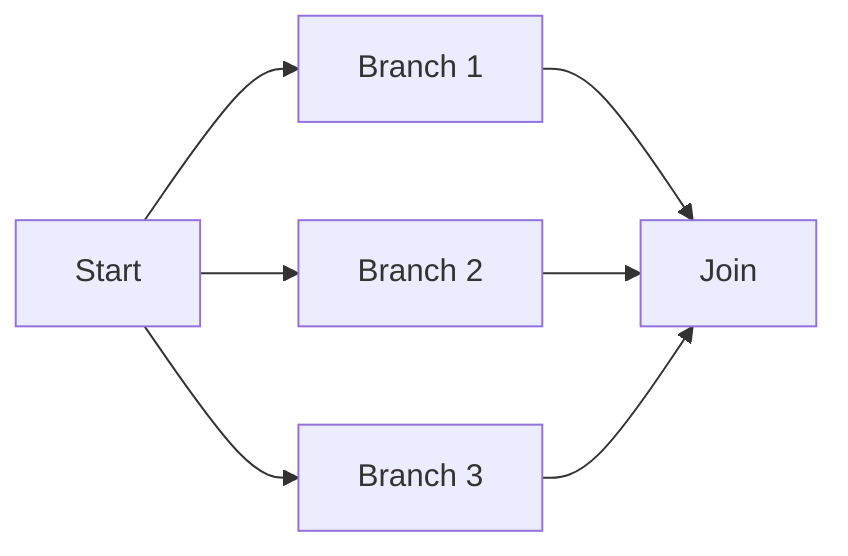
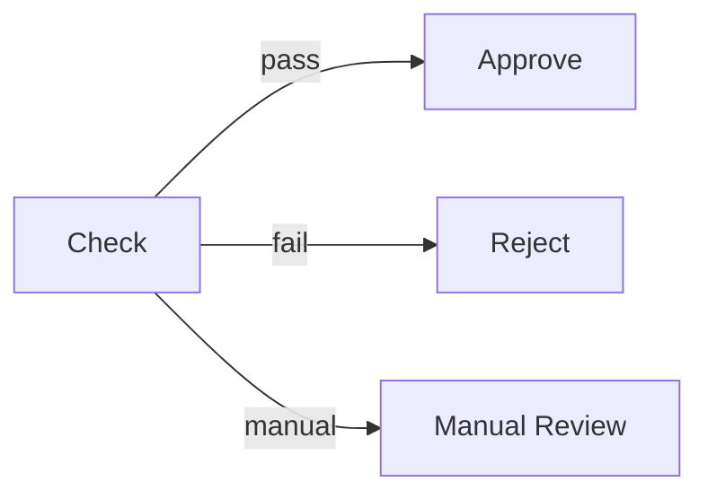
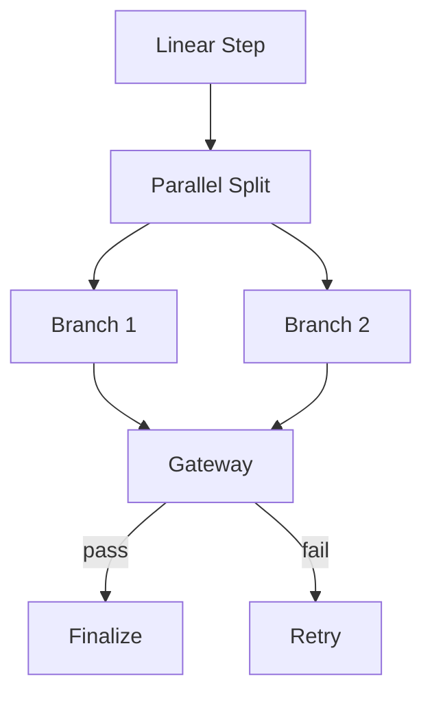

# DAG 模式选择

> 本 skill 教你（Agent）根据业务需求选择合适的 DAG 拓扑模式。
> 生成新 workflow 前先读本 skill 确定拓扑，再读 workflow-author skill 学规范。

---

## 一、四种基础模式

### 1.1 线性（Linear）


**适用场景**：
- 步骤间严格顺序依赖
- 每步产物是下步输入
- 无并行可能

**示例**：`log-patrol`（scan → analyze → report → notify）

**yaml 模板**：
```yaml
nodes:
  step1:
    after: []
    outputs:
      result:
        to: "step2.in:result"
  step2:
    after: [step1]
    outputs:
      result:
        to: "step3.in:result"
```

---

### 1.2 并行（Parallel Branch）



**适用场景**：
- 多个独立子任务可并行执行
- 结果需要汇总
- 耗时敏感（并行缩短总时长）

**示例**：`travel-expense` 的 step3（corp / db / attach 三路并行）

**yaml 模板**：
```yaml
nodes:
  parallel_split:
    type: parallel_branch
    branches: [branch1, branch2, branch3]
    join_strategy: all  # all | first | any
    cancel_on_first_fail: true

  branch1:
    after: [parallel_split]
    outputs:
      result:
        to: "join.in:branch1_result"

  branch2:
    after: [parallel_split]
    outputs:
      result:
        to: "join.in:branch2_result"

  join:
    after: [branch1, branch2]
```

**join_strategy**：
- `all`：等所有分支完成（默认）
- `first`：第一个完成即继续（其余取消）
- `any`：任一成功即继续（不取消其余）

> **join 铁律**：join 节点的 `after` 必须显式列出**全部**上游分支。
> 数据边（`outputs.to` 路由）只投递数据、不构成控制屏障——上游没进 `after` 就不会被等待。
> 真实事故：multi-actor-live-report v2 的 join_surfaces 漏写 `after: [actor_research]`（虽接收了 research_surface 数据），导致 join 在 research 未完成时被放行、产出残缺报告。

---

### 1.3 网关（Gateway）



**适用场景**：
- 根据条件走不同分支
- 审批流 / 校验流
- 多结果路由

**示例**：`travel-expense` 的 step8_decision

**yaml 模板**：
```yaml
nodes:
  decision:
    type: gateway
    gateway_kind: condition
    condition: "{{check.passed}}"
    branches: [approve, reject, manual]

  approve:
    after: [decision]
    # 只在 condition=true 时执行
```

---

### 1.4 混合（Hybrid）



**适用场景**：
- 复杂业务流（线性 + 并行 + 网关组合）
- 多阶段处理

**示例**：`travel-expense`（9 步完整流程含并行 + 网关）

---

## 二、模式选择决策树

```mermaid
graph TD
    Start[业务需求] --> Q1{步骤数}
    Q1|< 3| Direct[直接对话，不建 workflow]
    Q1|≥ 3| Q2{步骤间关系}
    Q2|严格顺序| Linear[线性模式]
    Q2|可并行| Q3{需要汇总}
    Q3|是| Parallel[并行模式]
    Q3|否| Q4{有条件分支}
    Q4|是| Gateway[网关模式]
    Q4|否| Parallel
    Q2|有条件分支| Gateway
    Q2|混合| Hybrid[混合模式]
```

---

## 三、节点拆分原则

1. **单一职责**：一个节点只做一件事（调一个工具或组装一类输出）
2. **可重试**：节点失败后能独立重跑（不依赖前序节点的内存状态）
3. **可跳过**：用 `skip_if` 表达"无重大问题时跳过 notify"
4. **可并行**：独立子任务拆成 parallel_branch，不要串行等待
5. **可终止**：必须有至少一个无 output 的终止节点（validator 图论校验）

---

## 四、反模式

| 反模式 | 问题 | 正确做法 |
|---|---|---|
| 一个节点干所有事 | 不可重试 / 不可并行 / 不可跳过 | 按职责拆分 |
| 强行并行有依赖的步骤 | 数据竞争 / 顺序错乱 | 用线性拓扑 |
| join 只依赖数据边、漏写 `after` | 上游未完成即被放行，产出残缺 | `after` 显式列出全部上游（见 §1.2 join 铁律） |
| 网关 condition 过于复杂 | 难维护 / 易出错 | 拆成多个网关节点 |
| 缺少终止节点 | 图论校验失败 | 确保至少一个无 output 的节点 |
