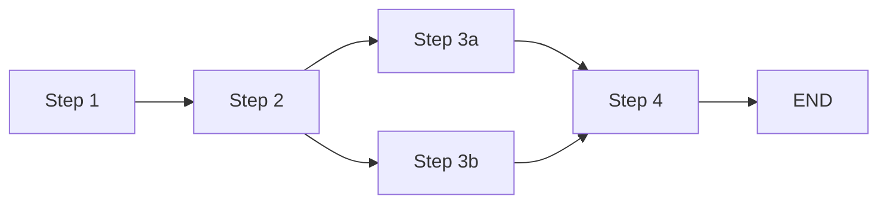

---
name: workflow-author
description: 教 Agent 如何按 AgentOps 规范生成 DAG workflow yaml（含 agent / command / gateway / while 节点）。生成后必须跑 cli.py validate 三层校验（结构+语义+图论）确保能跑通。新增 workflow 必须重启后端才会被 WorkflowRegistry 扫描到。
version: 1.0
domain: _shared
depends_on: [dag-patterns]
triggers:
  - 创建 workflow
  - 生成 DAG 流程
  - 编排多步任务
  - 新建工作流
  - workflow yaml
---

# Workflow Author Skill

> 本 skill 教你（Agent）如何按 AgentOps 规范生成可执行 DAG workflow yaml。
> 生成后**必须**跑 `cli.py validate` 三层校验，确保业务方拿到的 workflow 可以直接跑通。

---

## 一、何时生成 workflow

只有满足以下条件之一才生成新 workflow（否则用对话模式直接回答）：

- 步骤 ≥ 3 的多步流程
- 含人工审批 / 表单输入等门控节点
- 产物可被下游消费（如生成视频、生成报告）
- 需要定时触发（cron）
- 跨业务域协作（如视频生产 + 通知推送）

**不满足时直接对话回答，不要为简单问答生成 workflow。**

---

## 二、Workflow yaml 规范摘要

### 2.1 Envelope（顶层字段）

```yaml
workflow_id: <string>          # 必填，kebab-case（如 log-patrol / video-pipeline）
name: <string>                 # 必填，中文名称
version: <float>               # 必填，从 1.0 开始
description: |                 # 必填，多行业务描述
  <业务目标 + 节点拓扑摘要>

workspace:                     # 可选，运行时产物目录
  root: "workspace/<id>/{{run_id}}/"
  structure:
    data: "data/"
    script: "script/"

inputs:                        # 必填，外部入参 schema
  - name: <string>
    type: string|integer|array|object
    required: true|false
    default: <value>
    description: <string>

nodes:                         # 必填，节点字典
  <node_id>:
    ...

widget_inputs:                 # 可选，HIL 表单输入绑定
  - from_widget: <widget_id>
    to_node: <node_id>
    to_input: <input_name>
```

> **注意**：旧顶层 `widgets:` 静态配置已**降级为遗留机制**（emit 的 widget.update 仅在对话区内联渲染，大屏画布已删除）。需要大屏可视化时，改用 **actor_visual_profile + report_surface_state 协议**（见 §2.5）。

### 2.2 节点字段

```yaml
nodes:
  <node_id>:                  # kebab-case 或 snake_case，全 workflow 唯一
    name: <string>           # 必填，中文节点名（如 "Step 1 · 搜索素材"）
    type: agent               # 必填，当前只支持 agent
    agent: <agent_id>         # 必填，来自 config/agents/*.yaml（如 video_creator）
    business_role: <string>   # 可选，节点级角色提示；同时也是 actor_visual_profile
                              # 的加载目录名（config/actors/<business_role>/）
    role_prompt: |            # 可选，节点级任务提示（含可视化协议 + 交付协议，见 §2.5/§2.6）
    harness: codex            # 可选，覆盖 agent yaml 默认值（codex/local_llm/opencode/deterministic）
    model: <provider/id>      # 可选，节点级模型覆盖
    after: [<node_id>, ...]   # 依赖节点列表（控制屏障）；join 节点必须显式列出全部上游
    inputs: [<name>, ...]     # 接收的 input port 名（与上游 output port 对应）
    outputs:                  # 输出端口 + 路由
      <port_name>:
        to: "<downstream>.in:<port_name>"          # 单目标
        # 或
        to:                                                # 多目标（广播）
          - "<downstream1>.in:<port_name>"
          - "<downstream2>.in:<port_name>"
    skip_if: ""  # 可选，条件跳过（如 "{{not validate.passed}}"）
    timeout_seconds: 600      # 可选，默认 600s
```

### §2.2.0 agent 节点的 output_files 对齐规则（P0.4 强约束）

`type: agent` 节点的每个 outputs.<port> **必须在对应 agent yaml (`config/agents/<agent_id>.yaml`) 的 `output_files.<port>` 声明文件路径**，否则文件收割失败 + handoff 找不到交付物。

```yaml
# workflow node:
plan_sql:
  type: agent
  agent: smart_query
  outputs:
    sql: { to: "validate_sql.in:sql" }   # 声明了 sql port

# agent yaml (config/agents/smart_query.yaml):
agent_id: smart_query
output_files:
  sql: '{{workspace.root}}artifacts/sql.txt'   # 必须声明同名 port
  intent: '{{workspace.root}}artifacts/intent.json'   # 其他节点 port 也必须有
```

**对齐规则**：
- 节点 `outputs` 有 N 个 port，agent yaml `output_files` 必须正好有 N 个 key（缺失一个就报 `[语义] Node 'X' outputs port 'P' 在 agent 'Y' 的 output_files 中未声明，文件收割会失败`）
- 同 agent 跨节点复用时（如 smart_query agent 跨 route_intent / plan_sql / present_result），`output_files` 必须包含所有节点的 port 名（union 集合）
- `output_files` 模板可用 `{{workspace.root}}` / `{{run_id}}` / `{{node_id}}` 等运行时变量
- 文件收割失败时引擎不会立即报错，但 handoff 调用 `content` 为空时会被拒（触发 correction 重试，最终节点 FAILED）—— 排查时检查 `workspace/<id>/<run_id>/artifacts/` 目录

### 2.2.1 command 节点配置（P0.1 新原语——确定性脚本）

`type: command` 节点用于「确定性脚本」场景（CLI 执行 / 数据库校验 / 文件解析 / git diff / pytest / ffprobe 等不需要 LLM 的步骤）。

```yaml
nodes:
  resolve_schema:
    name: 解析数据库表结构
    type: command                       # 必填，固定 command
    business_role: 数据管理员            # 可选，同 agent 节点
    command_config:                     # 必填，CLI 配置块
      cli_template: "python tools/db_cli.py resolve-schema --database {database}"
                                          # 模板字符串，{input_name} 占位符自动替换
      timeout_seconds: 30               # 可选，默认 30s
      success_exit_code: 0              # 可选，默认 0
      parse_stdout: "json.loads(stdout)" # 可选，Python 表达式，结果写入 outputs.success
    after: [<upstream_id>]
    inputs: [<input_name>, ...]         # 与 cli_template 占位符对应
    outputs:                            # 必填，**必须含 success port**
      <数据_port>:
        to: "<downstream>.in:<input_port>"
      success:                          # ⚠️ 强约束：command 节点缺 success port 会阻断校验
        to: "<downstream>.in:success"   # 流转场景
        # 或
        # to: ""                        # 终止场景（terminal success port 是 P0.1 规定的合法终止）
```

§2.2.1 节中 `command 节点 outputs 端口语义（success vs 数据 port 分工）`：

- `success` 是**控制/心跳端口**（表示命令执行成功），不是数据载体
- 数据由 `cli_template` + `parse_stdout` 提取，写到「其他命名 port」（如 `schemas`、`result`、`rows` 等）
- 下游通过 `outputs.success: { to: "next.in:success" }` 形成「命令→命令」控制流串联
- 即使是 terminal command 节点，`outputs.success: { to: "" }` 也是合法终止
- **设计原则**：每个数据 port 必须有对应 success port 在同一个 outputs 块（保证执行成功后才投递数据）

**command 节点 vs agent 节点的本质区别**：
| 维度 | agent 节点 | command 节点 |
|---|---|---|
| 执行体 | LLM harness（codex/local_llm/opencode） | CLI / 二进制 |
| 配置字段 | agent / harness / model | command_config（cli_template + parse_stdout）|
| outputs 终止 | `outputs: {}`（留空）| `outputs.success: { to: "" }`（terminal success port）|
| outputs 流转 | outputs.<port>.to 路由到下游 | 同上 + 必须含 success port |

### §2.2.2 cli_template Windows cmd.exe 引号转义陷阱（P0.2）

模板字符串含双引号 + 单引号 + 反斜杠时，PowerShell / cmd.exe 转义规则不同（macOS/Linux bash 则正常）。

**反例（cmd.exe 会吞掉双引号，输出被破坏）**：
```yaml
# 错（cmd.exe 下 echo 后双引号被剥离，输出变 "okfalseerror..."）：
cli_template: 'echo {"ok":false,"error":"非数据查询"}'
```

**正例 1**：用 `python -c "..."` 把整段逻辑包起来，避免 shell 引号解析：
```yaml
cli_template: 'python -c "import json,sys; sys.stdout.write(json.dumps({\"ok\":False,\"error\":\"非数据查询\"}, ensure_ascii=False))"'
```

**正例 2**：把生成 JSON 的逻辑写到 `tools/<name>.py` 里，cli_template 只负责调用（**最推荐**）：
```yaml
cli_template: "python tools/refuse_intent.py --reason '非数据查询'"
```

**跨平台建议**：
- 优先把逻辑放到 `.py` 脚本里，yaml 里只放调用入口
- 模板字符串含 `{input_name}` 占位符时，要警惕上游长字符串（SQL / JSON）被插值后引号未转义 —— 用 `python -c` 包裹或写到 `.py` 文件
- Windows 平台测试：写完务必跑一次 `cmd /c "<cli_template>"` 看实际输出，不要信 PowerShell

### §2.2.3 gateway 节点（P0.3 注意事项——条件表达式不可信）

`type: gateway` 节点用于「多路分发 / 静态路由」，**但 condition 表达式仅在文档层有效，运行时不会被解析**。

| 字段 | 是否运行时生效 | 用途 |
|---|---|---|
| `gateway_kind` (condition / parallel_branch) | ✅ 生效 | 决定节点类型判定 |
| `condition: "..."` 表达式 | ❌ **不解析** | 仅文档/提示作用，引擎忽略 |
| `outputs.<port>.to` 路由表 | ✅ 生效 | 控制下游执行依赖 |

**真实事故**：smart-query.yaml 最初用 `type: gateway` + `condition: "result.is_data_query ? 'query' : 'refuse'"`，引擎无视 condition，**永远走第一个 output port**（永远路由到 query 分支），refuse 分支永远不触发。

**正确做法：条件分流用「agent + skip_if」模式**（推荐）：
```yaml
# 1. 上游 agent 节点产出布尔 / 枚举（通过 handoff 工具）：
route_intent:
  type: agent
  agent: smart_query
  business_role: 意图分类员
  harness: local_llm
  after: []
  inputs: [question]
  role_prompt: |
    判断 {{question}} 是否属于数据查询。
    完成后调用 handoff(port=intent, content=true|false, summary=...)
  outputs:
    intent:
      to:
        - "resolve_schema.in:intent"
        - "refuse_intent.in:intent"

# 2. 下游节点用 skip_if 实现条件跳过：
resolve_schema:
  type: command
  ...
  skip_if: "{{not route_intent.intent}}"   # intent=false → 跳过本节点

refuse_intent:
  type: command
  ...
  skip_if: "{{route_intent.intent}}"       # intent=true  → 跳过本节点
```

**什么时候可以用 gateway？**
- 纯静态多路路由（不需要判定，所有路都要走）：用 `gateway_kind: parallel_branch` + 多目标 `to: [...]`
- 需要条件判定：永远用 `agent + skip_if`，不要赌 condition 表达式会被解析

### 2.3 边规则（重要）

- **数据边**：`outputs.<port>.to: "downstream.in:port"` 隐含"上游完成 + 数据投递"双重语义
- **控制边**：`after: [node_id]` 仅控制依赖，不投递数据
- **多消费者**：一个 output port 可路由到多个下游（`to:` 用 list）
- **多入边汇合**：多个上游打到同一节点的同一 input port，**自动 join**（最后一个到达触发节点 ready）
- **禁止成环**：拓扑必须无环，validator 会检测

### 2.4 边规则补充：数据边 ≠ 控制依赖

- `outputs.<port>.to` 数据边**只投递数据，不构成控制屏障**。下游节点要等某上游完成，必须在 `after` 里显式声明
- **join 节点铁律**：`after` 必须显式列出**全部**上游。真实事故：v2 multi-actor-live-report 的 join_surfaces 只 after 了 synthesis/auditor，漏了 research（虽有数据边投递 research_surface），导致 join 在 research 未完成时被放行

### 2.5 可视化协议（actor_visual_profile + report_surface_state）

DAG 节点要在前端大屏出卡片，走 **surface 协议**（不是旧 widgets）：

**1. 声明 profile**：`config/actors/<business_role>/actor_visual_profile.json`

```json
{
  "actor_id": "research",
  "allowed_surface_views": [{
    "view_id": "research-live",
    "required_phases": ["started", "partial", "final"],
    "fields": {
      "title":   {"type": "string", "required": true, "max_length": 80},
      "progress": {"type": "integer", "required": true, "min": 0, "max": 100},
      "primary_tone": {"type": "enum", "required": true, "values": ["neutral", "info", "positive", "warning", "critical"]}
    },
    "template": [
      {"id": "bar", "component": "AoProgress", "label": "$phase_text", "value": "$progress"}
    ]
  }]
}
```

- `fields`：data_model 白名单 + 类型约束（required / max_length / min / max / enum），缺字段或类型错会被校验拒绝
- `template`：组件树模板，`$field` 绑定 data_model 字段，agent 不需要传 components

**2. role_prompt 里写明调用纪律**（节点内置 `report_surface_state` 工具）：

```
只传 view_id + phase + data_model 三个参数（fields-only 模式）。
按顺序恰好调用 3 次，每次都是完整字段快照：
  1. phase='started'：progress=5，占位文案，计数填 0
  2. phase='partial'：progress=55，真实中间结果
  3. phase='final'：progress=100，完整真实结论
phase 单调推进（started→partial→final），禁止跳跃或回退。
```

### 2.6 交付协议（handoff 铁律）

**节点完成 ≠ 模型说完话，而是 handoff 工具被调用**。引擎强校验：

| 规则 | 违反后果 |
|---|---|
| 每个声明的 output port 必须恰好 handoff 一次 | 未 handoff 触发 correction 重试（最多 2 次），耗尽后节点 FAILED |
| `content` 必须是完整交付物（结构化正文） | 空值/null/空容器被拒（`empty_handoff_content`），同 turn 内补全重试 |
| 声明了 surface 工具的节点必须先 emit `phase='final'` | handoff 被拒（`surface_sequence_incomplete`），先补发 final 快照 |

handoff 调用签名（节点内置工具，无需配置）：

```python
handoff(
    port="research_surface",      # 与节点 outputs 声明的 port 名一致
    content={"actor": "research", "status": "ready",
             "summary": "一句话总结", "items": ["关键发现…"]},   # 完整交付物
    summary="一句话总结"
)
```

**role_prompt 里必须写明**：「禁止以纯文本结束回合，必须以 handoff 工具调用结束」。

### §2.6.1 同 agent 跨节点复用时的 role_prompt 结构（P0.5 强约束）

当一个 agent 被 workflow 多个 LLM 节点复用（如 smart_query agent 跨 route_intent / plan_sql / present_result 三个节点），**role_prompt 必须按 `{{node_id}}` 分段写每个节点的交付协议**，否则 LLM 不知道该节点该 handoff 哪个 port、content 应该是什么类型。

**结构模板**：
```yaml
# config/agents/smart_query.yaml
system_prompt: |
  【全局约束】
  - 数据源 / 白名单 / 跨域约束（所有节点共享）

  【handoff 工具通用规则】
  - 每个 LLM 节点完成后必须调用 handoff 工具交付结果（禁止以纯文本收尾）
  - handoff(port=<端口名>, content=<交付内容>, summary=<一句话总结>)
  - content 的类型因节点而异

  === node_id == "route_intent" ===  意图分流
  输入：{{question}}
  交付协议：
    port: "intent"
    content: true|false           # 布尔
    summary: 一句话说明判定理由

  === node_id == "plan_sql" ===  生成 SQL
  输入：{{question}} {{schema_info}}
  交付协议：
    port: "sql"
    content: SELECT ...             # 纯 SQL 字符串
    summary: 一句话说明查询意图

  === node_id == "present_result" ===  展示结果
  输入：{{question}} {{rows}}
  交付协议：
    port: "final"
    content: {"answer": "...", "rows": [...]}   # 结构化对象
    summary: 一句话总结

  （每个段末尾必须写「禁止以纯文本结束回合，必须以 handoff 工具调用结束」）
```

**关键点**：
- 每段必须明确写出 `port` 名、`content` 类型（bool / str / dict）、`summary` 长度要求
- 同 agent 跨多节点时，**必须给每个 node_id 写独立段落**，不要让 LLM 自行推断
- LLM 注意力有限：system_prompt 控制在 200 行内（>300 行 LLM 容易丢关键约束）
- 如发现 LLM 总是以纯文本结束回合（outputs 为空），优先检查该 node_id 段落是否缺失 / 描述是否模糊

### §2.6.2 allowed_tools 必须显式声明 handoff 等节点工具（P0.6 强约束）

即使 handoff 是节点内置工具、sql_query 是平台工具，**agent yaml 也必须在 `permissions.allowed_tools` 显式列出**，否则 LLM 看不到该工具，无法调用。

```yaml
# config/agents/smart_query.yaml
agent_id: smart_query
permissions:
  allowed_tools:
    - handoff          # ⚠️ 必须有，否则 LLM 节点无法交付 → outputs 空 → 节点卡死
    - sql_query        # 数据查询
    - data_analysis    # 数据分析
    - present_content  # 推送大屏
    - finalize         # 收尾
    - request_cross_domain  # 跨域请求
```

**踩坑事故**：smart-query agent 一开始 `allowed_tools` 没加 `handoff`，plan_sql 节点即使想调用 handoff 也调不到，outputs.sql.content 一直是空，引擎等 600s 超时后节点 FAILED。

**排查方法**：
- 节点卡在 LLM 调用阶段 + outputs 为空 → 检查 agent.yaml allowed_tools 是否包含 `handoff`
- 节点报 `tool_not_allowed: handoff` → allowed_tools 拼写错误或缺失
- LLM 决定不调工具而是纯文本 → 检查 role_prompt 是否漏了「必须以 handoff 工具调用结束」

---

## 三、生成步骤（5 步标准流程）

### Step 1：理解业务需求

向业务方确认：
1. 业务目标是什么？（如"每周自动生成周报"）
2. 涉及哪些步骤？每步做什么？
3. 哪些步骤可以并行？哪些必须串行？
4. 需要哪些输入参数？哪些必填？
5. 产物是什么？（报告 / 视频 / 通知）
6. 是否需要人工审批？

### Step 2：选择 agent（按能力域）

**不要按 workflow 设计 agent**。先查现有 agent 是否有能力覆盖：

```bash
# 查看现有 agent
ls config/agents/*.yaml
```

判断现有 agent 是否覆盖能力需求：
- 视频生成 → `video_creator`（mm_image + mm_speech + hyperframes）
- 内容写作 → `content_curator`（obsidian_vault + ingest_source）
- 质量校验 → `quality_inspector`（local_llm + 校验规则）
- 日志分析 → `log_analyst`（log_query + wecom_notify）
- SQL 查询 → `smart_query`
- 数据分析 → `smart_analysis`

**只有真正需要新工具/新知识库时才新增 agent**（详见 [DESIGN-architecture-refactor-v2.md §12](file:///e:/Project/AgentOps/docs/00-platform/architecture/DESIGN-architecture-refactor-v2.md)）。

### Step 3：设计拓扑

用拓扑表达业务流程：



规则：
- 必须有终止节点（无 outputs 的节点）
- 拓扑必须无环
- 并行节点用 `after: [共同上游]`
- 条件跳过用 `skip_if: "{{not <node>.<port>}}"`

### Step 4：写 yaml

按 §2 规范写 yaml 文件，保存到 `workflows/<workflow_id>.yaml`。

### Step 5：跑 validate（必跑）

```bash
python cli.py validate workflows/<workflow_id>.yaml
```

**必须全 pass 才能交付**。如果有 errors，按错误码修复后重跑。

---

## 四、常见错误码 + 修复方法

| 错误码 | 含义 | 修复方法 |
|---|---|---|
| `[结构] Node 'X' references unknown dependency 'Y'` | after 引用了不存在的节点 | 检查 after 列表拼写 |
| `[结构] Node 'X' output port 'P' references unknown target 'Y'` | output 路由到不存在的节点（含把 `_terminal` 当目标字段） | 检查 to 字段拼写，**禁止用 `_terminal`，agent 终止用 `outputs: {}`，command 终止用 `outputs.success: { to: "" }`** |
| `[结构] Agent node 'X' must have 'agent' set` | agent 节点未配 agent_id | 添加 agent 字段 |
| `[结构] Workflow contains cycle: A -> B -> A` | 拓扑成环 | 重新设计拓扑，移除环 |
| `[语义] command 节点 'X' 必须声明 outputs.success port` | command 节点没有 success 端口 | 加 `outputs.success: { to: "<next>.in:success" }`（流转）或 `outputs.success: { to: "" }`（终止） |
| `[语义] Widget 'W' emit_on_event='run_started' 不在 DagEventType 枚举中` | 事件名用了下划线版本 | 改为带点版本（`run.created`） |
| `[语义] Node 'X': opencode harness 节点必须配 agent_id` | 非 deterministic 节点缺 agent | 添加 agent 字段 |
| `[语义] Node 'X' output port 'P' 路由到 Y.in:Z，但下游节点未声明该 input port` | port 声明缺失（warning，不阻断） | 在下游 inputs 列表加 `Z` |
| `[图论] 工作流没有终止节点` | 所有节点都有 outputs | 添加终止节点：agent 节点用 `outputs: {}` 留空，command 节点用 `outputs.success: { to: "" }` terminal success |
| `[图论] Node 'X' skip_if 引用不存在的节点 'Y'` | skip_if 引用错误 | 检查 `{{Y.port}}` 拼写 |
| `[图论] Node 'X' skip_if 引用 Y.Z，但该节点未声明 output port 'Z'` | skip_if 引用的 port 不存在 | 在 Y 的 outputs 加 Z port |
| `[语义] Node 'X' outputs port 'P' 在 agent 'Y' 的 output_files 中未声明，文件收割会失败（agent output_files: [...]）` | agent 节点 outputs 与 agent yaml 的 output_files 不对齐 | 在 `config/agents/<Y>.yaml` 的 `output_files` 加同名 port 路径 |
| `[图论] Node 'X' skip_if 引用 Y.Z，但 Y 是 agent 节点且未通过 handoff(port=Z) 交付内容` | skip_if 引用了 port，但上游 agent 没用 handoff 工具交到该 port | 检查 Y 的 role_prompt §{{node_id}} 段落是否声明了该 port 的交付协议 |

**运行时错误**（validate 查不出，跑的时候引擎强制）：

| 运行时错误码 | 含义 | 根因 |
|---|---|---|
| `empty_handoff_content` | handoff content 为空 | role_prompt 未要求交付物正文进 content |
| `surface_sequence_incomplete` | handoff 前未 emit final surface | 节点声明了 surface 工具但 role_prompt 未写三阶段纪律 |
| `phase_not_monotonic` | surface phase 回退/跳跃 | role_prompt 未锁定 progress 节奏 |
| correction 耗尽 → `node.failed` | 2 次 correction 后仍未 handoff | role_prompt 缺「必须以 handoff 结束」条款 |

---

## 五、最佳实践清单（13 条）

1. **workflow_id 用 kebab-case**：`log-patrol`（不是 `log_patrol` 或 `LogPatrol`）
2. **node_id 全 workflow 唯一**：`scan` / `analyze` / `report` / `notify`（语义清晰）
3. **inputs 命名与上游 output port 同名**：方便 port 匹配，减少 warning
4. **agent 节点终止**：`outputs: {}` 留空（validator 用 outputs 是否为空判断终止）
5. **command 节点终止**：`outputs.success: { to: "" }`（P0.1 规定的合法 terminal success port，不是真"结束"——表示本节点"成功完成"且无下游）
6. **command 节点流转**：`outputs.success: { to: "<downstream>.in:success" }`，缺 success port 必阻断
7. **路由严格匹配**：上游 `outputs.<port>.to` 的下游 `inputs:` 必须含同名 port，否则报 `[语义] ... 未声明该 input port` 警告
8. **description 写业务目标 + 节点拓扑摘要**：让 Manager 能路由（prompt 注入用到）
9. **business_role 必填**：节点级角色提示，用于泳道分组 + role_prompt 拼装
10. **harness 选择**：`codex`（docker 容器，LLM 节点默认，享受 correction 补救）/ `local_llm`（确定性关键任务，避免 opencode 4096 崩溃）/ `opencode`（需要 MCP/多轮，注意稳定性）/ `deterministic`（纯 CLI 短脚本）
11. **model 仅在节点需要不同模型时覆盖**：默认走 agent yaml 配置
12. **role_prompt 必须含交付协议**：「禁止以纯文本结束回合，必须以 handoff 工具调用结束」；有 surface 需求时同时写三阶段可视化纪律（见 §2.5/§2.6）
13. **生成后必跑 `cli.py validate`**：禁止交付未校验的 workflow

---

## 六、完整示例（minimal）

```yaml
workflow_id: example-greet
name: 示例问候工作流
version: 1.0
description: |
  2 步 DAG 示例：generate → notify。
  用于演示 workflow yaml 规范（含 handoff 交付纪律）。

inputs:
  - name: user_name
    type: string
    required: true
    description: 要问候的用户名

nodes:
  generate:
    name: Step 1 · 生成问候语
    type: agent
    agent: content_curator
    business_role: 问候生成员
    harness: local_llm
    after: []
    inputs: [user_name]
    role_prompt: |
      为 {{user_name}} 生成一句问候语。
      完成后调用 handoff 工具恰好一次：
        port: greeting
        content: {"greeting": "<生成的问候语>"}
        summary: 一句话总结
      禁止以纯文本结束回合，必须以 handoff 工具调用结束。
    outputs:
      greeting:
        to: "notify.in:greeting"

  notify:
    name: Step 2 · 输出问候
    type: agent
    agent: content_curator
    business_role: 通知员
    harness: deterministic
    after: [generate]
    inputs: [greeting]
```

生成后跑：

```bash
python cli.py validate workflows/example-greet.yaml
```

预期输出：`✅ All checks passed`（0 errors, 0 warnings）。

---

## 七、与 validator 的协作

本 skill 只教规范，**不参与运行时校验**。校验由 [workflow/validator.py](file:///e:/Project/AgentOps/workflow/validator.py) 三层校验代码强制执行：

| 层 | 校验内容 | 失败行为 |
|---|---|---|
| 结构层 | after 引用 / output 目标 / agent 必填 / gateway / parallel_branch / 环检测 / widget_input | errors 阻断 |
| 语义层 | port 声明匹配（warning）/ 事件名枚举 / 非 deterministic 必须有 agent_id | errors + warnings |
| 图论层 | 终止节点存在 / skip_if 引用完备 | errors 阻断 |

**生成流程**：本 skill 指导 → 生成 yaml → validator 强制校验 → 全 pass 才交付。

---

## 七·二、command 节点最小示例（确定性脚本混合）

```yaml
workflow_id: smart-query
name: 智能问数（一次性查询工作流）
version: 1.0
description: |
  agent + command 混合 DAG 演示：3 个 LLM 节点 + 3 个 command 确定性脚本 + 1 个 gateway。
  数据库：audit_platform（只读 SELECT）。

inputs:
  - name: question
    type: string
    required: true

nodes:
  route_intent:
    name: 意图路由
    type: agent                                            # 条件分流用 agent + skip_if，不用 gateway
    agent: smart_query
    business_role: 意图分类员
    harness: local_llm
    after: []
    inputs: [question]
    role_prompt: |
      判断 {{question}} 是否属于数据查询任务。
      完成后调用 handoff 工具恰好一次：
        port: "intent"
        content: true|false
        summary: 一句话判定理由
      禁止以纯文本结束回合，必须以 handoff 工具调用结束。
    outputs:
      intent:
        to:
          - "resolve_schema.in:intent"     # 两个下游都广播，skip_if 决定谁跑
          - "refuse_intent.in:intent"

  resolve_schema:                                       # command 节点：CLI 解析表结构
    name: 解析数据库表结构
    type: command
    command_config:
      cli_template: "python tools/db_cli.py resolve-schema --database {database}"
      timeout_seconds: 30
      parse_stdout: "json.loads(stdout)"
    after: [route_intent]
    skip_if: "{{not route_intent.intent}}"                 # intent=false → 跳过本节点
    inputs: [database, question]
    outputs:
      schemas:  { to: "plan_sql.in:schemas" }
      tables:   { to: "plan_sql.in:tables" }
      success:  { to: "plan_sql.in:success" }            # ⚠️ command 节点必须含 success port

  plan_sql:                                             # agent 节点：LLM 看 schema 生成 SQL
    name: 生成 SQL
    type: agent
    agent: smart_query
    business_role: SQL 工程师
    harness: codex
    after: [resolve_schema]
    inputs: [question, schemas, tables, denied_columns, max_rows, success]
    outputs:
      sql: { to: "validate_sql.in:sql" }

  validate_sql:                                         # command 节点：安全校验
    name: SQL 安全校验
    type: command
    command_config:
      cli_template: "python tools/db_cli.py validate --database {database} --sql \"{sql}\""
      timeout_seconds: 10
      parse_stdout: "json.loads(stdout)"
    after: [plan_sql]
    inputs: [database, sql]
    outputs:
      ok:       { to: "execute_query.in:ok" }
      error:    { to: "execute_query.in:error" }
      success:  { to: "execute_query.in:success" }

  execute_query:                                        # command 节点：实际查 DB
    name: 执行查询
    type: command
    command_config:
      cli_template: "python tools/db_cli.py query --database {database} --sql \"{sql}\""
      timeout_seconds: 60
      parse_stdout: "json.loads(stdout)"
    after: [validate_sql]
    inputs: [database, sql, ok, error, success]
    outputs:
      result:  { to: "present_result.in:result" }
      success: { to: "present_result.in:success" }

  present_result:                                       # agent 节点：LLM 把行集翻译成人话
    name: 呈现结果
    type: agent
    agent: smart_query
    business_role: 结果讲解员
    harness: codex
    after: [execute_query]
    inputs: [question, result, success]
    outputs: {}                                          # ⚠️ agent 终止：outputs 留空

  refuse_intent:                                        # command 节点：拒绝非数据查询
    name: 拒绝非查询
    type: command
    command_config:
      cli_template: "python -c \"import json,sys; sys.stdout.write(json.dumps({'ok':False,'error':'非数据查询'}, ensure_ascii=False))\""
      timeout_seconds: 5
      parse_stdout: "json.loads(stdout)"
    after: [route_intent]
    skip_if: "{{route_intent.intent}}"                    # intent=true → 跳过本节点
    inputs: [question]
    outputs:
      message: { to: "" }                                # ⚠️ command 终止：success + message 都 to: ""
      success: { to: "" }                                # terminal success port
```

**关键约束清单**（共 11 条，缺一不可）：

1. command 节点必有 `outputs.success`（指向下一节点 `in:success` 或 `to: ""`）
2. agent 节点终止：`outputs: {}` 留空
3. command 节点终止：`outputs.success: { to: "" }`
4. 上游 `outputs.<port>.to` 的下游 `inputs:` 必须含同名 port（如 `ok` / `error` / `success`）
5. 条件分流用 `type: agent` + `skip_if`，**不要赌 gateway.condition 会被解析**（§2.2.3）
6. workflow 至少 1 个终止节点
7. `business_role` 必填（用于 actor_visual_profile 加载 + 泳道分组）
8. 拓扑无环
9. agent 节点的每个 outputs.<port> 必须在 agent.yaml 的 `output_files` 声明（§2.2.0）
10. agent.yaml `permissions.allowed_tools` 必须包含 `handoff` 及节点要用的工具（§2.6.2）
11. `cli_template` 涉及引号 / JSON / Windows 平台时优先用 `python -c "..."` 或单独 `.py` 脚本（§2.2.2）

---

## 八、何时不该用本 skill

- 简单问答（"什么是 DAG"）→ 直接回答，不生成 workflow
- 单步任务（"搜索 XX"）→ 直接调用工具，不生成 workflow
- 临时性任务（"帮我跑一次脚本"）→ 用 `trigger_workflow(run_mode="task")`，不生成 yaml
- 已有 workflow 能覆盖 → 直接 `trigger_workflow(workflow_id="现有 id")`，不重复生成

---

## 九、参考文档

- [AgentOps 架构重构方案 v2.0 §13 双层核验机制](file:///e:/Project/AgentOps/docs/00-platform/architecture/DESIGN-architecture-refactor-v2.md)
- [workflow/validator.py 三层校验实现](file:///e:/Project/AgentOps/workflow/validator.py)
- [workflow/schema.py WorkflowDefinition schema](file:///e:/Project/AgentOps/workflow/schema.py)
- [orchestrator/protocol.py DagEventType 枚举](file:///e:/Project/AgentOps/orchestrator/protocol.py)
- [config/agents/ 现有 agent 清单](file:///e:/Project/AgentOps/config/agents)
- [workflows/ 现有 workflow 样本](file:///e:/Project/AgentOps/workflows)

---

## 十、运维陷阱（生成后端没生效时的排查清单）

### 10.1 新增 / 修改 workflow yaml 后必须重启后端

`WorkflowRegistry.scan()` 只在 lifespan 启动时跑一次，**热加载不支持**（v1 限制）。新增 workflow 或修改 yaml 结构（不是 handoff/role_prompt 内容）后：

```powershell
cd E:\Project\AgentOps
.\stop.ps1
.\start.ps1
```

只改 role_prompt 内容 + agent yaml system_prompt 通常不需要重启（agent yaml 由 get_system_config 在请求时读取——除非改了 agent_id / harness / model / 工具列表），但加新 workflow / 改 workflow 拓扑必须重启。

### 10.2 校验失败被静默吞掉

`api/server.py:281-282` 在 lifespan 启动时这样写：

```python
for wf_path in (PROJECT_ROOT / "workflows").glob("*.yaml"):
    try:
        _orchestrator.load_workflow_file(str(wf_path))
    except Exception as e:
        logger.warning(f"Failed to load {wf_path.name}: {e}")
```

校验失败被 `logger.warning(...)` 静默吞掉，**前端只看到 workflow 不见了，不会报错**。排查时直接：

```bash
grep -i "<workflow_id>\|invalid\|Failed to load" logs/backend.log
```

### 10.3 正确端点是 `/api/agent/workflows`

不是 `/api/workflows`（后者根本不存在，返回 `{"workflows": []}`）。其他常用端点：

| 端点 | 用途 |
|---|---|
| `GET /api/agent/workflows` | 列出所有 workflow（从 `_orchestrator.workflows`）|
| `GET /api/agent/workflows/{id}` | 单个 workflow 详情（含完整 definition）|
| `GET /api/agent/agents` | 列出所有 agent（从 `config/agents/*.yaml` + runtime）|
| `GET /api/agent/agents/{id}` | 单个 agent 详情（含 workflow_bindings）|

### 10.4 workflow 列表对得上但页面没显示

可能是前端缓存，Vite HMR 通常会自动刷；如果不刷，硬刷（Ctrl+F5）。AgentRegistry 已被撤销（D-057），manager 只通过 trigger_workflow 调度 workflow，不显示单 agent 列表——这是预期行为，不是 bug。
